# 기존 축구 게임 규칙 상세 정리 (2026-09-06)

패스 앤 슛 컨셉 수립을 위한 선례 조사 2차. 1차 요약은 `research-existing-games-2026-09-06.md`.
이 문서는 게임별로 규칙을 최대한 원문(규칙서 PDF, 공식 사이트, 상세 인스트)에 근거해 옮겼다.
각 게임 표의 "근거 수준" 이 신뢰도다. "미확인" 은 자료를 찾지 못한 항목이며 추정으로 채우지 않았다.
참고 이미지는 `research-images/` 에 내려받아 두었고, 각 이미지 아래 원본 URL 을 적었다. 외부 저작물이므로 기획 참고용으로만 쓴다.

## 목차

- 그룹 A. 일본·국내 경량 게임
  - 카드 스트라이커
  - 트럼프 게임 "골"
  - 사커 장기 티키·타카
  - 레지스타 / 사커 체스
  - 현실에 다가가라! 마스목 사커 택틱스
  - BROAD 기사 수록 3작
  - 원탑 풋볼
  - 그룹 A 횡단 요약
- 그룹 B. 영어권 카드 게임
  - 소커즈
  - 타임 볼트 사커
  - 매직 넘버 일레븐
  - 스트라이커즈
  - 사커 시티
  - 킥오프 / 페널티
  - 풋볼 카드
  - 비교 요약
- 그룹 C. 독일어권 카드·보드 게임
  - 슛과 골
  - 해트트릭
  - 축구 대결
  - 루카스와 놀자: 드리블 열병
  - 리그레토 축구
  - 페널티킥!
  - 피날레
  - 그룹 C 종합 — "간단한 축구 시뮬레이션 카드 게임" 에 주는 시사점
- 그룹 D. 보드 시뮬레이션과 매니지먼트
  - 카운터 어택
  - 골라조
  - 스트리트사커
  - 토탈 어택!! 사커
  - 사커 택틱스 월드
  - 일레븐: 풋볼 매니저 보드게임
  - 풋볼 드라마
  - 그룹 D 횡단 정리: "간단한 축구 시뮬레이션 카드 게임" 에 쓸 만한 판정 모델

## 근거 수준 표기

- **규칙서 원문**: 제작사 규칙서 PDF 또는 공식 규칙 페이지를 직접 읽었다.
- **상세 리뷰·인스트**: 플레이어가 옮겨 적은 규칙 전문이나 절차를 인용한 리뷰.
- **상점·소개문**: 판매 페이지, 기사 한 단락, 박스 사진 판독. 규칙의 세부는 신뢰하지 말 것.

---

## 그룹 A. 일본·국내 경량 게임

### 카드 스트라이커 (カードストライカー / Card Striker, 野村紹夫(노무라 아키오, 有限会社ルートイレブン), 大創出版(다이소 퍼블리싱), 2022)

| 항목 | 값 |
|---|---|
| 인원 | 2인 |
| 플레이 시간 | 15분 전후 |
| 연령 | 6세 이상 |
| 형태 | 카드 + 종이 플레이시트(A5) |
| 근거 수준 | 상세 인스트 (ボドゲーマ 이용자 アルミ缶ルーチス 가 옮겨 적은 규칙 전문) + 상점 원문(다이소) + 리뷰 3건 + 보드 사진 판독 |

DAISO 디자이너즈 보드게임 제4탄. 110엔(세금 포함). 게임 No. 5211. 아트워크 ハセチャコ. 난이도 ★★☆☆(2). 박스 문구 "どこでフェイントかけるかが勝負のカギ！(어디서 페인트를 거느냐가 승부의 열쇠)". 다이소 퍼블리싱 소개문: "2인 축구 진검승부! '세-노' 로 오펜스는 상대와 **다른** 카드를, 디펜스는 상대와 **같은** 카드를 내는 것을 노린다. 같은 카드면 그 자리에서 공수 교대! 나머지는 상대의 수를 읽고… 슛이다!"

#### 구성물
다이소 상품 페이지(공식): 카드 20장(50×72mm), 볼 칩 1(20mm), 키퍼 칩 4(20×20mm), 타임 칩·득점 칩(10×10mm), 설명서, 플레이시트(148×210mm, 두께 0.01cm 종이).
인스트 기준 세부:
- 게임 보드(코트) 1장 (얇은 종이)
- 타임 칩 1개
- 볼 칩 1개
- 득점 칩 2개 (청/황 각 1)
- 키퍼 칩 4개 (청/황 각 2)
- 플레이 카드 16장 (청/황 각 8장). 카드 1장의 **위아래를 뒤집으면 오펜스용/디펜스용으로 바뀐다** (양방향 인쇄). 종류는 3종: (슈퍼)드리블 / (슈퍼)패스 / 페인트. 디펜스 면은 각각 (슈퍼)드리블 컷 / (슈퍼)패스 컷 / 페인트를 깨기.
- 슈퍼 슛 카드 1장 (공용)
- 슛 카드 3장 (공용). 리뷰(DKnewyork)에 따르면 레프트/센터/라이트 3택.
- 8장 중 종류별 장수, 카드에 적힌 숫자(전진 칸 수)의 값: **미확인**. 인스트에 "지정 수 이내의 칸만큼 볼을 전진" 이라고만 되어 있어 카드마다 최대 이동 칸 수가 적혀 있다는 것까지만 확인.

플레이시트 구조 (ボドゲーマ 게시 사진 2장 판독):
- 세로로 긴 코트. 각 진영에 굵은 실선(드리블 경로)과 점선(패스 경로)으로 연결된 원형 칸(노드)이 있다. 진영 중앙에 "センター" 칸(킥오프 시 볼 위치).
- 특수 칸: 상대 골 앞에 "シュート!" 칸 3개(좌·중·우), 그 뒤쪽에 "ロングシュートチャンス" 칸 2개, 진영마다 "スーパーポイント" 칸 2개. 나머지는 무늬 없는 일반 칸.
- 골: 일반 슛용 3존(レフト/センター/ライト) + 롱슛용 골 2존(レフト/ライト) 이 따로 그려져 있다.
- 타임 트랙: "キックオフ" 칸 → 1~12 칸(2번 칸에 10min, 5번 칸 20min, 8번 30min, 11번 40min, 12번 45min 표기) → "アディショナルタイム" 칸. 즉 하프당 12턴.
- 득점 트랙: 팀별 1점~6점.

#### 셋업
1. 팀(청/황)을 정하고, 자기 팀 코트가 자기 앞에 오도록 보드를 펼친다.
2. 타임 칩을 "킥오프" 칸에 둔다.
3. 자기 팀 플레이 카드 8장, 키퍼 칩 2장, 득점 칩 1개를 받는다. 득점 칩 1개와 키퍼 칩 2개(앞면)를 손 앞에 둔다.
4. 슈퍼 슛 카드 1장과 슛 카드 3장을 둘 다 손이 닿는 곳에 둔다.
5. 볼 칩으로 "볼 토스" 를 해 첫 오펜스/디펜스를 정한다. 볼 토스: 한 명이 앞/뒤를 예상하고, 다른 한 명이 볼 칩을 튕겨 올린다. 맞히면 예상한 사람이 오펜스, 틀리면 토스한 사람이 오펜스.
6. 오펜스 진영의 센터 칸에 볼 칩을 놓는다.
7. 오펜스는 카드의 오펜스 면을 위로, 디펜스는 디펜스 면을 위로 해서 8장을 상대에게 안 보이게 든다.

#### 턴 구조
전반전 시작. ①~③ 을 타임 칩이 종료 칸에 닿을 때까지 반복.
1. **① 오펜스가 타임 칩을 1칸 전진.** 잊고 ③ 에서 볼을 진행시켰다면 "파울": 전진하기 전 칸에서 오펜스 교대. 카드만 냈다면 세이프. 버린 카드 수를 세어 타임 칩을 올바른 위치로 옮긴 뒤 재개.
2. **② "세-노!" 로 동시에 카드 1장 공개.** 각자 1장 골라 엎어 낸 뒤 동시에 뒤집어도 된다. 디펜스가 늦게 내면(後出し) 무조건 오펜스 성공.
3. **③ 판정 후 두 카드를 버림 더미로.**
   - 카드 보충: 어느 한쪽 손패가 한 종류만 남으면((슈퍼)드리블만, (슈퍼)패스만, 페인트만) 상대에게 손패를 보여 알리고 **둘 다 손패를 8장으로 되돌린다**.
드로우는 없다. 8장을 다 쓰거나 한 종류만 남을 때 리셋.

#### 판정
| 결과 | 조건 | 처리 |
|---|---|---|
| **오펜스 성공** | 두 카드의 **종류가 다름** | (슈퍼)드리블 / (슈퍼)패스 → 드리블류는 굵은 선, 패스류는 점선을 따라 카드 지정 수 **이내**의 칸만큼 볼 칩 전진. 페인트 → 1회째: 상대 키퍼 1장을 뒤집는다. 2회째: 뒤집힌 키퍼를 제거한다. |
| **디펜스 성공** | 두 카드의 **종류가 같음** | 그 자리에서 오펜스 교대. 둘 다 지금 들고 있는 카드의 상하를 바꿔 든다. 볼 위치는 그대로, 볼 화살표 방향만 바꾼다. |
리뷰(DKnewyork): "페인트는 볼을 못 움직이고, 배팅되면 공수 교대 리스크가 있어서 꽤 어렵다." 같은 리뷰: 페인트를 2번 통과시키면 무조건 골(키퍼 0장).

#### 슈팅과 득점
- **シュート 칸**에 볼이 오면 **반드시** 그 자리에서 슛. **ロングシュートチャンス 칸**에서는 슛을 해도 안 해도 된다.
- 슛 절차:
  1. ❶ 오펜스는 슛 카드 3장(롱슛일 때는 라이트/레프트만)에서 1장 골라 엎어 낸다.
  2. ❷ 디펜스는 골(롱슛이면 롱슛용 골)에 **제거되지 않은 키퍼 칩**을 배치한다.
  3. ❸ 슛 카드 공개. 키퍼가 없는 존 → 득점(득점 칩을 득점 칸으로). 키퍼가 있는 존 → 노 골.
  4. ❹ 오펜스 교대, 새 오펜스의 센터 칸에 볼 칩 배치, **양쪽 키퍼 칩을 2장으로 되돌리고** 재개.
- 키퍼가 2장이면 3존 중 2존을 막으므로 1/3 확률, 1장이면 2/3, 0장이면 무조건 골. 롱슛은 2존이므로 키퍼 2장이면 무조건 막힘(→ 키퍼를 줄여 두어야 의미가 있음).
- **スーパーポイント 칸**에 볼이 오면 3가지 중 1택: (a) 슈퍼 슛 카드를 얻는다 (b) 상대 키퍼를 1장으로 만든다 (c) 자기 키퍼를 2장으로 되돌린다. 슈퍼 슛 카드의 효과 텍스트: **미확인** (사진에서 판독 불가).

#### 시간 진행과 종료
- 오펜스가 매 라운드 시작에 타임 칩 1칸 전진. 하프당 12칸(45분 표기).
- 전반 종료 후: 전반의 공수를 반대로 해서 후반. 양쪽 손패 8장(공수 각 방향), 키퍼 2장으로 리셋, 타임 칩은 킥오프 칸으로.
- **어디셔널 타임**: 전반/후반 종료 시(타임 칩 "12" 턴이 끝났을 때) **오펜스가 1점 차로 지고 있을 때만** 그대로 계속. 타임 칩은 전진시키지 않고 ②~③ 을 반복, 오펜스가 득점하거나 디펜스가 볼 컷에 성공하면 종료.
- 득점 많은 쪽 승. 후반 종료 후 동점이면 PK전.

#### 특수 상황
- 파울: 타임 칩 전진을 잊은 채 볼을 움직인 경우만 (위 ①).
- **PK전**: 슛을 번갈아 1개씩, 각 5개. 볼 토스로 선후. 키퍼 칩은 양쪽 1장씩. 5개 전에 결정되면 종료. 5개로 안 끝나면 같은 수를 차고 먼저 1개 리드한 쪽 승.
- 오프사이드, 세트피스, 교체: 없음.

#### 평가와 교훈
- ボドゲーマ 평점(6표): 7,6,6,5,5,2. 플레이감 투표: 심리전 3, 공방 3, 전략 2, 운 1.
- DKnewyork(6세 아들과): "시간이 매 턴 흐르고 어디셔널 타임 역전 요소까지 있어 100엔에 사도 되나 걱정될 수준. 골 앞 두근거림을 아이와 즐길 수 있었다. 단, 어린애에게 져 주는 플레이가 불가능해 어쩔 수 없이 진지해진다. 축구인데 완전히 배팅 게임."
- みなりん: "거의 정보가 없는 상태에서 상대 카드를 읽는 게임. 볼이 좀처럼 안 나가 초조한 장면도. 실제 축구도 1-0 이 흔하니 그런 의미로는 리얼. 개인적으로는 점수가 더 펑펑 나는 쪽이 취향." 
- t-machine ぜっくん(추천 ★1/3): "80년대 일본산 게임 분위기. 다이소 보드게임 중 규칙량이 비교적 많고 약간 복잡. 컴포넌트가 아주 작아 잃어버리기 쉽다. 정체돼도 규정 횟수로 끝나고 PK로 결착이라 수렴성은 나쁘지 않다. 매 라운드 하는 일은 동시에 1장 내기뿐이며 결과에 따라 볼이 가거나 공수 교대되는 변칙 가위바위보."
- BROAD 기사: "상대가 고를 카드를 예상하는 배팅 게임."
- **가져올 점**: (1) 카드 1장을 뒤집어 공수 양면으로 쓰는 것 → 손패 리셋 없이 공수 교대 표현. (2) "같은 종류 = 수비 성공, 다른 종류 = 공격 성공" 한 줄 판정. (3) 슛 판정을 카드(3존) vs 키퍼 칩 배치의 동시 선택으로 처리 → 키퍼 수가 곧 저지 확률이라 페인트 카드에 목적이 생김. (4) 타임 트랙 + 1점 차 한정 어디셔널 타임 + PK 로 반드시 끝남. (5) 손패가 한 종류만 남으면 리셋 → 카운팅의 극단화를 막음.
- **피할 점**: 볼이 좀처럼 안 나가는 저득점 정체(리뷰 2건 공통 지적), 규칙 분량 대비 결과가 단조롭다는 평, 어린이 상대 조절 불가.

#### 참고 이미지
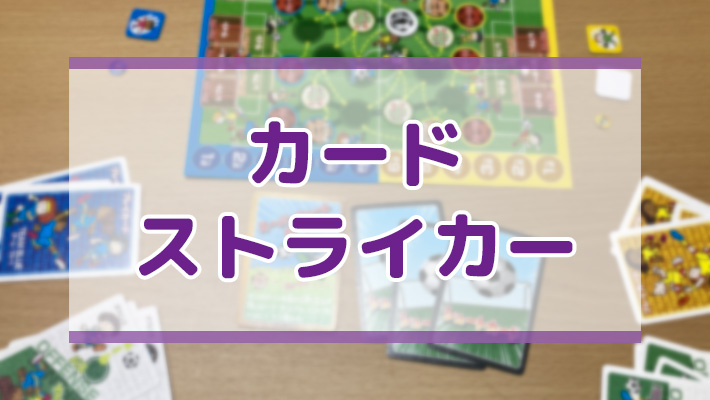
출처: https://minarinbg.com/wp-content/uploads/2024/01/CardStriker01.jpg
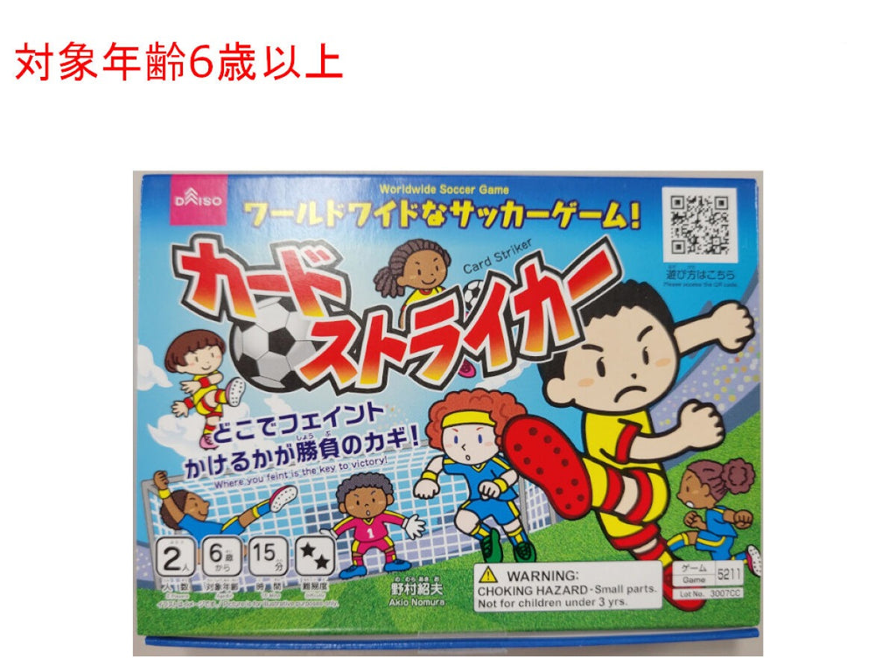
출처: https://jp.daisonet.com/cdn/shop/products/4550480145211_10_1024x.jpg
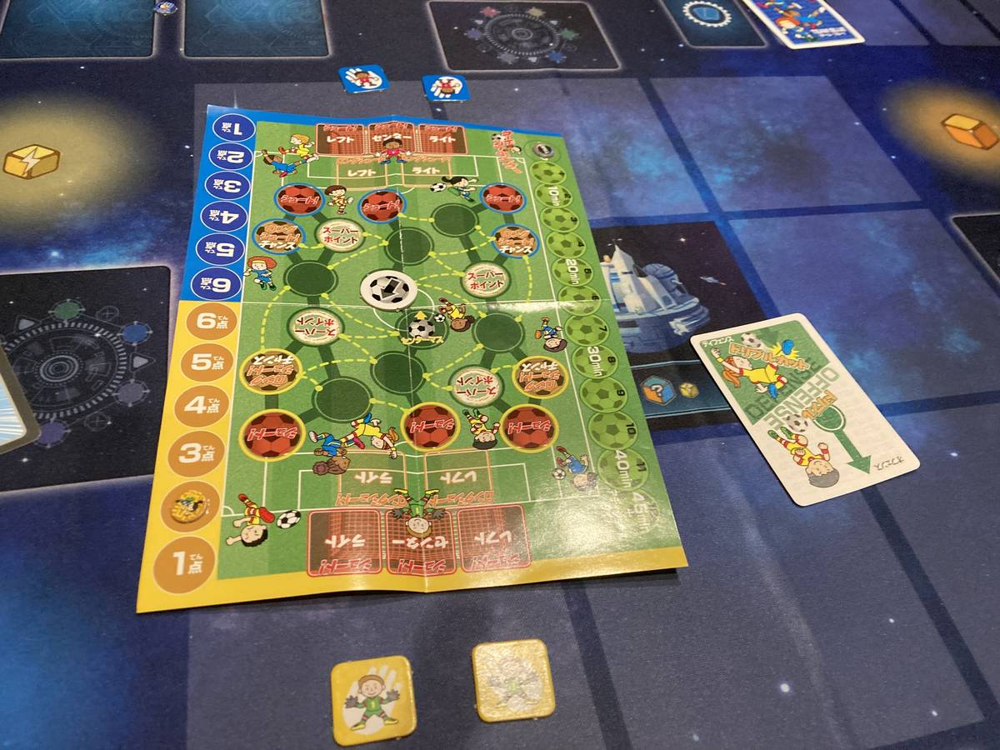
출처: https://image-bodoge.cdn-hoobby.net/small_light(dw=auto,dh=900,cw=1200,ch=900,da=l,ds=s,q=70,cc=FFFFFF)/picture_484a7de8-9ef7-41f2-9bdb-5efa5c0fe138.jpeg
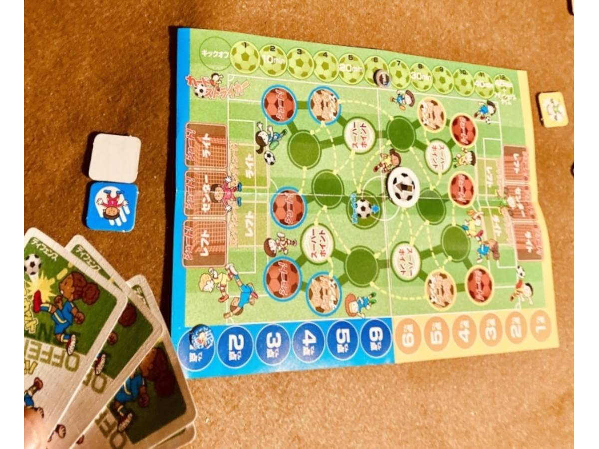
출처: https://image-bodoge.cdn-hoobby.net/small_light(dw=auto,dh=900,cw=1200,ch=900,da=l,ds=s,q=70,cc=FFFFFF)/picture_76b4db94-f52b-4fbf-99a9-157ce682b98d.jpeg

#### 출처
- 규칙 전문(인스트): https://bodoge.hoobby.net/games/card-striker/instructions/44924
- 게임 데이터·소개문: https://bodoge.hoobby.net/games/card-striker
- 리뷰 DKnewyork: https://bodoge.hoobby.net/games/card-striker/reviews/42998
- 리뷰 みなりん: https://bodoge.hoobby.net/games/card-striker/reviews/44708 , https://minarinbg.com/cardstriker/
- 다이소 상품 페이지(구성·크기): https://jp.daisonet.com/products/4550480145211
- 다이소 퍼블리싱 시리즈 페이지: https://www.daiso-syuppan.com/boardgame-4/
- 리뷰 t-machine: https://t-machine.jp/web-bungei/94934/
- BROAD 기사: https://broad.tokyo/news/21687

---

### 트럼프 게임 "골" (トランプゲーム「ゴール」, 디자이너 미확인(전승/아마추어 규칙), 출판사 없음, 연도 미확인 — 소개 글 2020-09-06)

| 항목 | 값 |
|---|---|
| 인원 | 2인 |
| 플레이 시간 | 미확인 (13라운드 × 2 하프) |
| 연령 | 미확인 |
| 형태 | 카드 (일반 트럼프 1벌) |
| 근거 수준 | 상세 인스트 (note 필자 ぐんまみのる 가 규칙 전체를 서술) |

트럼프 한 벌로 하는 축구 모티프 심리전 게임. 필자 소개: "축구를 몰라도 되고, 카이지급 심리전을 가볍게. 지금까지 소개한 것 중 가장 간단한 규칙."

#### 구성물
- 트럼프 1벌 (사용하는 것은 ♡A~K 13장, ♠A~K 13장)
- 코인 (마커가 될 만한 것이면 무엇이든)
- 축구 코트를 그린 종이. 사진에서는 A4 종이에 손으로 그린 코트: 중앙선, 센터 마크, 양쪽 페널티 박스, 골. 본문 설명으로는 볼 위치 구역이 **검정(미드필드) → 노랑(페널티 에어리어) → 파랑(골 에어리어)** 3단으로 각 진영에 있다. 즉 중앙선 기준 양쪽으로 3칸씩.

#### 셋업
- ♡A~K 를 한 명에게, ♠A~K 를 다른 한 명에게 (각 13장 전부 손패).
- 코트 중앙선에 볼(코인)을 둔다. 상대 골에 넣으면 1점.

#### 턴 구조
- 매 라운드: 둘 다 손패(선수) 13장 중 1장을 골라 **뒤집어 세팅**, 둘 다 세팅 후 **동시 공개**.
- 강한 쪽이 이김. 이긴 쪽은 볼을 상대 코트 쪽으로 **1칸** 옮긴다.
- 비기면 볼은 안 움직이고 카드만 제거.
- 낸 카드는 제거(다시 못 씀). 13라운드로 손패가 다 떨어지면 전반 종료.
- 후반: 13장을 다시 손에 들고 볼을 중앙으로. 같은 일을 반복, 손패가 다 떨어지면 게임 종료.
- 드로우 없음. 손패 13 고정.

#### 판정
| 대결 | 결과 |
|---|---|
| 숫자 카드(2~10) 끼리 | 큰 수가 이김 |
| 그림 카드(J,Q,K) vs 숫자 카드 | 그림 카드가 이김 |
| 그림 카드끼리 | K > Q > J |
| A vs 그림 카드 | **A 가 이김** |
| A vs 숫자 카드 | **A 가 짐** |
| 같은 랭크 | 무승부 (볼 정지) |
- 볼 이동: 최단 3연승으로 골(미드필드 → 페널티 → 골 에어리어 = 득점). 1번 지면 1칸 뒤로 (예: 노랑에 있을 때 지면 검정으로; 자기 미드필드에서 지면 상대 코트의 미드필드로 넘어감).

#### 슈팅과 득점
- 별도 슈팅 단계 없음. 파랑(골 에어리어)에 볼이 들어가면 1점.
- 득점 후 볼은 중앙에서 재개.

#### 시간 진행과 종료
- 전반 13라운드, 후반 13라운드. 후반 종료 시점 득점으로 승부.
- 동점 처리: **미확인** (원문에 없음).

#### 특수 상황
- 파울, PK, 오프사이드, 교체: 없음.

#### 평가와 교훈
- 필자 평: "골을 넣으려면 1번 이기는 걸로 부족하고 몇 번 이겨 볼을 운반해야 하므로 이길 곳과 질 곳을 판단해야 한다. 골 앞 공방에서 A 를 낼지 그림을 낼지, A 를 읽혀 숫자로 맞으면 진다. 쓴 카드를 외우면 상대 잔여 손패를 알 수 있어, 손패 상황·볼 위치·상대 심리를 읽어 냈을 때의 상쾌함이 크다."
- **가져올 점**: (1) 컴포넌트 0 에 가까운 최소 구성으로 "볼 트랙 + 동시 공개 비교" 만으로 축구의 진자(振り子) 감각을 냄. (2) 이긴 만큼 전진, 진 만큼 후퇴하는 1차원 트랙. (3) A 의 가위바위보식 순환(그림에 이기고 숫자에 짐)이 단순 대소 비교에 블러프를 넣음. (4) 사용 카드 비복원 → 카운팅과 자원 배분(어디서 강한 카드를 쓸지).
- **피할 점**: 동점 처리 규칙 부재. 볼이 골 에어리어에 있을 때 비기면 어떻게 되는지(정지) 외에 세부가 없음. 하프당 13라운드 고정이라 "시간" 감각이 카드 수와 동일.

#### 참고 이미지

출처: https://assets.st-note.com/production/uploads/images/34077631/rectangle_large_type_2_805847d559dbc8baa6256483dc2a7cc1.jpg
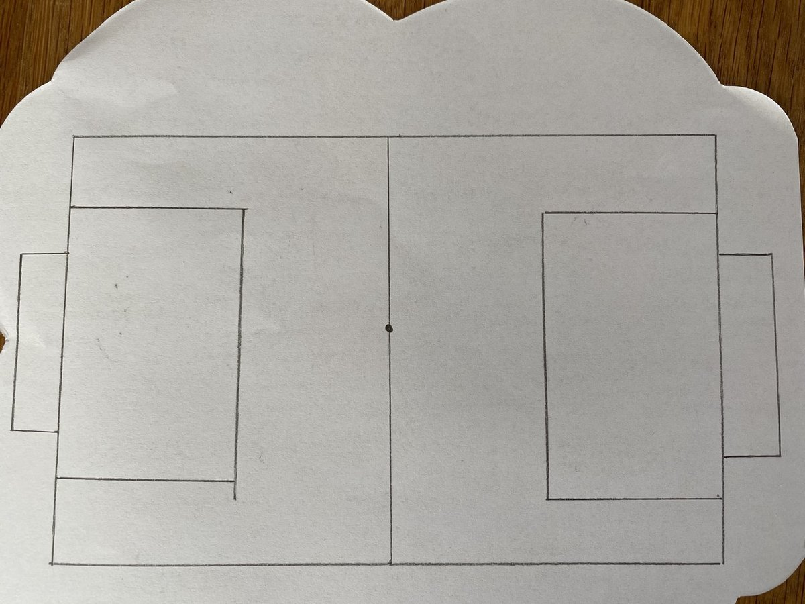
출처: https://assets.st-note.com/production/uploads/images/34078182/picture_pc_ad48fbd18f9697b2c97de14d5e1a0da9.jpeg
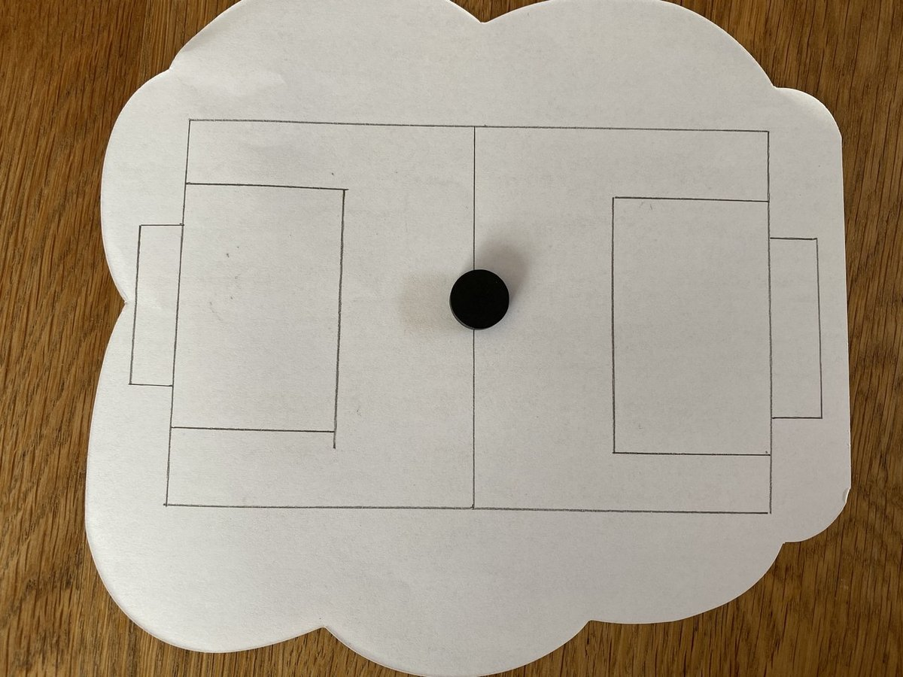
출처: https://assets.st-note.com/production/uploads/images/34078207/picture_pc_f84e4ff705b8590c6187a481b6f9c232.jpeg
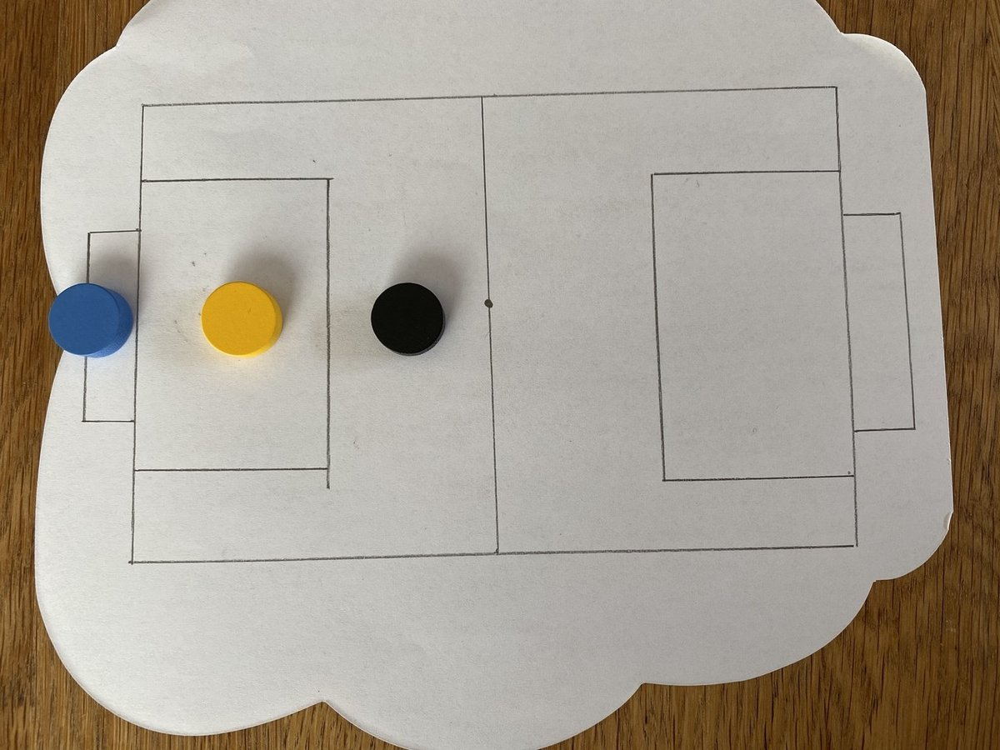
출처: https://assets.st-note.com/production/uploads/images/34078229/picture_pc_178d86c49298c5758f630f88ff2a3449.jpeg

#### 출처
- https://note.com/minoru_g/n/nf5ca59f45a68

---

### 사커 장기 티키·타카 (サッカー将棋「ティキ・タカ」, 齊藤 敬 = 만담가 宮田陽(미야타 요, 宮田陽・昇)의 본명, 발매원 미확인(발명학회 넷숍·陽の部屋 판매), 연도 미확인 — 상점 이미지 2021-10 등록)

| 항목 | 값 |
|---|---|
| 인원 | 2인 |
| 플레이 시간 | 미확인 |
| 연령 | 미확인 ("어린이부터 노인까지") |
| 형태 | 보드 (추상 전략) |
| 근거 수준 | 상점·소개문 (발명학회 넷숍, 陽の部屋) + 박스 뒷면 사진 판독 + BROAD 기사 한 단락 + 구매자 리뷰 2건. 규칙서 원문은 미확보 |

가격 2,000엔. 박스 문구 "考えて動かせ！", "漫チェスターP公認ゲーム"(맨체스터 U 엠블럼 패러디). 발명학회 페이지의 발명자 표기는 "齊藤 敬"; BROAD 기사와 위키백과는 만담 콤비 宮田陽・昇 의 宮田陽 이 고안했다고 하며, 위키백과에 宮田陽 본명이 齊藤 敬 으로 기재되어 있어 동일 인물. 개발 경위(발명자 담): "축구를 리얼하게 하려 할수록 규칙이 복잡해지는 문제가 있었는데, **축구 게임인데 볼 말을 마지막까지 움직이지 않는다** 는 규칙을 떠올려 해결했다."

#### 구성물 (박스 뒷면 기재)
- 필드 플레이어 말 18개 (청 9 / 적 9, 나무 원반)
- 골키퍼 말 2개 (청 1 / 적 1, 가운데 흰 구멍이 있는 원반)
- 볼 말 1개 (흰색 정사각 조각)
- 축구 코트 1장 (접이식 판)
- 설명서 1장
코트 구조(사진 판독): 점(교점)들을 가로·세로·대각선으로 이은 격자. 가로 9열, 세로 약 13행(정확한 행 수 미확인). 중앙에 노란 띠(하프웨이 라인). 양 끝 골라인 밖에 3점 폭의 골 영역. 각 진영에 ◇ 표시 5개(골라인 위 골 안쪽 3개, 그 앞줄 좌우 2개) — 의미 **미확인**.

#### 셋업
상점 사진의 배치: 골키퍼는 골 영역 중앙, 그 앞줄에 3명, 다음 줄에 2명, 하프웨이 직전 줄에 4명(4-2-3 형태로 읽힘). 볼은 하프웨이 라인 중앙 교점. 이것이 규정 초기 배치인지 예시인지 **미확인**.

#### 턴 구조
- BROAD 기사: "10개의 말을 번갈아 1칸 움직여, 선수가 **직선으로 패스 코스가 이어졌을 때** 슛 선언을 한다."
- 이동 방향(직교만인지 대각 포함인지), 말 종류별 이동 차이, GK 이동 규칙: **미확인**. 격자에 대각선이 있으므로 대각 이동/패스 라인이 존재할 가능성이 높으나 원문 미확인.

#### 판정
- 박스 뒷면: "골로 가는 길(道筋)이 생기면 '슛합니다' 라고 선언." / "패스 코스를 만들어! 골에 볼을 꽂아라!!"
- BROAD: "슛 선언을 당한 쪽은 그 코스의 어딘가를 막지 않으면 골이 들어가 패배. 슛은 장기의 왕수(王手)와 같다."
- 볼 말은 게임 내내 움직이지 않는다(발명자 담). 즉 볼은 시작 지점에 고정되고, 볼 → 선수 → 선수 → 골로 이어지는 직선 패스 코스가 성립하는지가 판정 대상.

#### 슈팅과 득점
- BROAD: "먼저 골을 넣으면 승리" (1골 결착).
- 구매자 리뷰: "골을 키퍼와 선수 두 명으로 막아 버리면 드로 게임이 돼서, 골 앞에는 키퍼만 들어갈 수 있다는 하우스 룰로 놀고 있다." → 골 폭 3점을 3개 말로 완전 봉쇄 가능.

#### 시간 진행과 종료
- 미확인 (1골 결착으로 읽힘).

#### 특수 상황
- 오프사이드 규칙 있음 (상점 페이지). 내용 **미확인**.
- 파울, PK, 세트피스, 교체: 미확인.

#### 평가와 교훈
- Yahoo 상점 리뷰 2건: "아이의 앞을 내다보는 힘을 기르려고 구입. 재미있게 놀고 있으나 골 봉쇄 드로 문제." / "아이 축구 전술 공부용. **규칙 상세가 없어서** 좀 더 알기 쉽지 않으면 어렵다. 어른은 바로 즐길 수 있고, 중학생 정도는 돼야."
- BROAD: "패스 코스를 잇는 데 머리를 쓸 듯. 『どうぶつサッカー』 본격판 느낌."
- **가져올 점**: "볼을 움직이지 않고 패스 라인의 성립만 본다" 는 발상 → 규칙량을 극단적으로 줄임. 슛 = 장기의 왕수(선언 → 상대가 막지 못하면 끝).
- **피할 점**: 골 앞 완전 봉쇄로 드로가 나는 문제(리뷰), 설명서가 얇아 초심자가 규칙을 못 채우는 문제(리뷰). 결정론적 규칙서를 쓸 때 반면교사.

#### 참고 이미지
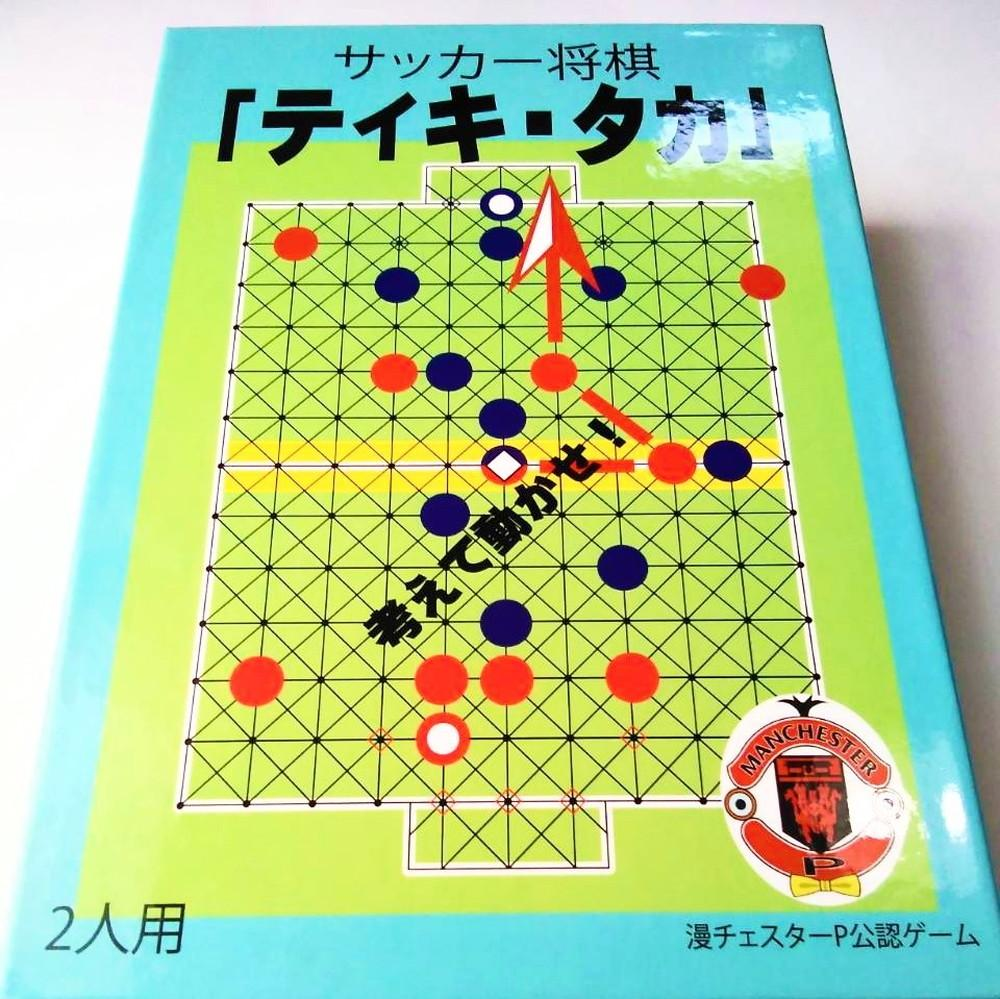
출처: https://hatsumei.sd1san.jp/cdn/shop/products/ko-37512-soccers_1500x.jpg
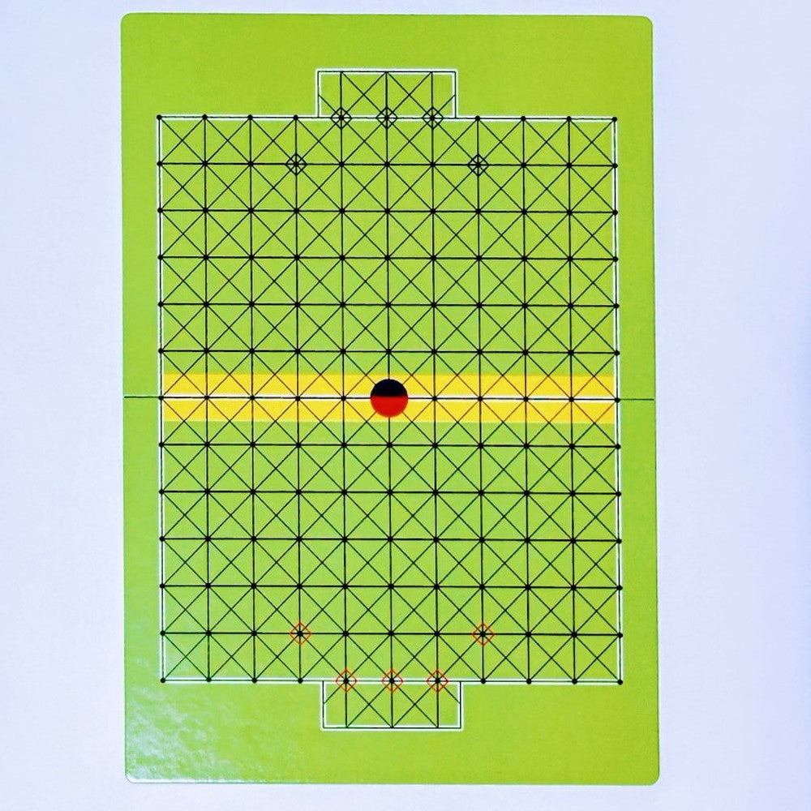
출처: https://hatsumei.sd1san.jp/cdn/shop/products/ko-37512-soccers_3_1500x.jpg
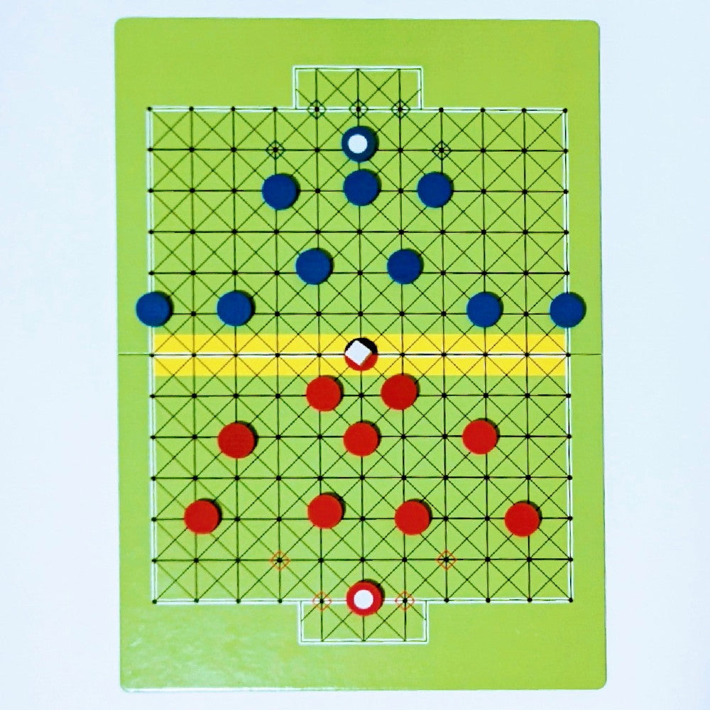
출처: https://hatsumei.sd1san.jp/cdn/shop/products/ko-37512-soccers_5_1500x.jpg
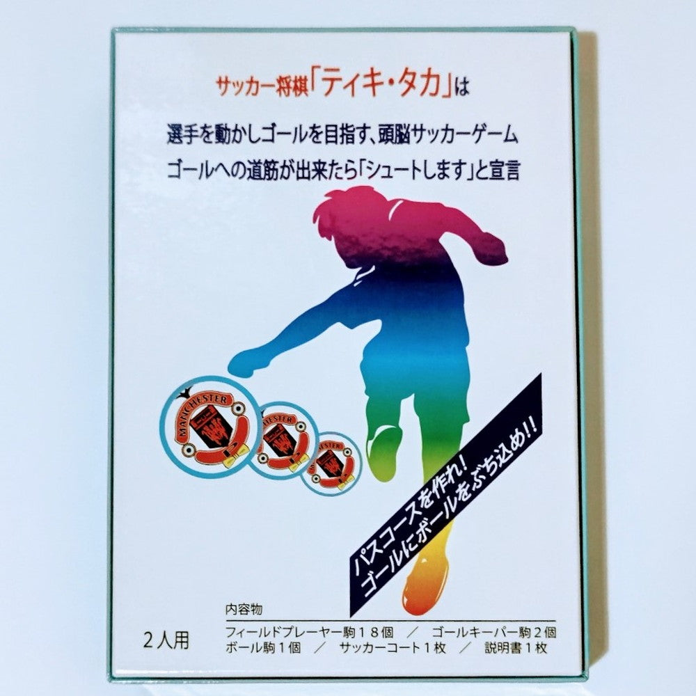
출처: https://hatsumei.sd1san.jp/cdn/shop/products/ko-37512-soccers_1_1500x.jpg

#### 출처
- https://hatsumei.sd1san.jp/products/ko-37512-soccers
- https://store.shopping.yahoo.co.jp/hatsumei-net/ko-37512-soccers.html
- https://yonoheya.base.shop/items/51363990 (제작자 상점)
- 설명 영상 (자막 없음, 내용 미확인): https://www.youtube.com/watch?v=iH97cvBe2Uc
- https://broad.tokyo/news/21687
- https://ja.wikipedia.org/wiki/宮田陽・昇 (본명 확인)

---

### 레지스타 / 사커 체스 (レジスタ / Regista → サッカーチェス / Soccer Chess, 디자이너 미확인, グラパックジャパン(Grapac Japan), 2002(레지스타) / 2005(사커 체스))

| 항목 | 값 |
|---|---|
| 인원 | 2인 |
| 플레이 시간 | 60분 전후(ボドゲーマ) / 30분(プレイスペース広島) / 30~60분(熊熊飯店) |
| 연령 | 12세 이상(ボドゲーマ, 広島) / 10세 이상(熊熊飯店) |
| 형태 | 보드 (헥스 보드 + 주사위) |
| 근거 수준 | 상세 리뷰 (ボドゲーマ はぐれメタル 의 규칙 요약 리뷰) + 블로그 2건 + 상점 소개문 |

レジスタ 발매 2002-04-26, サッカーチェス 발매 2005-09-30 (mignon 블로그의 Amazon 정보). 사커 체스는 "기본 규칙은 그대로, 롱슛 등 전개를 재미있게 하는 요소를 추가한 버전"(mignon). 헥스(6각) 보드. 보드는 2장 조합, 뒷면은 작은 풋살 코트. 박스 다국어(영/독/일). 절판, 프리미엄 가격.

#### 구성물
- 검색 요약에 인용된 상품 설명: 필드 보드(2분할) 1, 선수 말 30개(팀당 15), 볼 말 1, 주사위 2, 스코어 보드, 설명서. **원문 페이지 직접 확인 실패(Amazon 차단)** 이므로 수량은 참고치.
- 말 종류 5: GK, DF, MF, FW, R(레지스타 = 패서 MF). 포지션별 능력 보정.
- 사커 체스 박스 사진: 필드에 11 vs 11 + 보드 밖 교체 말(청 3, 적 2 보임), 주사위 청/적 각 1.

#### 셋업
- 포메이션 자유(mignon: 4-2-3-1 vs 4-3-3 예. "현실과 달리 엉뚱한 포메이션이 유리한 듯").
- 초기 배치 규정, 킥오프 절차: **미확인**.

#### 턴 구조 (はぐれメタル 리뷰 기준)
- 1턴에 **이동 2회까지**. 이동 거리 1~3칸(레지스타는 1~2칸). 적 말을 뛰어넘을 수 있고, 빈 칸으로만 이동. 원칙 1선수 1회 이동이나, "볼을 받기 위해 이동 → 볼을 받으면 재이동" 가능.
- 볼을 가진 채 골까지 이동하면 무조건 골.
- 이동 외 아래 행동을 "가능한 한 몇 번이든" 할 수 있다(패스는 이어지는 한 무제한 — mignon):
  - **숏패스**: 1~3칸 앞 아군에게. 적과 접촉(인접)한 아군에게는 불가. 다른 선수 머리 위 통과 불가. **레지스타**는 1~9칸을 숏패스로.
  - **롱패스**: 1~9칸(아군일 필요 없음 = 클리어 가능). 착지점에서 보정(주사위 산포). 아무도 없으면 흘러나온 볼(こぼれ球). 머리 위 통과 불가. 레지스타는 롱패스 불가.
  - **슛**: 1~3칸 앞의 적 골로. **키퍼가 골 지점에서 4칸 이상 떨어져 있으면 무조건 골.** 3칸 이하면 주사위 듀얼: 공격 승 = 골, 패 = 볼 상실·상대 골킥. FW 가 슛하면 +2.
  - **미들슛**: 1~6칸. 착지점 보정. 필드에 떨어지면 슛 불성립·흘러나온 볼. 필드 밖이면 빗나감(별명 "우주개발"), 상대 턴·골킥. 골 에어리어에 들어가면 키퍼 4칸 이상 → 골, 3칸 이하 → 듀얼(GK +2, FW +2).
  - **태클**: 인접한 적에게 볼 탈취 시도, 주사위 듀얼. MF 가 볼 보유 시 MF +2, DF 가 뺏을 때 DF +2. 1선수 1턴 1회.
- 熊熊飯店: "번갈아 선수 말을 이동, 태클·슛 성공 판정에 주사위."
- BROAD: "선수 2명까지 움직일 수 있고, 이동/드리블은 2회까지인 액션 포인트제. 롱패스·태클 시 주사위. 포지션마다 성공률이 다르다."

#### 판정
- 주사위 듀얼: 양쪽이 굴려 큰 쪽. 동점이면 결착까지 재굴림. 보정치는 위 표.
- 헥스 6방향 이동/드리블(mignon).

#### 슈팅과 득점
- 위 슛/미들슛 규칙. 골 후 재개 절차: **미확인**.

#### 시간 진행과 종료
- 사커 체스: "15턴 종료 시점에 득점 많은 쪽 승"(プレイスペース広島) / "전후반 30턴"(mignon; 전후반 합계로 읽히나 미확인). 레지스타의 턴 수: **미확인**.
- "스코어리스 드로가 꽤 많다"(mignon).

#### 특수 상황
- **오프사이드** 있음: 이 게임의 오프사이드 라인은 (GK 제외) 적 최후미의 **1칸 앞** (대각 칸이 있어 2칸으로도 불림). 리뷰어가 "독자적이라 축구를 아는 사람도 혼란" 이라고 지적. 오프사이드 트랩 가능(mignon).
- **교체**: 실제 축구처럼 3명까지.
- 골킥: 슛 실패/빗나감 후 상대 골킥. 코너킥·스로인·파울·PK: **미확인**.

#### 평가와 교훈
- ボドゲーマ 플레이감: 운 3, 전략 5, 심리 2, 공방 2. 리뷰어: "게임보다 시뮬레이터. 감독이 전술 연구에 쓸 것 같다. 잘 만들었지만 MF·DF 가 강하고 FW 는 위협이 없어 없어도 될 정도, GK 도 약함. 오프사이드 라인이 복잡." 제안: 이동 3회, 볼 보유 시 FW 외 1~2칸·FW 1~3칸, 오프사이드는 실제 축구식, FW 에 루프슛(+2 없음), GK 태클 +2, 골 듀얼 동점은 코너킥.
- 熊熊飯店: "체스 좋아하는 사람, 축구 좋아하는 사람, 2인 플레이 기회가 많은 사람에게."
- **가져올 점**: 포지션별 +2 보정으로 역할 차별화, "키퍼가 골에서 몇 칸 떨어졌나" 로 슛 자동 성공/듀얼을 가르는 단순 기준, 접촉(인접)한 아군에게 패스 불가 → 프리 만들기.
- **피할 점**: 독자 오프사이드 정의로 인한 혼란, 스코어리스 드로 빈발, 포지션 밸런스(FW·GK 약함). 카드 게임에서는 헥스 이동 자체가 무겁다.

#### 참고 이미지
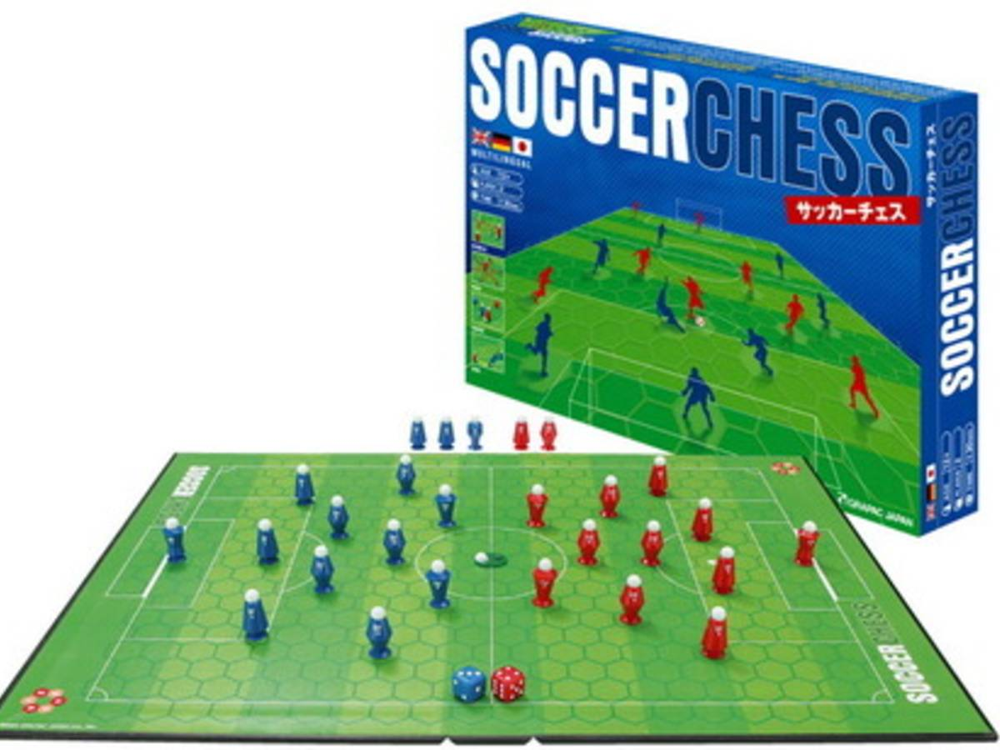
출처: https://image-bodoge.cdn-hoobby.net/small_light(dw=auto,dh=900,cw=1200,ch=900,da=l,ds=s,q=70,cc=FFFFFF)/picture_8f532cae-7f48-4997-840f-8af0208c6635.jpg

#### 출처
- https://bodoge.hoobby.net/games/soccer-chess (リ뷰 はぐれメタル 포함)
- https://mignon.hateblo.jp/entry/2011/07/26/132402 (사커 체스)
- https://mignon.hateblo.jp/entry/2013/07/29/225743 (레지스타)
- http://www.ps-hiroshima.com/board/soccerchess.htm
- https://kumagumahanten.com/regista/
- https://broad.tokyo/news/21687
- Amazon(접근 차단, 검색 요약만): https://www.amazon.co.jp/dp/B00030GSU8

---

### 현실에 다가가라! 마스목 사커 택틱스 (現実(リアル)に迫れ！マス目サッカー タクティクス, オオタキソウシ(오타키 소시), ベリーマッチ・トイ / Office Verymuch, 2015 봄 게임마켓)

| 항목 | 값 |
|---|---|
| 인원 | 2인 |
| 플레이 시간 | 20~90분(게임마켓) / 추천 90분(가이드) |
| 연령 | 10세~ (가이드: "10세 정도~ 성인 대상") |
| 형태 | 보드 (격자 + 종이 스탠드 말 + 주사위 1) |
| 근거 수준 | **규칙서 원문** (제작사 공개 게임 가이드 PDF 2015.11 개정판 8쪽, 이미지 판독) + 게임마켓·ボドゲーマ 제작사 게시 요약 |

가격 2,000엔(게임마켓) / 2,700엔(BASE, 품절). 디자인·일러스트·DTP 오타키 소시. "장기+축구". 게임마켓 2015 봄~2023 봄 출전. 2017 ver. 시뮬레이션 영상 존재. **주의**: 2015.11 가이드는 오펜스 2수·디펜스 3수이고, 게임마켓·ボドゲーマ 게시문(이후 개정으로 보임)은 오펜스 3수·디펜스 3수. 아래는 가이드 원문을 기준으로 하고 차이를 표기.

#### 구성물 (가이드 p.1)
- 게임 보드 1장 (격자 축구장. 가로 11칸 × 세로 약 16칸으로 보이나 정확한 칸 수 미확인. 골 뒤에 "SCORE" 칸)
- 선수 말 22개 (팀당 11, 종이 스탠드, 등번호 1~11. 큰 숫자 면이 등 = 뒤)
- 스코어 말 8개 (표0/裏1 ×2, 표2/裏3 ×2, 표4/裏5 ×2, 표6/裏7 ×1, 표8/裏9 ×1)
- 예비 말 2개
- 볼 말 1개 (선수가 볼을 키핑하면 볼 위에 선수를 올린다 = キープ選手)
- 주사위 1개 (d6)
- 스페셜리스트 카드 6장
- 게임 가이드 1부

#### 셋업 (가이드 p.6 킥오프)
1. 양 팀, 센터(하프웨이) 라인을 사이에 두고 자기 진영 칸에 11명 배치. 1칸 1명, 상대 골 쪽을 향해. 포메이션 자유. 단 **등번호 1 은 골키퍼** (자기 페널티 에어리어 안에서 GK 어드밴티지).
2. 선공·후공을 정한다. 선공은 센터 마크 칸에 선수와 볼을 둔다. 후공은 센터 서클이 걸리는 6칸을 제외한 자기 진영에 배치.
3. 게임은 센터 마크 위 키핑 선수의 **패스**로 시작(킥오프). 킥오프한 선수는 다른 선수가 한 번 볼을 만질 때까지 볼을 못 만진다.
4. 득점 후는 양 팀 재배치, 실점 팀의 킥오프.
5. 스페셜리스트: 게임 전 각 팀 3명 선출(방법 자유: 가위바위보로 순서를 정해 1명씩 교대 선택, 또는 뒤집어 3장씩). 카드는 보드 옆에 두고, 카드의 등번호 선수가 그 능력을 가진다. 카드는 양 팀 공용 1종(같은 번호 선수가 양 팀 모두 능력을 가짐).

#### 턴 구조 (가이드 p.2)
- 2인 대국, 교대. 자기 차례 = 턴. 볼을 상대 골에 넣으면 득점, 많은 쪽 승.
- 선수의 플레이 3종: **이동(드리블)**, **차지(볼 뺏기)**, **킥(패스·슛)**.
- **오펜스(볼 키핑 팀)**: 1턴에 "이동" "킥" 중에서 **2수** (1선수 1수씩 2명, 또는 1선수가 이동+킥 2수). "이동" 은 1선수 1턴 1회만. [게임마켓판: 3수. 3선수 1수씩, 또는 1선수 2수(이동+킥)+1선수 1수]
- **디펜스(볼을 쫓는 팀)**: 1턴에 "이동" "차지" 중에서 **1선수 1수씩 3선수 = 3수**. 디펜스는 1선수 2수 불가. [게임마켓판: 이동·차지 각 1선수 1수까지]
- 차지나 패스 미스로 디펜스가 볼을 키핑한 순간 **오펜스/디펜스 교대**. 그때까지의 턴이 리셋되고, 새 오펜스는 즉시 오펜스 턴 1수째부터 플레이(연속 턴). 루즈볼이 되어도 디펜스가 한 번 키핑하지 않는 한 교대 없음.
- 익숙해지면 1턴 20~30초 제한 권장.

#### 판정
**이동(드리블)**: 전후좌우대각 8방향 1칸(장기 왕과 같음). 키핑 선수가 볼과 함께 이동하면 드리블. 볼을 두고(루즈볼) 선수만 이동해도 됨. 1턴 1선수 1회.

**차지(볼 뺏기)** (p.3):
1. 디펜스가 키핑 선수의 **정면·양옆·대각 앞 5칸**에 있으면 차지 가능. 등 뒤 3칸에서의 차지(백 차지)는 파울 → 상대 프리킥.
2. 어느 선수가 차지할지 선언(콜).
3. 서로 주사위를 굴려 **큰 눈이 승**. **동점이면 차지한 디펜스 승**.
4. 승자가 키핑 선수가 되고 **두 선수의 위치가 교환**. 디펜스 승 → 즉시 오펜스가 되어 연속 턴. 오펜스 승 → 키핑 선수 그대로, 디펜스 턴 계속(차지한 선수는 그 턴 더 못 움직임). 차지 가능 위치라도 차지할지는 자유.
5. **수적 우위 어드밴티지**: 차지 5칸에 디펜스가 2명 → +2, 3명 → +3 (차지하는 것은 1명).
6. **페널티 에어리어 어드밴티지**: 디펜스가 자기 PA 안에서 차지 시 단독이라도 디펜더 +1, **골키퍼 +2**. 수적 우위와 합산.
- 금지: 다른 선수가 있는 칸에 들어가거나 밀어내기; 키핑 선수의 차지 5칸 전부를 아군으로 채우기; 자기 PA 안 GK 에게 백패스(아군이 찬 볼은 루즈볼이 되어도 GK 가 못 만짐. 상대가 튕긴 볼은 OK); 볼과 무관한 선수끼리 차지.

**킥(패스·슛)** (p.4~5):
- 키핑 선수는 8방향으로 킥. 아군 쪽 = 패스, 골 쪽 = 슛, 골에 들어가면 득점.
- 먼저 킥의 **종류와 방향을 콜**하고 주사위(인사이드 제외). 눈과 종류로 정해진 칸 수만큼 볼만 직선 이동, 키커는 제자리. 굴린 뒤 변경 불가.
- **GK 골킥 어드밴티지**: 자기 PA 안 GK 가 킥할 때 눈 +2 (인사이드 제외).
- 종류 3:
  - **인사이드 킥**: 1~2칸 직선, 주사위 없음, 확실. 코스 도중(2칸 이내)에 상대 선수가 있는 방향으로는 불가.
  - **로브 킥**: 높은 탄도 롱볼. 주사위 눈 1→3칸, 2→4, 3→5, 4→4, 5→5, 6→6 (1~3 에만 +2 로브 어드밴티지). 코스 위 선수 머리 위를 통과, 착지점까지 아무 간섭 없음. 착지 칸에 선수가 있으면 그대로 키핑 또는 **헤딩**(8방향 직선 1~2칸, 도중 선수 넘기 가능; 헤딩은 키커의 1수 안에 포함). 착지 칸이 골 안이면 득점, 골보다 멀면 크로스바 넘김 → 상대 GK 골킥.
  - **그라운더 킥**: 눈 = 볼 전진 칸 수. 강하지만 불안정. 코스 위 선수와의 거리 d(2칸 이상)에 대해: 눈 ≤ d−1 → 못 미침, 루즈볼. 눈 = d → 발밑 정확, 아군이면 패스 성립, 상대면 탈취. 눈 = d+1 → 원트랩 키핑(또는 8방향 1칸 흘리기). 눈 ≥ d+2 → 트랩 불가, 아군/적 무관하게 키커가 원하는 8방향으로 (눈−d)칸 튕김(원터치 패스·발리 슛 등 1수에 복수 플레이 가능). 키커 바로 옆(1칸) 선수에 맞으면: 눈 1~4 → 그 선수 키핑(상대면 탈취), 눈 5 → 1칸, 6 → 2칸 키커 방향 선택으로 튕김.
- **슛 판정**: 골 앞 격자에 칸별 "골에 필요한 주사위 눈" 표가 있다(슛 코스가 2방향/3방향인 칸 구분). 그라운더로 골까지 칸 수 이상 나오면 골, 부족하면 앞 칸에 루즈볼. 대각 코스가 골포스트에 닿는 특례: 밖→중앙 방향은 포스트 맞고 대각으로 튕김, 중앙→밖 방향은 포스트 옆을 지나 골킥.

**스페셜리스트 카드 6** (p.6): 2 파워플레이어(차지 강함: 단독 차지에도 +1 등), 7 드리블러(드리블 시 1수에 2칸), 8 스프린터(볼 없이 이동 시 1수에 2칸), 9 하이톨러(헤딩 강함: 주변 8칸에 착지하는 로브볼을 헤딩 가능), 10 게임메이커(인사이드 킥 3칸까지), 11 스트라이커(그라운더 킥 시 눈 +2).

#### 슈팅과 득점
- 위 킥 규칙으로 볼이 골 칸에 도달하면 득점. 스코어 말을 뒤집어/교체해 표시.
- 득점 후 재배치와 실점 팀 킥오프.

#### 시간 진행과 종료
- 전·후반 45분씩 90분(실시간)이 리얼하나, 시간이 없으면 전·후반 20분씩 40분, 또는 1골 승. 시간 내 미결착이면 PK전.

#### 특수 상황 (p.7)
- **스로인**: 볼이 터치라인 밖으로 → 마지막에 만진 쪽의 상대 턴, 나간 칸에서 세트플레이 절차로 필드 안 3방향 중 하나로. 스로인한 선수는 라인 건너 인접 3칸 중 하나로 이동해 즉시 참가(3칸 다 차 있으면 빌 때까지 못 들어옴). 직접 상대 골에 들어가면 무득점·상대 골킥, 자기 골이면 상대 코너킥.
- **코너킥**: 볼이 골라인 밖, 마지막 터치가 디펜스 → 새 오펜스 턴, 코너 아크 칸에서 세트플레이, 3방향.
- **프리킥**: 백 차지, 오프사이드 등 파울 → 그 지점 칸에서 상대 직접 FK(모두 직접 FK). 자기 PA 안 파울은 PK.
- **오프사이드**: 오펜스 선수가 (GK 제외) 상대 최후미 디펜더보다 상대 골에 가까운 위치에서 **뒤에서 온 패스를 받았을 때**. 스로인·코너킥·골킥은 제외.
- **골킥 1**: 볼이 골라인 밖, 마지막 터치가 오펜스 → 상대 턴, 골 에어리어 모서리 칸에서 GK 가 세트플레이. PA 안 GK 킥 +2.
- **골킥 2**: GK 가 자기 PA 안에서 볼을 캐치(키핑)한 순간 공수 교대, GK 가 세트플레이 절차로 골킥. 이때만 1수째 GK 이동 + 2수째 킥 허용.
- **세트플레이 공통 절차**: ① 키커와 볼을 규정 칸에 배치 ② 오펜스는 다른 아군을 임의 수만큼 빈 칸에 재배치 ③ 디펜스도 **같은 수**만큼 재배치 ④ 키커 턴으로 재개, 그 턴 1수째 또는 2수째에 킥. 키커는 다른 선수가 만질 때까지 못 만짐.
- **PK**: 디펜스가 자기 PA 안에서 파울, 또는 동점으로 시간 종료 시. 키커와 볼을 페널티 마크 뒤 칸에. GK 는 골 네트에 그려진 주사위 숫자(1~6) 칸 중 하나 앞에 서서 **키커의 눈을 예상**. 키커가 굴려 1 → 골 밖, 2~6 → GK 예상과 일치하면 캐치, 아니면 득점(성공률 4/6). PK전은 5명씩, 많이 넣은 쪽 승.
- **비기너 룰** (p.8, 어린이용 히라가나): 1턴에 3종 중 1수만, 킥은 방향만 콜하고 주사위, 나머지는 축약.

#### 평가와 교훈
- BROAD: "주사위 운에 휘둘리는 추상 게임 같은 느낌."
- 게임마켓 소개: "의지와 운의 균형이 절묘. 리얼 축구의 전개가 눈앞에."
- **가져올 점**: (1) "눈 = 거리 → 정확, +1 → 트랩, +2 이상 → 튕김" 처럼 주사위 눈과 목표 거리의 **차이**로 결과를 정하는 그라운더 판정표. (2) 로브 킥 눈 매핑(1→3 … 6→6)으로 최소 사거리 보장. (3) 차지 동점 = 수비 승, 수적 우위 +2/+3, PA 안 +1/GK +2 등 **가산 보정만으로** 상성을 표현. (4) 세트플레이 재배치 "오펜스 n명 → 디펜스도 n명" 대칭 규칙. (5) PK 를 "GK 가 눈을 맞히면 캐치" 로 4/6 확률 고정.
- **피할 점**: 규칙 8쪽·상황별 예외(골포스트 특례, 골킥 2 예외 등)가 많아 카드 게임에는 과함. 실시간 90분 권장은 경량 게임과 반대.

#### 참고 이미지
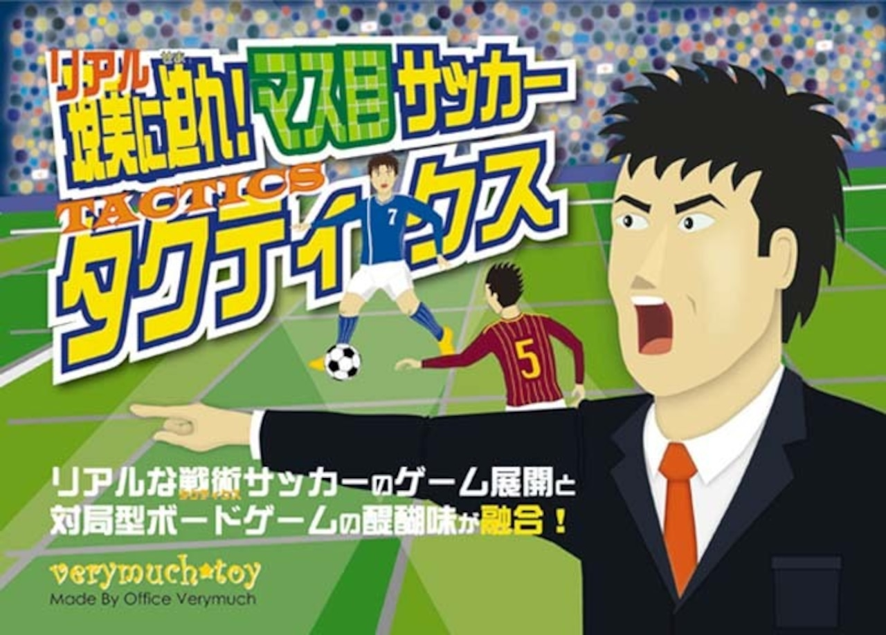
출처: https://baseec-img-mng.akamaized.net/images/item/origin/fc7ea4eccecedbd692a6d36455d45d29.jpg
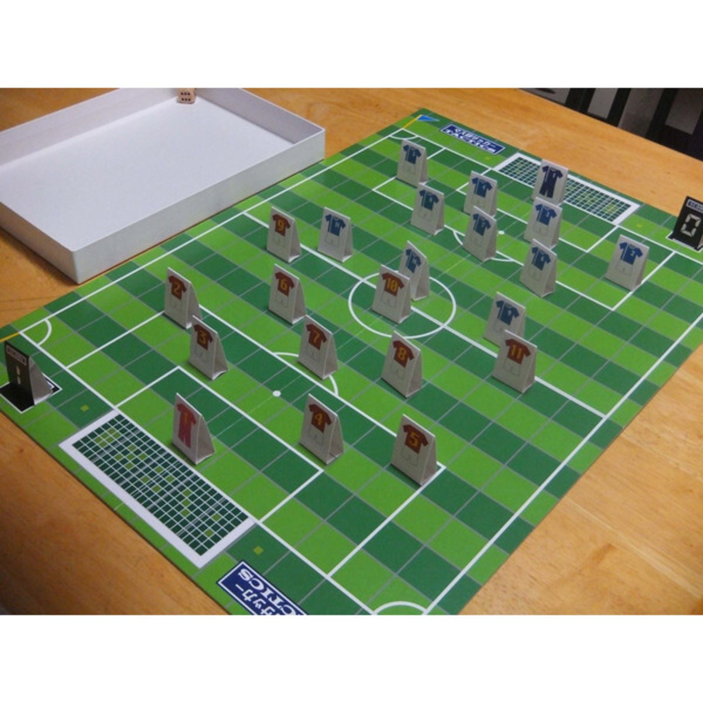
출처: https://baseec-img-mng.akamaized.net/images/item/origin/b048f0b6e3aefd703d58963ac83a22cf.jpg
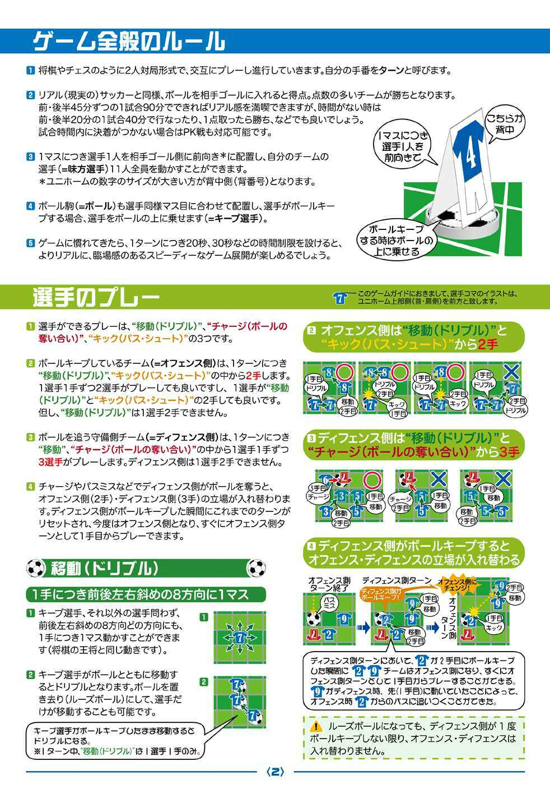
출처: http://verymuch.org/toy/soccer/guideP1-8.pdf (2쪽)
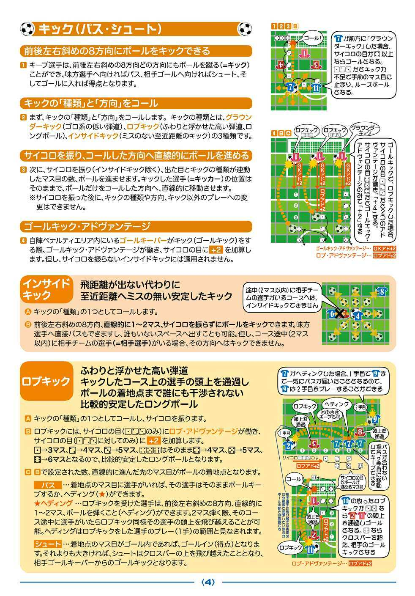
출처: http://verymuch.org/toy/soccer/guideP1-8.pdf (4쪽)

#### 출처
- 게임 가이드 PDF(2015.11 개정판): http://verymuch.org/toy/soccer/guideP1-8.pdf
- 게임마켓 게임 페이지(주요 규칙): https://gamemarket.jp/game/250
- ボドゲーマ 제작사 인스트: https://bodoge.hoobby.net/games/square-soccer-tactics-verymuch/instructions/18139
- BASE 상점: https://verymuchtoy.base.shop/items/51305798
- 제작사 블로그(규칙 개정 기록 106건): https://ameblo.jp/verymuch-toy/theme-10089333584.html
- 2017 ver. 시뮬레이션 영상: https://www.youtube.com/watch?v=24Lp7RgLTPM
- https://broad.tokyo/news/21687

---

### BROAD 기사 수록 3작 (간단 정리)

#### 동물 사커 (どうぶつサッカー / Dōbutsu Soccer, しんどうこうすけ(신도 코스케), 幻冬舎エデュケーション(프로듀스 エイベックス・スポーツ), 2014-11-28)

| 항목 | 값 |
|---|---|
| 인원 | 2인 |
| 플레이 시간 | 5분(ボドゲーマ·BROAD) / 15분(bged) |
| 연령 | 5세 이상 |
| 형태 | 보드 (추상, 나무 말) |
| 근거 수준 | 상세 리뷰·기사 (ケータイWatch 규칙 열거 + 4Gamer 보도자료 + ボドゲーマ 소개문) |

1,500엔+세. 일러스트 藤田麻衣子(『どうぶつしょうぎ』와 같은 일러스트레이터. 세계관만 공유, 작자·규칙은 별개).

- **구성물**: 동물 말 6개(さる×2, うさぎ×2, りす×2, 나무), 볼 말 1(나무), 코트 판 1(나무), 놀이법 가이드. 코트는 **5×3 칸**(세로 5, 가로 3), 양 끝에 골.
- **셋업**: 3 vs 3. 볼은 중앙. 초기 배치 규정: 미확인(사진: 각 팀 뒷줄~중간에 3개).
- **턴**: 자기 동물 말 1개를 전후좌우대각 **8방향 1칸** 이동. 다른 말이 있는 칸 불가. 이동한 칸에 볼이 있으면 **말에 그려진 방향으로 볼을 1~2칸 킥**(중간 말을 뛰어넘을 수 있음). 키핑·드리블 없음. 킥한 곳에 아군 말이 있으면 **연쇄 패스** 계속.
- **말 종류**: 원숭이(さる) — 패스 방향 대각 앞과 뒤만. 적진 최후열에 들어가면 뒤집어 "親子ざる" 로 승격, 1회에 2칸 이동. 다람쥐(りす) — 전후좌우 4방향. 토끼(うさぎ) — 옆을 포함한 전방 모든 방향(사령탑).
- **득점·종료**: 적진 안쪽 골에 볼이 들어가면 1점. 4Gamer(보도자료): "먼저 볼을 상대 골에 넣은 쪽 승". BROAD: "먼저 3골". ケータイWatch: "1점". 승리 조건 골 수는 **출처 간 불일치, 미확인**.
- **특수 상황**: 없음.
- **평가**: bged 3/5 "게임이 움직일 땐 한순간, 연쇄 패스로 볼이 단숨에 움직여 완급이 뚜렷. 볼 이동 예측이 어려워 독자적 사고 요구. 칸이 적어 어른에겐 조금 부족." ケータイWatch: "말은 1칸씩만 움직여 이상적 위치를 못 잡고 패스 코스가 막히는 상태가 이어지다, 상대 위치의 구멍을 찔러 연속 패스가 성공한 순간이 카타르시스." **교훈**: 말은 자유·볼은 제약이라는 역전, 연쇄 패스의 순간 폭발.

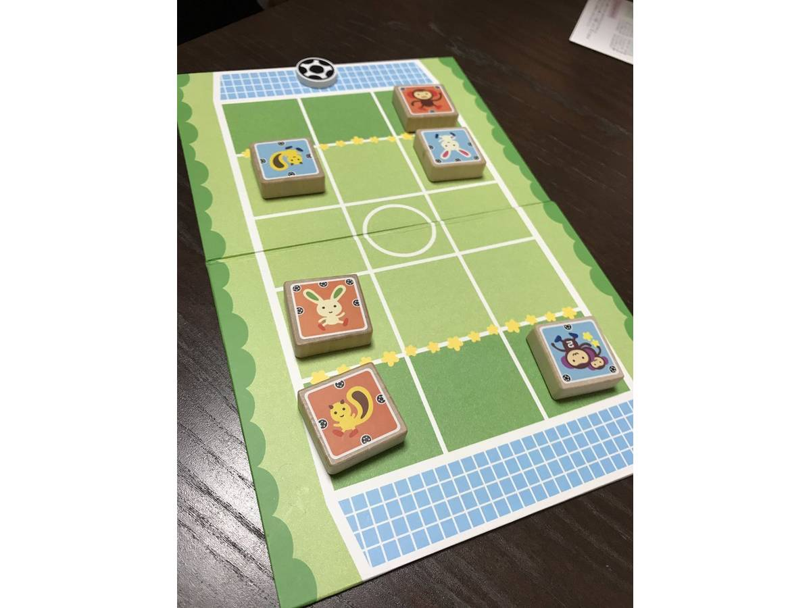
출처: https://image-bodoge.cdn-hoobby.net/small_light(dw=auto,dh=900,cw=1200,ch=900,da=l,ds=s,q=70,cc=FFFFFF)/picture_4ca6077d-2eda-4606-80e2-9325df85a561.jpg
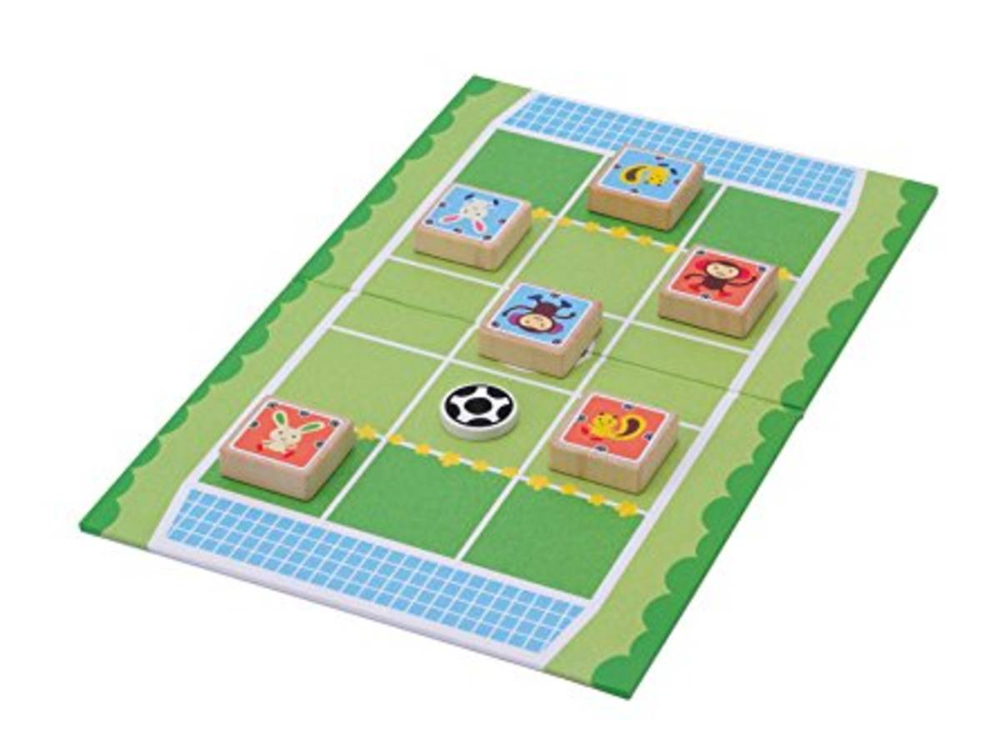
출처: https://image-bodoge.cdn-hoobby.net/small_light(dw=auto,dh=900,cw=1200,ch=900,da=l,ds=s,q=70,cc=FFFFFF)/picture_c9314262-c425-438f-91a2-b9223f880d68.jpg

출처: https://k-tai.watch.impress.co.jp/docs/column/todays_goods/687935.html , https://www.4gamer.net/games/999/G999905/20141125030/ , https://bodoge.hoobby.net/games/dobutsu-soccer , https://bged.info/doubutusakka , https://jellyjellycafe.com/games/animal_soccer , https://broad.tokyo/news/21687

#### 풋살 미플 (フットサルミープル / Futsal meeple, ナイトウ ソウヤ(Souya Naito), 동인(발매원 미등록), 연도 미확인(2015-01 트윗 존재))

| 항목 | 값 |
|---|---|
| 인원 | 2인 |
| 플레이 시간 | 30분 전후 |
| 연령 | 8세 이상 |
| 형태 | 보드 (격자, 미플 말, 주사위, 카드) |
| 근거 수준 | 상점·소개문 (ボドゲーマ 소개문 + BROAD 한 단락) |

아트워크 GAKIO, Minami. 메카닉(ボドゲーマ): 액션 포인트 시스템, 배틀 카드(공격치-방어치), 그리드 이동.
- 선수는 전부 미플, **GK 포함 5인** 팀. 선공·후공. 모든 행동은 **액션 포인트제**로 선택. 패스·드리블 컷과 슛 판정은 **모두 주사위 눈**. 수 시작 전에 카드 1장을 뽑아 조건이 맞으면 효과 발동. 팀별 특성, 액션 카드 존재.
- 소개문: "센터 서클에서도 슛이 가능하고, 롱패스는 사이에 있는 적의 수만큼 판정이 들어가는" 등 패미컴 축구 게임(캡틴 츠바사 풍) 오마주. "쿳! AP 가 부족해!"
- 종료: 먼저 3골(BROAD).
- 세부 규칙(AP 양, 판정표): **미확인**.
- 교훈: "롱패스는 경유 적 수만큼 판정" 은 카드 게임에도 옮기기 쉬운 규칙.

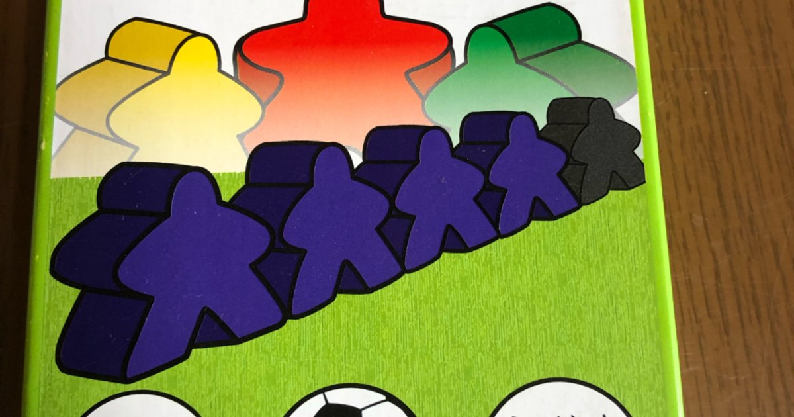
출처: https://image-bodoge.cdn-hoobby.net/small_light(dw=1200,dh=630,cw=1200,ch=630,da=s,ds=s,q=90,cc=FFFFFF)/picture_99b7a3ff-c595-4597-9fd4-e79b7a2ab05d.png

출처: https://bodoge.hoobby.net/games/futsal-meeple , https://broad.tokyo/news/21687

#### 11 (イレブン, Dieter Stein, nestorgames(스페인), 규칙서 ©2009)

| 항목 | 값 |
|---|---|
| 인원 | 2인 |
| 플레이 시간 | 실시간 2×20분 권장 (BROAD 표기 40분) |
| 연령 | 6세 이상(BROAD) |
| 형태 | 보드 (네오프렌 매트, 원반 말, d6 1개) |
| 근거 수준 | **규칙서 원문** (nestorgames 공식 영문 규칙 PDF 2쪽) |

BROAD 기사에서 "일본판" 으로 언급되나 별도 일본어판 존재 여부는 **미확인**(하카세 트윗은 nestorgames 판을 플레이).

- **구성물**: 게임보드(축구장, 선으로 이어진 점 네트워크; 중앙 7개 짙은 칸 = 센터 에어리어, 각 페널티 에어리어에 4개 짙은 칸, 골 칸), 선수 원반 2×10, 골리 2, 볼(흰색) 1, 녹색 d6 1. 타이머는 별매.
- **셋업**: 골리를 골 칸에. 선공이 선수 1개를 볼과 함께 킥오프 칸(중앙)에. 이후 교대로 자기 진영 빈 칸에 1개씩 배치(센터 에어리어 7칸 제외).
- **턴**: 주사위를 굴려 나온 수 = 이동/공격 포인트. 자기 선수(골리 포함)에게 자유 분배. 이동: 선을 따라 1칸 1점(교차점에서 방향 전환 불가; 자기 골 칸에는 자기 골리만). 공격(볼 없는 선수만): 상대 칸에 진입 1점 + 볼 탈취 1점 + 상대를 인접 칸으로 밀어내기 1점(인접 상대 공격 = 2점, 볼 가진 상대 = 3점). 아무도 없는 볼 칸 진입 = 1점. 포인트 부족하면 불가, 남기는 것은 가능.
- **골리**: 자기 PA(4칸) 안에서는 공격당하지 않으나 **볼을 보유할 수 없다** — 같은 턴에 반드시 슛(패스)해야 함. PA 밖에서는 일반 선수.
- **슈팅(패스)**: 턴당 1회, 포인트 불필요. 볼 보유 선수가 1 또는 2칸으로 킥. 상대가 점유한 칸을 통과 불가(그 상대가 볼을 얻음). 빈 칸으로도 가능. 아군 칸에 떨어지면 **즉시 연속 킥**(제한 없음). 연쇄의 마지막 킥만 골로(1칸). "슛→이동→슛" 불가, "이동→슛→이동" 가능.
- **득점**: PA 안 3개 짙은 칸 중 하나에서 골 칸으로 킥. 골리가 골 칸에 없으면 즉시 골. 있으면: 공격자가 주사위를 **숨겨서 1~6 세팅**, 골리 측이 "lo(1-2)/mid(3-4)/hi(5-6)" 콜. 맞히면 세이브(골리가 볼, 상대 턴), 틀리면 골. 골 후 상대 진영·센터 에어리어에 있던 선수 전부 회수, 골리 복귀, 실점 팀이 킥오프 칸에 선수+볼, 이후 교대 재배치.
- **종료**: 20분 경과 후 1 이 나올 때까지 계속, 1 이 나오면 하프 종료·진영 교대·재셋업(선공 교대). 다시 20분. 무승부 허용; 싫으면 2×5분 연장 후 **PK**: 5명씩 교대, 같은 lo/mid/hi 판정, 동점이면 2골 앞설 때까지.
- **평가**(Gameosity): "축구로 위장한 영리한 추상. 인접 아군에게 무제한 연쇄 패스로 필드를 가로지르는 순간이 백미. 주사위 1 vs 6 은 가혹. 실시간 타이머 대신 점수/행동 수 종료도 가능." **교훈**: 슛 판정을 "숨긴 주사위 vs 3분할 콜" 로 처리(카드 스트라이커의 3존과 같은 발상), 골리가 볼을 못 갖게 해 GK 를 단순화.

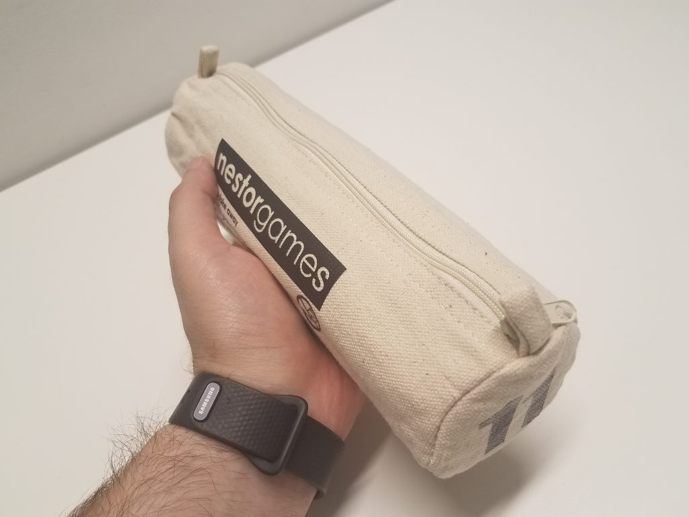
출처: https://www.gameosity.com/wp-content/uploads/2019/09/11-1-1024x768.jpg
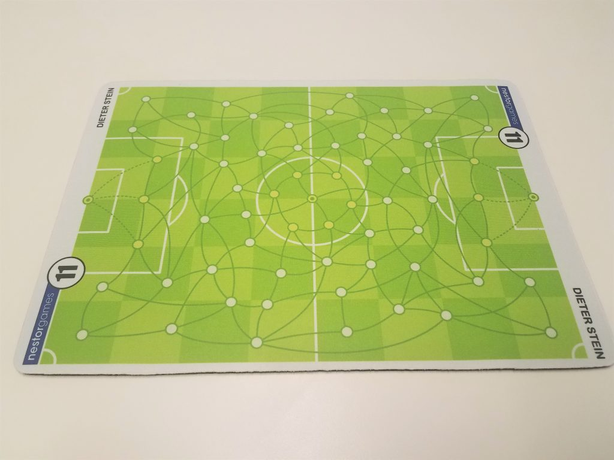
출처: https://www.gameosity.com/wp-content/uploads/2019/09/11-3-1024x768.jpg

출처: 규칙서 https://nestorgames.com/rulebooks/11_EN.pdf , https://www.gameosity.com/2019/09/20/11-review/ , https://broad.tokyo/news/21687

---

### 원탑 풋볼 (ONETOP FOOTBALL, 루카스 김(텀블벅 창작자명), 자체 제작(KIKAKUV SPORTS 표기), 2020-12 텀블벅 펀딩)

| 항목 | 값 |
|---|---|
| 인원 | 2인 |
| 플레이 시간 | 15분 |
| 연령 | 6세 이상 |
| 형태 | 카드 (45×68mm) |
| 근거 수준 | 상점·소개문 (텀블벅 API 메타데이터, 보드라이프 데이터, 커버 이미지 판독). 스토리 본문·규칙은 미확보 |

- 텀블벅 프로젝트 "축구 카드 게임 〈원탑 풋볼〉" (permalink `onetop_football_basic`, id 113633). 사전 공개 2020-12-03, 펀딩 2020-12-05 ~ 2021-01-04. 목표 2,000,000원, 모인 금액 793,000원(39%), 후원자 66명, **무산(failed)**. 태그: 축구, 보드게임, 카드게임, football, soccer, footballgame. 창작자 누적 후원자 259명(다른 프로젝트 포함. 보드라이프에 같은 시리즈 "원탑 베이스볼" 등록: 6세+, 2인, 15분, 평점 7.0).
- 한 줄 소개: "축구팬들뿐만 아니라 누구나 어디서든 가볍게 즐길 수 있는 축구 카드 보드 게임".
- 보드라이프: 원탑 풋볼 — 6세 이상, 2명, 15분, 종합 순위 10,5xx위(평점 없음).
- 커버 이미지 판독: 선수 카드에 **공격 / 패스 / 수비** 세 수치가 있고 각 수치에 +/− 부호가 붙는다(예: "게터 토마스" FW 공격 9+, 패스 7+, 수비 3+, 특수 텍스트 "멀티골 성공 시 3점 획득"; "에릭" GK 공격 4+, 패스 7−, 수비 9+). 포지션 표기 FW/GK. 별도로 경기장(페널티 박스) 그림 카드가 있다. 브랜드 표기 KIKAKUV SPORTS.

#### 구성물 / 셋업 / 턴 구조 / 판정 / 슈팅과 득점 / 시간 진행과 종료 / 특수 상황
- **미확인**. 텀블벅 스토리 페이지는 JS 렌더링이라 본문이 수집되지 않았고, 공개 API 는 메타데이터만 반환, 웹 아카이브 스냅샷 없음, 네이버 블로그 후기 없음. 확인된 것은 위 카드 수치 구조(공격·패스·수비 + 부호)와 포지션뿐.

#### 평가와 교훈
- 텀블벅 후원자 후기 1건: "초등학생과 간단히 져주면서 놀기 좋습니다. 성인들끼리는 좀 심심합니다만 가볍고 간단한 룰이 재미있습니다."
- **가져올 점**: 카드에 공격/패스/수비 3축 수치 + 포지션이라는 국내 시도가 있었다는 사실. **피할 점**: 어른끼리는 심심하다는 평 → 수치 비교만으로는 긴장이 부족.

#### 참고 이미지
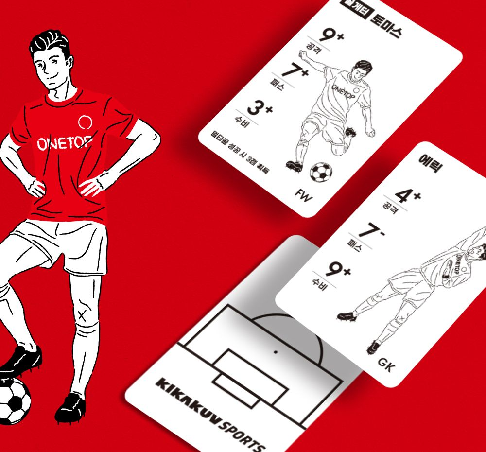
출처: https://img.tumblbug.com/eyJidWNrZXQiOiJ0dW1ibGJ1Zy1pbWctcHJvZCIsImtleSI6ImNvdmVyL2E5NGY2ZDNiLWU1YWItNGQ3Mi05ZjA2LWE0NjIxZjJjN2QwOS9jN2NiZjQ5Mi02Y2Y5LTRiN2MtOTIzNC02YmUzNzQzYzBkMGQuanBnIiwiZWRpdHMiOnsicmVzaXplIjp7IndpZHRoIjoxMDAwLCJoZWlnaHQiOjEwMDAsIndpdGhvdXRFbmxhcmdlbWVudCI6dHJ1ZSwiZml0IjpudWxsfSwicm91bmRDcm9wIjpmYWxzZSwicm90YXRlIjpudWxsfX0=
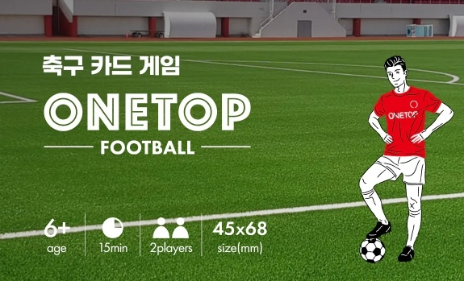
출처: https://img.boardlife.co.kr/wys2/swf_upload/2026/03/11/1607254026-259010.jpg

#### 출처
- https://tumblbug.com/onetop_football_basic (및 API https://tumblbug.com/api/v1/projects/onetop_football_basic)
- https://tumblbug.com/onetop_football_basic/story (본문 미수집)
- https://boardlife.co.kr/game/13905

---

### 그룹 A 횡단 요약 (간단한 축구 시뮬레이션 카드 게임에 쓸 재료)

| 게임 | 공수 전환 | 볼 진행 | 슛 판정 | 시간·종료 | 핵심 교훈 |
|---|---|---|---|---|---|
| 카드 스트라이커 | 같은 종류 카드 = 컷 → 즉시 교대 | 카드 숫자만큼 노드 이동 | 슛 카드 3존 vs 키퍼 칩 배치 | 하프 12턴 + 1점차 어디셔널 + PK | 양면 카드, 페인트=키퍼 제거 |
| 트럼프 골 | 승패로 1칸 전후진 | 3칸 트랙 | 없음(골 에어리어 도달) | 13장×2하프 | A 의 순환 상성, 비복원 손패 |
| 티키·타카 | 없음(교대 이동) | 볼 고정, 패스 라인 성립 | 선언 후 차단 실패 = 골 | 1골 결착 | 왕수식 슛 선언 |
| 레지스타 | 태클 듀얼 승 | 헥스 1~3칸, 패스 무제한 | GK 거리 ≥4 자동골, 아니면 듀얼 | 15턴(사커 체스) | 포지션 +2 보정 |
| 마스목 사커 | 차지 듀얼(동점=수비) | 8방향 1칸, 킥 3종 | 눈−거리 차이표 | 실시간 90분 또는 1골 | 거리차 판정표, PK 4/6 |
| 동물 사커 | 없음 | 볼은 킥으로만 1~2칸, 연쇄 | 골 칸 도달 | 1골(출처 불일치) | 말 자유·볼 제약 |
| 풋살 미플 | AP 제 | 격자 | 주사위 | 3골 | 경유 적 수만큼 판정 |
| 11 | 포인트 소모 공격 | 선 네트워크, 연쇄 패스 | 숨긴 주사위 vs lo/mid/hi | 실시간 2×20분 | 3분할 콜 슛 판정 |
| 원탑 풋볼 | 미확인 | 미확인 | 미확인 | 15분 | 공격/패스/수비 3축 수치 |

---

## 그룹 B. 영어권 카드 게임

### 소커즈 (Soccards: Soccer Tactical Card Game, 디자이너 미확인, Laptopcats Productions, 2026)

| 항목 | 값 |
|---|---|
| 인원 | 1 (AI 상대 싱글플레이. "No logins, no accounts") |
| 플레이 시간 | 실시간 6~10분(공식 사이트) / 6~8분(스토어). 가상 90분 |
| 연령 | 미확인 |
| 형태 | 디지털 (브라우저 HTML5, Android, CrazyGames 앱) |
| 근거 수준 | 공식 사이트 규칙 페이지(soccards.io/how-to-play, /tactical-guide) + Google Play·CrazyGames 소개문. 리뷰·Reddit·유튜브·Steam·itch 는 검색 결과 없음 |

개발사는 이탈리아 Laptopcats Productions(laptopcats.it). CrazyGames 출시 2026-05, 평점 8.6. Google Play 최종 업데이트 2026-05-21. 영어·이탈리아어. 오프라인 가능. 가챠·부스터 없음("Your style picks your deck for you").

#### 구성물
- **피치**: 자기 시점에서 수비(defence)·미드필드(midfield)·공격(attack) 3존. 내 수비존 = 상대 공격존. 매 라운드 "활성 존(active zone)" 은 하나.
- **포메이션 6종** → 존별 기본 점수(base points). 공식 표:

| 포메이션 | 수비 | 미드 | 공격 | 공식 설명 |
|---|---|---|---|---|
| 4-4-2 | 5 | 5 | 5 | 균형. 약한 존 없음 |
| 4-3-3 | 5 | 4 | 6 | 공격형. 미드필드 싸움 감수 |
| 5-3-2 | 6 | 5 | 4 | 내려앉아 역습 |
| 3-5-2 | 4 | 6 | 5 | 미드필드 장악 |
| 4-5-1 | 6 | 6 | 3 | 수비적 컵 매치 형태 |
| 3-4-3 | 4 | 5 | 6 | 공격적. 뒤가 얇음 |

- **전술 스타일 6종** → 덱 구성. "Every style ships 75 primary + 75 support cards." 소진 시 결정론적으로 리셔플("reshuffles deterministically"). 스타일별 카드 비중(정확한 매수는 미확인, 공식 설명은 정성적):

| 스타일 | 많음 | 지원카드 | 적음 |
|---|---|---|---|
| Balanced | 고르게 | 공격·수비 보너스 균형 | 없음 |
| Tiki-taka | Structured Play, Shot, Pressing | Creativity 다수 | Long Ball, Header |
| Counter-attack | Man Marking, Pressing, Long Ball, Shot | The Wall 다수 | Structured Play, Header |
| Gegenpressing | Wide Play, Forward Pass, Quick Break, High Press | Creativity 다수 | Low Block |
| Route One | Long Ball, Shot, Low Block, Quick Counter | Finisher 다수 | Man Marking, Quick Break |
| All-out Attack | Wide Play, Forward Pass, Header | Finisher, Creativity 다수 | Low Block, Quick Counter |

- **템포 3종**: Normal / Fast(모든 주 카드 시간 비용 +1) / Ultra(+2).
- **손패**: 항상 8장 = 주(primary) 카드 5장(짙은 파랑) + 지원(support) 카드 3장(흰색). 라운드마다 5+3 으로 보충.
- **주 카드 3역할**
  - Build up: 공격값 카드. 수비존·미드존에서 전진용. 볼 소유 시에만. 예: Structured Play, Forward Pass, Long Ball.
  - Recover: 수비값 카드. 볼 회수용. 비소유 시에만. 예: Tackle, Pressing, Low Block.
  - Finish: 공격값 카드. 공격존에서 슛. Long Shot 은 미드존에서도. 예: Shot, Header, Long Shot.
- **스토어에 열거된 카드 이름**: 공격 = Through Ball, Wide Play, Build-up, Long Shot, Header, Shot. 수비 = Low Block, Man Marking, Pressing, Quick Counter, Tackle, Gegenpress, High Press. 전술 가이드에 추가로 등장하는 이름: Structured Play, Forward Pass, Long Ball, Quick Break, Quick Counter.
- **지원 카드 2종**
  - Bonus: 공격 또는 수비에 +1/+2 (예: Focus, High Focus +2, The Wall +1, Creativity, Finisher), 또는 시간 진행 ±1분 (Quick Tempo −1, Slow Tempo +1). 시간 보정은 자기 쪽이 라운드를 이겼을 때만 적용.
  - Event: VAR Check(상대 골을 재판정 "re-rolls an opponent goal"), Tactical Change(다음 라운드부터 포메이션 교체), Time Wasting(승패와 무관하게 +2분).
- 공식 이미지에 보이는 카드 값 예: Tackle 4(3'), Low Block 5(4'), Through Ball 4(3'), Shot 3(3'). **카드별 전체 값·매수 목록과 상성표는 공개되지 않음 → 미확인.** 판정은 가위바위보식 상성이 아니라 점수 마진 비교다.

#### 셋업
킥오프 전 포메이션·스타일·템포 선택. 볼 소유는 항상 한쪽에만 있다. 8장 손패로 시작.

#### 턴 구조
라운드 단위, 양측 동시.
1. **Phase 1 Discard(선택)**: 최대 2장을 표시해 버리면 즉시 교체 카드가 들어온다. 교체된 손패로 Phase 2 진행.
2. **Phase 2 Plan**: 주 카드 최대 1장 + 지원 카드 최대 1장 선택. 화면에 존 점수 미리보기.
3. **Confirm**: "PLAY 2 CARDS" 버튼. 상대(AI)도 병행.
4. **Reveal**: 동시 공개.
5. **Resolve**: 활성 존 점수 비교 → 마진 계산 → "rolls once" → 결과와 해설. 시계 진행.

#### 판정
- 각 측 점수 = **활성 존 기본 점수 + 낸 주 카드 값(있으면) + 보너스 카드(있으면)**.
- **일반 판정(슛이 아닌 경우)**: 소유측 대 비소유측 비교. "The bigger the margin in your favour, the more likely you'll get the outcome you want." → 마진이 클수록 원하는 결과 확률이 높아지는 확률 판정. 확률표는 미확인.
  - 소유측 승 → 존이 소유측 공격 방향으로 한 칸 전진 (수비→미드→공격).
  - 수비측 승 → 소유 교체, 존 유지.
  - 결정적 승리 시 존 하나를 건너뛰는 카드: Long Ball, Quick Counter, Quick Break.
- 예: 4-3-3 대 5-3-2 는 그쪽 필드에서 공격 6 대 수비 6 → 카드 전 마진 0.

#### 슈팅과 득점
- 소유측이 공격존에서 카드를 내면(또는 미드존에서 Long Shot) 슛. "Even an evenly matched attack has a strong chance of finding the net."
- 실패 시 4가지 결과 중 하나: 골키퍼 세이브 / 빗나감 / 코너(볼 유지, 공격존 유지) / 수비 회수. 각 확률 미확인.
- VAR Check 이벤트로 상대 골 재판정. 스토어 문구에 자책골 언급("own goals") 이 있으나 발생 규칙은 미확인.

#### 시간 진행과 종료
- 모든 주 카드에 시간 비용(예 3', 4'). 매 라운드 **승자의 주 카드 시간 비용**만큼 시계 진행. 승자가 주 카드를 안 냈으면 Normal 템포 기준 3분.
- Quick Tempo −1 / Slow Tempo +1 은 자기 쪽 승리 시만, Time Wasting +2 는 무조건.
- 90분 도달 시 종료. 하프타임, 인저리 타임, 종료 휘슬 연출(스토어). 공식 사이트에 "extra-time" 언급이 있어 연장이 존재하는 것으로 보이나 조건은 미확인.
- 흔한 스코어 1-1, 2-1, 3-2 (스토어).

#### 특수 상황
- 코너: 실패 결과 중 하나. 볼 유지·공격존 유지.
- 포메이션 교체: Tactical Change 이벤트, 다음 라운드부터.
- 파울, PK, 오프사이드, 교체, 경고: 언급 없음 → 미확인.
- 동점 처리: 미확인.

#### 평가와 교훈
리뷰가 없어 공식 문서 기준.
- 가져올 점: **존 3개 + 포메이션 기본 점수 + 카드 1장 + 보너스 1장 = 한 번의 덧셈**으로 라운드가 끝나는 구조. 시간 비용을 카드에 인쇄해 "이긴 카드의 시간만큼 시계가 간다" 는 방식은 90분 시뮬레이션을 카드 수로 자연스럽게 제한한다. 소유 여부에 따라 낼 수 있는 카드 종류(Build up/Recover)가 갈리는 것도 손패 관리의 긴장을 만든다.
- 피할 점: 결과가 "마진에 비례한 확률 + 한 번의 굴림" 이라 규칙서만으로는 결과가 하나로 정해지지 않는다. 종이 게임으로 옮기면 마진→결과 표를 명시해야 한다. 카드 목록·상성이 공개되지 않아 밸런스 근거를 옮겨올 수 없다.

#### 참고 이미지
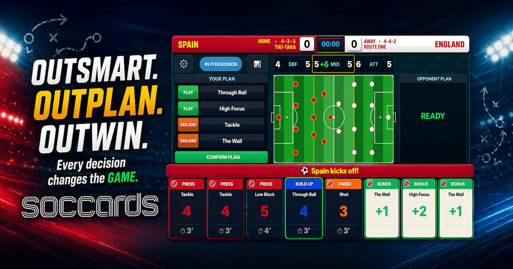
출처: https://soccards.io/assets/img/og-image.png
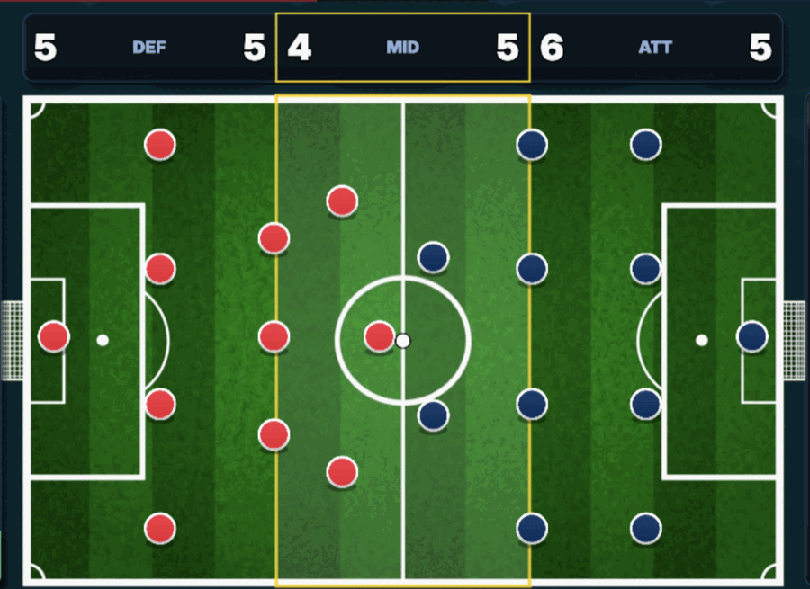
출처: https://soccards.io/assets/img/pitch.png
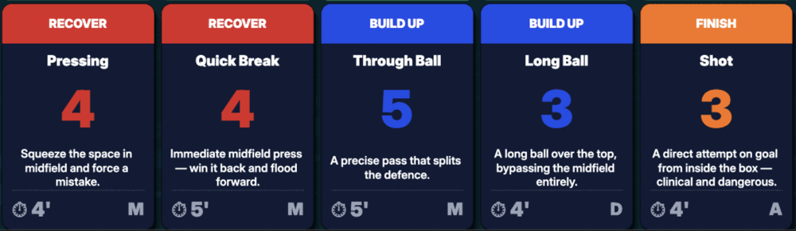
출처: https://soccards.io/assets/img/hand-primary.png
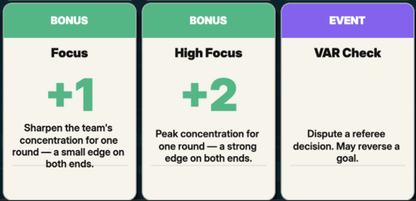
출처: https://soccards.io/assets/img/hand-support.png

#### 출처
- https://soccards.io/how-to-play/ (규칙 페이지)
- https://soccards.io/tactical-guide/ (포메이션 표, 스타일별 덱 구성)
- https://soccards.io/
- https://play.google.com/store/apps/details?id=it.laptopcats.soccards
- https://www.crazygames.com/game/soccards

---

### 타임 볼트 사커 (Time Vault Soccer, Scott Shea, Sneaky Prawn Games → Silo 10 Games, 2018)

| 항목 | 값 |
|---|---|
| 인원 | 2 ("Boss" 2명). 컵·리그·시즌 포맷으로 다인 |
| 플레이 시간 | 30~45분(Dale Yu) / "45분에서 원하는 만큼"(공식) / 20~30분(BGG 요약) |
| 연령 | 8+ (Dale Yu 리뷰 표기) |
| 형태 | 카드 |
| 근거 수준 | 규칙서 원문(Official Rulebook 2nd Edition, 1st Printing, ©2023 Silo 10 Games, 9쪽 PDF) + 공식 Pro rules 페이지(2024-09-30 갱신) + Opinionated Gamers 리뷰 2건 |

디자인·그래픽 Scott Shea. 1판 카드는 ©2018/2020/2022 Sneaky Prawn Games, 2판 규칙서는 Silo10Games UK 제조·유통. 실존 선수(1950~90년대) 카드. 공식 사이트는 "BGG 축구 게임 중 최고 순위, 8.6/10" 이라 주장.

#### 구성물
- **스쿼드 1개 = 선수 16명 × 동일 카드 2장 = 32장**. 2팀 세트(예: Rivals England '66 vs Germany '90)는 64장 + 규칙서(Dale Yu: "64 cards, 1 rulebook").
- **카드 정보**(규칙서 9쪽 "Know your players"): ① 이름, 포지션(ATTACK/MIDFIELD/DEFENCE/GOALKEEPER, 측면 표기 C·L·R·SW), 별 등급 1~5 ② 국적, 클럽, "Ref's call" 기호(X / Y / R) ③ Attack·Defend 수치 ④ 능력 [특성] 과 스킬 텍스트 ⑤ 시즌 통계.
  - 예: Altobelli ATT 6/DEF 2, Oriali 3/6, Collovati 3/7, Scirea 4/8, Bein 6/3, Littbarski 5/3, Klinsmann 7/3, Bobby Moore 4/8, Cohen 3/5, Hunter 3/6, Gordon Banks(GK) 2/7, Duncan Edwards 5/5.
- **플레이 영역**: 각자 ATT Zone, DEF Zone, 가운데 Match Deck·Discard. Pro 규칙에서 Set Piece Zone 추가.
- 주사위·보드 없음. 동전 1개(킥오프 결정).

#### 셋업
1. 스쿼드 배정. 선발 11명 선언 → 11쌍 = **22장 Match Deck**. 상대가 리셔플 또는 컷.
2. 위에서 **5장 드로우** = Hand.
3. 동전으로 킥오프(선공) 결정.
4. (Pro) 벤치에 최대 5명 배치.

#### 턴 구조
- 자기 턴: Hand 에서 카드 1장을 앞면으로 ATT Zone 또는 DEF Zone 에 낸다. ATT 에 낸 카드들 = Attacking Move, DEF = Defending Move. 기존 Move 위에 겹쳐 합류하거나, 따로 놓아 새 Move 를 시작. Move 는 여러 개 만들 수 있다.
- 카드의 Special Skill 해결 → Match Deck 에서 1장 보충(손패 5장 유지. 카드 텍스트에 "maximum Hand size" 개념 존재) → 상대 턴.
- 같은 선수의 사본이 이미 필드에 있으면 손의 사본을 낼 수 없다. 대신 필드의 카드를 버리고 손의 사본을 다시 낸다.
- 킥오프로 새 Move 를 시작한 선수는 카운터당하지 않는다. 실점 후 기존 Move 에 합류하며 킥오프하면 카운터될 수 있다.

#### 판정
- **Power = Move 안 카드들의 해당 수치 합 + Special Skill 보너스.**
  - 예(규칙서): 공격 Bein 6 + Littbarski 5 + Klinsmann 7 + 스킬 4 = 22. 수비 Moore 8 + Cohen 5 + Hunter 6 + 스킬 4 = 23.
- **골키퍼**: Defending Move 에 있으면 같은 Move 의 다른 모든 카드의 인쇄 Defend 수치를 2배.
- **Ref's Call(동점)**: DEF Power = ATT Power 이면 발동. 수비측이 공격측 Hand 에서 카드 1장을 뽑아 그 카드의 기호를 본다.
  - X(기호 없음) = 플레이 온, 세이브 인정.
  - Y = 프리킥. 마지막 수비 카드에 옐로.
  - R = 페널티. 마지막 수비 카드 레드, 퇴장.
  - 뽑힌 카드는 항상 손으로 돌아간다.
- 스킬 예: Klinsmann "Too Clever" — ATT Move 에 낼 때 자기 ATT > 상대 DEF 합(보너스 제외)이면 Ref's Call: X = 프리킥 획득, Y 또는 R = 다이빙으로 옐로. Littbarski "Playmaker" — 같은 Move 의 다른 선수 +2 attack. Moore "Inspirational" — 수비 시 다른 수비 카드 +2, 공격 시 +1. Banks "Safe Hands" — 세이브의 마지막 카드로 쓰이면 소유권 유지.

#### 슈팅과 득점
- 슛 조건(카드가 달리 말하지 않는 한): ① 이번 턴에 그 Move 에 카드를 냈다(Shooting Card) ② Attacking Move 가 **3장 이상**.
- 상대가 카운터하지 않으면 슛 선언, ATT Power 공표. 상대가 **더 큰 DEF Power** 의 DEF Move 를 쓸 수 없거나 쓰지 않으면 **골**. 득점한 Move 는 버리고 상대가 플레이 계속(킥오프). 다른 카드는 필드에 남는다.
- 세이브 선택지: ① 아무것도 안 하고 실점 ② 기존 Defending Move 사용 → 세이브 ③ 손에서 **최대 2장** 을 내어 Defending Move 를 완성/생성(goalmouth scramble) → 세이브. 세이브 후 사용된 공격·수비 카드 전부 버림. 사용 안 된 카드는 남는다.
- **프리킥**: 수비 Boss 가 손에서 2장을 골라 들어 올린다. 공격 Boss 가 손에서 1장을 공개해 공격 카드로 선언하고, 수비 2장 중 하나를 골라 공개. 수비 카드의 Defend 가 더 높거나 GOALKEEPER 이면 세이브, 아니면 골. 세이브 → 공격측 소유 유지. 골 → 수비측 킥오프. 관련 카드는 버리지 않고 손으로 복귀.
- **페널티**: 프리킥과 같되 수비가 **3장** 제시.
- 손패가 바닥났으면 버린 더미를 섞어 뽑아 해결하고, 그 카드는 버린다.

#### 시간 진행과 종료
- 전·후반 2하프. 한 하프 = 양 Boss 의 Hand 가 모두 소진될 때까지(Dale Yu: "22장 덱을 한 번 돌리면 한 하프"). 후반 전 Match Deck 리셔플.
- **스토피지 타임**: 내 Match Deck 이 바닥나면 스토피지 타임. 상대가 아직 드로우할 수 있으면, 상대도 덱이 바닥나고 손패 매수가 같아질 때까지 내 턴을 거부할 수 있다.
- 양 하프 합산, 다득점 승. 동점이면 승부차기로 결정할 수 있다("may").
- **승부차기**: 종료 시점의 Match Deck 을 선수 쌍별로 나눠 Shooting Deck(ATT Zone)·Saving Deck(DEF Zone) 구성. Shooting Deck 에서 5명 = Shooting Hand. Saving Deck 에서 GK 선택, 나머지 섞어 4장 드로우 + GK = Saving Hand. 페널티 규칙대로 번갈아 슛/세이브. 공개된 카드는 버리고 Saving Deck 에서 보충(GK 는 Saving Hand 로 복귀). 5회씩. 동점이면 서든데스: 남은 Shooting Deck 에서 뽑아 한쪽 성공·한쪽 실패까지.

#### 특수 상황
- **반칙 획득 3경로**: ① 동점 Ref's Call ② 스킬 ③ 상대가 필드에 있는 카드의 2번째 사본을 냈을 때 — 내 다음 카드를 내기 전에 프리킥 선언 가능. 위반 카드 옐로·버림. 다른 카드가 나가기 전에 지적 못 하면 무효. "Just a talking to" — 재량으로 프리킥 대신 턴 다시 하게 할 수 있다.
- **경고·퇴장**: 한 경기 옐로 2회 또는 레드 1회 = 퇴장. 그 선수의 모든 사본을 즉시 제거. (Pro) 컵·리그·시즌에서는 다음 경기 출전 정지(교체 불가). 누적 옐로 3회도 다음 경기 정지 후 리셋.
- **교체(Pro)**: 경기당 최대 3회. 킥오프 전 벤치 최대 5명. 자기 턴 시작 시, 카드 내기 전에 손의 선수(Off) 를 벤치 선수(On) 와 교환. 턴 소모 없음, 들어온 선수는 이번 턴 사용 불가. Off 선수의 2번째 사본이 덱에 남아 있으면 드로우될 때 교체. 필드에 이미 나가 있는 선수를 교체하면 손의 사본 1장만 교체, 필드 사본은 대체 없이 버림. 동시 다수 교체 가능. 슛에 대한 반응으로는 불가.
- **코너(Pro, 선택 규칙, 2022-06 도입)**: 원문 — "When a shot is saved and no Free Kick (FK) is awarded - i.e., the Defending and Attacking Powers are equal, and the Ref's Call results in a yellow or red card, or a player skill awards one - compare the final Attacking card (the shooting card) with the final Defending card. If the shooting card's printed Attack Rating is greater than the defender's printed Defend Rating, the attacking team wins a corner kick." (문장이 자체 모순적으로 읽힘. 프리킥이 나지 않은 세이브에서 슛 카드 인쇄 ATT > 마지막 수비 카드 인쇄 DEF 이면 코너, 로 해석됨.)
  - 코너 진행: Set Piece Zone 에서 번갈아 1장씩 내어 **2장 공격 대 2장 수비** 구성. ATT 합 > DEF 합 → 골. DEF 합 > ATT 합 → 세이브. 같으면 "ball is bouncing around": 다음 카드를 계속 내며 개별 수치를 비교, 골 또는 세이브까지. 손패 소진 시 버린 더미 섞어 드로우. 해결 후 카드는 손으로 복귀(버린 더미에서 온 카드는 버린 더미로). Set Piece·Corner 스킬만 활성. GK 배수는 초기 2장 단계에서만. 바운싱 단계에서는 중복 카드 허용.
  - 키워드: Set Piece = FK, CK, PK. Clean Save = 세트피스로 이어지지 않은 세이브.
- **스쿼드 규정(Pro)**: 별 합계 Pro ≤ 26, Elite ≤ 32 (선수당 1회만 계산). Pro vs Elite 는 양 팀 ≤ 21. 드래프트: Playground Pick(번갈아 선택), Accrington Stanley Scramble(£100 예산 비밀 입찰, 최대 16명), Elite Squad(보유 카드로 자유 구성, 16명·32장, 선수당 한 버전).
- 부상: "Incident Deck" 확장 예정, 미출시.
- 오프사이드: 규칙 없음.

#### 평가와 교훈
Dale Yu(2019, 3회 플레이): "적은 구성물로 놀라운 깊이", "다른 전략 경로와 영리한 결정", 스쿼드 선택이 의미 있는 차이를 만든다. "game bag 에 넣을 만하다". 단점: 카드 미관이 떨어짐, 선수 선정이 어리둥절(유럽 배경 연대에 미국 선수), 통계가 카드를 어지럽혀 비축구팬을 혼란시킴. 2021 Rivals 리뷰에서도 "surprising amount of depth" 유지.
- 가져올 점: **보드 없이 "Move 에 카드를 쌓는다" 는 한 동작**으로 빌드업을 표현하고, 슛 조건을 "3장 이상 + 이번 턴에 카드를 냈을 것" 으로 못 박아 언제 슛인지 논쟁이 없다. 동점 처리를 "상대 손에서 1장 뽑아 기호 확인" 으로 해결해 주사위 없이 랜덤 반칙을 만든다. 골키퍼 = "같은 Move 의 다른 카드 2배" 는 한 줄로 GK 의 가치를 만든다. 프리킥/PK 의 "수비 2장/3장 중 1장 선택 후 공개" 는 심리전이 있으면서 판정은 결정론적이다.
- 피할 점: 스킬 텍스트가 많아 카드 읽기 부담이 크다(리뷰 지적). 코너 규칙 원문처럼 조건문이 길어지면 모호해진다. 하프 종료가 "양쪽 손패 소진" 이라 스토피지 타임 규칙(턴 거부)이 필요해졌다 — 시간을 덱 크기로 잡을 때 양측 덱 소진 시점 차이를 미리 설계해야 한다.

#### 참고 이미지
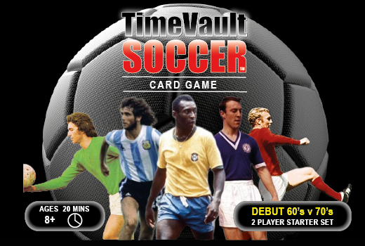
출처: https://opinionatedgamers.com/wp-content/uploads/2019/01/time-vault-soccer.png
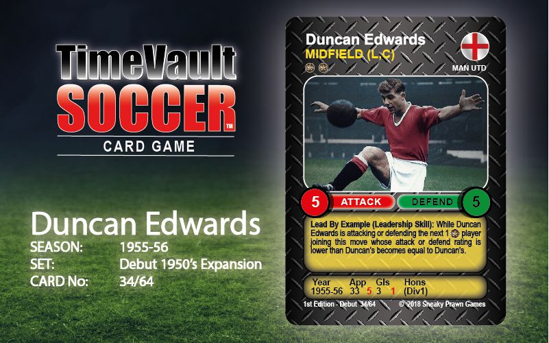
출처: https://opinionatedgamers.com/wp-content/uploads/2019/01/time-vault-soccer-card.jpg
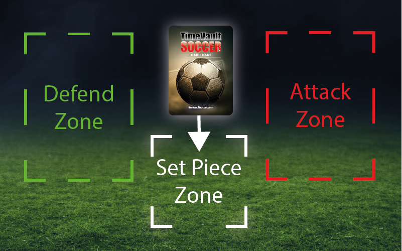
출처: https://timevaultsoccer.com/wp-content/uploads/2022/06/Play-zones.png
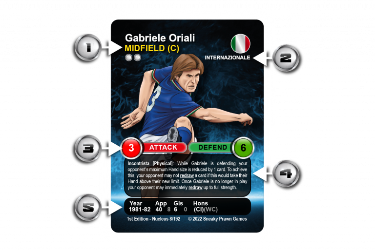
출처: https://timevaultsoccer.com/wp-content/uploads/2022/10/Gabriele-Oriali-Time-Vault-Soccer-how-to-read-card-768x513.png

#### 출처
- https://timevaultsoccer.com/wp-content/uploads/2025/02/Time-Vault-Soccer-rule-book-v.2.pdf (규칙서 원문)
- https://timevaultsoccer.com/pro-rules/ (교체·코너·징계·드래프트·토너먼트)
- https://timevaultsoccer.com/what-is-time-vault-soccer/
- https://opinionatedgamers.com/2019/01/12/dale-yu-first-impression-of-time-vault-soccer/
- https://opinionatedgamers.com/2021/03/27/dale-yu-first-impressions-of-time-vault-soccer-rivals-england-v-germany/

---

### 매직 넘버 일레븐 (Magic Number Eleven, Bonghwan Ju(주봉환) / 아트 Olin Jeong, Pluto Games(플루토게임즈, 한국), 2024)

| 항목 | 값 |
|---|---|
| 인원 | 2 |
| 플레이 시간 | 30분(박스) / 20~45분(상점) |
| 연령 | 14+ |
| 형태 | 카드 + 보드(필드 보드, 컨트롤 트랙) + 나무 토큰 |
| 근거 수준 | 상세 리뷰(tabletopping 2024-11, 확장 리뷰 2025-10) + BGG/Dice Tower/boardgamematcher/상점 설명문 + 보드라이프 유저 후기. 공식 규칙서 PDF(EN/JP/KR/CN) 는 BGG 파일 페이지에만 있어 로그인 없이는 미확보 |

2021년 초 구상, 2023-11 텀블벅 펀딩(17,533,998원, 437명, 1753%), 2024-02 배송. 해외 판권: Gém Klub(헝가리), Ogry Games(폴란드), Hepa Studio(중화권). 언어 비의존. BGG 무게 2.4, 메커닉: Hand Management, Pattern Building, Push Your Luck, Tile Placement, Tug of War, Connections. 카드 슬리브 45×68mm 76장(FroGames) → 카드 총량 약 76장으로 추정되나 공식 수량은 미확인.

#### 구성물
- 보드: 리뷰 "two boards". 사진 기준 큰 붉은 필드 보드(양 팀 하프, 상단 컨트롤 트랙, 하단 시너지/PK 슬롯) + 확장에서 승부차기 보드·코너킥 보드 추가.
- 나무 토큰(검은 원반), 컨트롤 마커.
- 카드: 홈 팀·어웨이 팀 기본 선수(각 "thirteen players"), 스타 플레이어 카드(특수 능력, 드래프트용), 시너지 카드(Synergy Cards, 팀워크·패스를 표현), PK 카드. 정확한 매수 미확인.
- 선수 카드: 포지션(CB, LB, RWF, SS, ST 등), 반원형 전술 아이콘이 카드 가장자리에 인쇄 — 공격(축구공), 수비(방패), 패스(+), 압박(번개). 인접 카드와 맞닿아 완전한 아이콘을 이루면 그만큼 파워("완성된 축구공 모양만큼 파워를 얻어서 슛").

#### 셋업
- 스타 플레이어 카드 3장 드래프트 → 기본 스쿼드 13명과 합침. 선발 10명, 교체 3명(리뷰 원문: "Each player selects a starting lineup of ten players, leaving three as substitutes"). 13+3 과 10+3 의 관계는 원문이 불명확 → 미확인.
- (확장) 스타 드래프트 후 골키퍼 카드 3장 중 1장 드래프트.

#### 턴 구조
- 2라운드(전반·후반), 하프타임에 리셋.
- 매 턴 2단계:
  1. **팀 액션 단계**: 시너지 카드 드로우 **또는** 컨트롤 마커 전진 중 택1. 컨트롤 레벨이 슛에 쓸 수 있는 시너지 카드 매수를 결정(최대 3).
  2. **선수 액션 단계**: 선수 카드 1장을 필드 보드의 전술 존(공격수/미드필더/수비수 열)에 배치 **또는** 슛 시도.
- BGG 설명: "Based on the tactical icons you have, you may 1) attempt a shot, 2) draw Synergy Cards, and 3) push the Control Marker on the Control Track." → 아이콘 종류가 가능한 행동을 연다.
- 라운드(하프)는 시너지 카드가 소진되면 끝난다(Dice Tower/BGG: "The round concludes when Synergy Cards deplete").

#### 판정
- 슛: **공격 파워 = 선수 카드 공격력 + 전술 아이콘 + 시너지 카드** 대 **수비 파워(같은 방식)**. 높은 쪽 승. 수비측도 시너지 카드로 보강.
- **항상 최소 1장의 시너지 카드는 덱에서 미공개로 뽑아 더한다** → 결과 보장 불가(BGG: "There is always at least ONE unknown Synergy Card which has to be played from deck").
- 컨트롤이 높을수록 시너지 카드를 더 더할 수 있다.

#### 슈팅과 득점
- 공격 파워가 **정확히 11** = "Magic Number" / 원더골. 상대 수비력이 더 높아도 막을 수 없다. 국내 후기: "반칙 태클로 저지하는 경우만 예외".
- **11 초과** = 항상 노골(too strong to be on target).
- 태클로 강한 슛을 막으면 페널티킥을 내줄 수 있다("A shot that seemed easy to block might concede a penalty kick due to a tackle").

#### 시간 진행과 종료
- 전반·후반 2라운드. 각 라운드는 시너지 카드 소진으로 종료. 국내 후기에 "경기 추가시간" 테마 언급이 있으나 규칙은 미확인.
- 2라운드 후 다득점 승. 동점 → **PK 카드로 승부차기**. 확장은 전용 승부차기 보드 추가.

#### 특수 상황
- 교체 선수 3명(사용 규칙 미확인).
- 확장(2025, "Corners, Keepers, and the Occasional Red Card"): VAR 카드 3장 덱(수비가 태클 카드를 공개하면 드로우해 결과 결정), 옐로·레드 카드, 페널티용 심판 카드, 코너킥 보드(토큰 튕겨 골 구멍에 넣기), 골키퍼 카드(하프당 1회 능력: 강슛 차단/컨트롤 마커 이동/시너지 리프레시), 새 스타 9명. 코너 조건: "goal check ends with equal attack and defence power, a total attack of ten or less, and the defending team in a defensive stance".
- 기본판 파울·오프사이드: 미확인.

#### 평가와 교훈
- tabletopping: 접근성과 전략성 양립, 변수 풍부, 긴장, 테마 결정, 휴대성, 규칙서 명료.
- 보드라이프 유저: "국내 작가 스포츠게임 중 가장 뛰어난 수작", "히든 드로우한 시너지카드가 일으키는 운빨이 매우 크지만 스포츠의 의외성", "공격자가 주도권(컨트롤)까지 갖고 있어야 수비와 대등한 싸움이 가능해 수비 위주로 흘러가는 점이 아쉽다".
- 가져올 점: **"정확히 N 이면 무조건 골, 초과하면 무조건 노골"** 한 줄이 push-your-luck 과 슛 타이밍 고민을 만든다. 시너지 카드 = 자원, 컨트롤 = 사용 한도, 로 공격 준비를 두 축으로 나눈 설계. 하프 종료를 덱 소진으로 잡음.
- 피할 점: 미공개 카드 1장 강제는 의도된 운이지만 결정론적 규칙서에서는 "덱 위 1장을 공개해 더한다" 로 절차를 못 박아야 한다. 공격자에게 컨트롤까지 요구하면 수비 우위가 되기 쉽다.

#### 참고 이미지
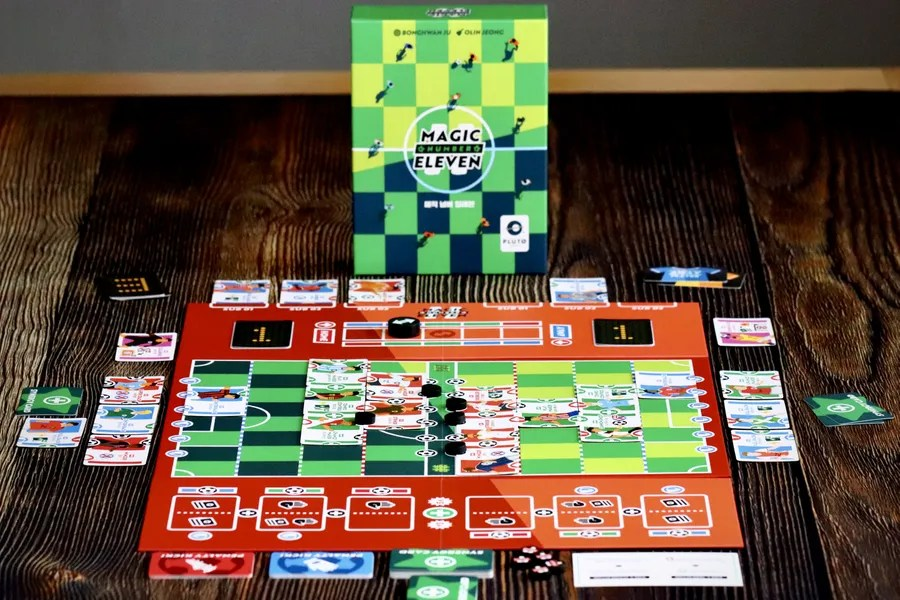
출처: https://i0.wp.com/tabletopping.games/wp-content/uploads/2024/11/magic-number-eleven-1.webp
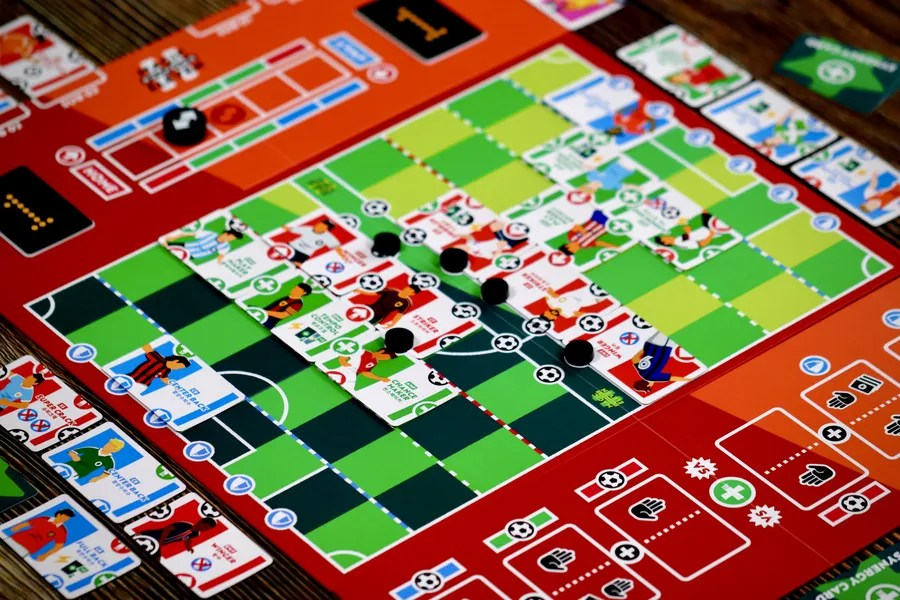
출처: https://i0.wp.com/tabletopping.games/wp-content/uploads/2024/11/magic-number-eleven-2.webp
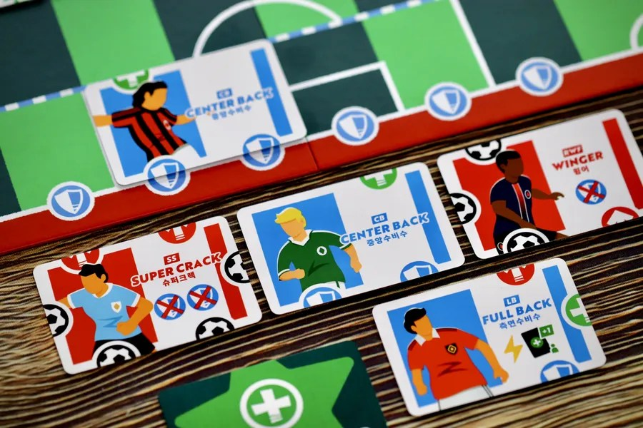
출처: https://i0.wp.com/tabletopping.games/wp-content/uploads/2024/11/magic-number-eleven-3.webp
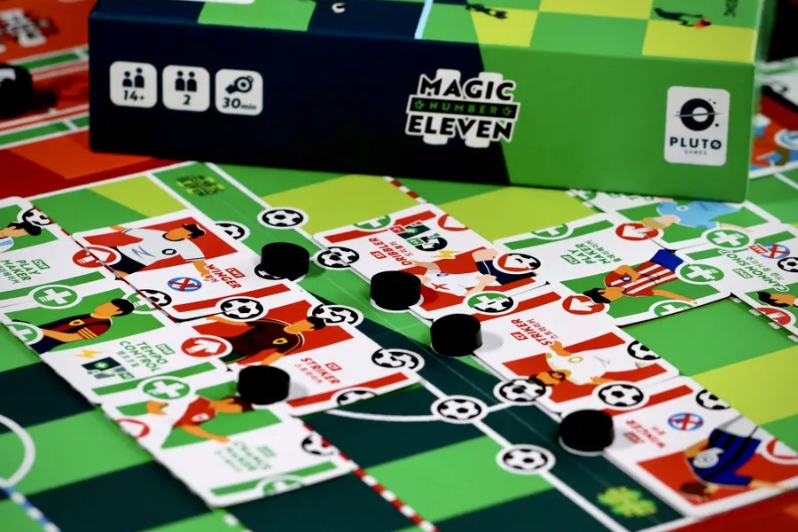
출처: https://i0.wp.com/tabletopping.games/wp-content/uploads/2024/11/magic-number-eleven-5.webp

#### 출처
- https://tabletopping.games/2024/11/21/magic-number-eleven/
- https://tabletopping.games/2025/10/15/magic-number-eleven-expansion/
- https://boardgamematcher.com/game/magic-number-eleven
- https://dicetower.com/board-game/411865
- https://frogames.it/en/products/magic-number-eleven
- https://spielradar.com/products/magic-number-eleven
- http://www.plutogames.co.kr/g1 (공식. 규칙서 링크는 BGG filepage 273658/273661/273662/293896)
- https://boardlife.co.kr/bbs_detail.php?tb=boardgame_strategy&bbs_num=18119
- https://vortexgaming.io/postdetail/176890
- https://tumblbug.com/magicnumber11

---

### 스트라이커즈 (StrikerZ Soccer Card Game, Randall Thompson, StrikerZ GameZ, 2011)

| 항목 | 값 |
|---|---|
| 인원 | 2 |
| 플레이 시간 | 15분(Father Geek) / 20분(공식) / 30분(BGG) |
| 연령 | 7+(Father Geek) / 8+(공식 사이트) |
| 형태 | 카드 |
| 근거 수준 | 상세 리뷰(Father Geek, 규칙 절차를 거의 전문 인용) + Dice Tower/BGG 설명문 + 공식 사이트 |

54장. 카드 두께는 일반 트럼프 수준.

#### 구성물
- 카드 54장. 종류: 팀 컬러(빨강/파랑)별 **저지(Jersey) 카드**(등번호와 포지션 Striker/Defender/Midfielder 인쇄. 예: 12 Striker, 3 Defender, 6 Midfielder. 팀당 11명 + 교체 #12·#14·#15), **볼 카드**(Left/Right, 각 2장씩 배부), **키퍼 카드**(Left/Right 한 세트, 팀 컬러 일치), **액션 카드**(Offside Flag, Yellow Card, Red Card, Whistle, Manager), 골 카드(리뷰에 언급). **종류별 정확한 매수는 미확인.**
- 공식 사이트: "11 players, 3 super-subs and a manager".

#### 셋업
1. 팀 컬러 선택.
2. 각 팀 저지 #12, #14, #15 를 빼서 소유자 앞에 앞면으로 = 교체 선수.
3. 각자 볼 카드 2장 + 자기 컬러 키퍼 카드(L, R) 를 받아 손에 숨긴다.
4. 나머지를 섞어 **4장씩** 추가 배분. 남은 덱 = 드로우 더미.

#### 턴 구조
1. **드로우**: 덱 맨 위 또는 버린 더미 맨 위 카드 1장.
2. **플레이** 1장: 액션 카드 / 자기 팀 저지 / 상대 팀 저지. 상대 저지는 손에 둘 수 있으나 버린 더미 외에는 낼 수 없다.
- 손패 상한, 버리기 의무: 리뷰에 명시 없음 → 미확인.

#### 판정
액션 카드 효과(리뷰 인용):
- Offside Flag: 2장 드로우, 2장 버림, 추가 턴.
- Yellow Card: 상대가 저지 카드를 공개, 그중 1장을 무작위로 뽑아 덱 맨 아래로 버림. 상대는 덱에서 1장 드로우. 추가 턴.
- Red Card: Yellow 와 같되 그 카드를 게임에서 영구 제거.
- Whistle: 상대 턴 상실.
- Manager: 자기 저지 1장을 교체 선수와 교환.

#### 슈팅과 득점
- 다음 셋 중 하나를 손에 모으면 골 시도: ① Striker 1 + Defender 1 + Midfielder 1 ② 저지 3장의 등번호 합 **30 이상** ③ 아무 저지 4장.
- 슈터가 볼 카드(Left/Right) 1장을 뒷면으로, 키퍼가 키퍼 카드(Left/Right) 1장을 뒷면으로 낸 뒤 동시 공개. **같은 방향 = 세이브, 다른 방향 = 골.**
- 골/세이브 후 카드 처리: 미확인.

#### 시간 진행과 종료
- 전반: 드로우 덱 소진까지. 후반: 버린 더미를 섞어 새 덱, 4장씩 다시 배분.
- 후반 종료 후 다득점 승. 동점 → 연장(하프 1개 추가). 그래도 동점 → "combined five penalty kicks" (5회 승부차기).

#### 특수 상황
- 오프사이드·경고·퇴장·교체는 모두 액션 카드로 표현(위 표). 파울·코너·프리킥 없음.

#### 평가와 교훈
Father Geek: Child Geeks 승인("fast-paced set collection"), Parent Geeks 미지근(아이와는 재미, 어른끼리는 "fell flat"), Gamer Geeks 거부("boring", 전략 깊이 부족).
- 가져올 점: **슛 = 좌/우 동시 선택, 일치하면 세이브** 는 가장 단순한 결정론적 PK 판정. 하프 = 덱 1회 소진. 셋 수집으로 "슛 자격" 을 만드는 발상.
- 피할 점: 축구 시뮬레이션이 아니라 세트 컬렉션에 축구 껍데기. 볼 이동·포지션·소유권 개념이 없어 "경기" 느낌이 안 난다(리뷰의 지루함 지적).

#### 참고 이미지
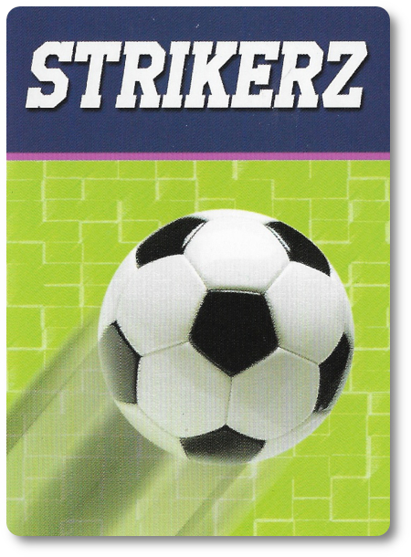
출처: https://fathergeek.com/wp-content/uploads/2021/02/strikerz_top.jpg
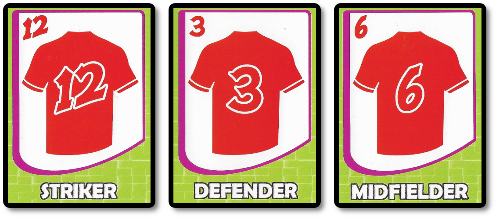
출처: https://fathergeek.com/wp-content/uploads/2021/02/strikerz_jersey.jpg
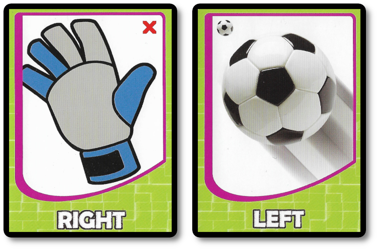
출처: https://fathergeek.com/wp-content/uploads/2021/02/strikerz_shoot.jpg
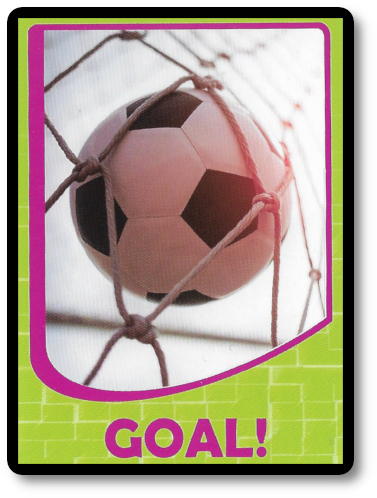
출처: https://fathergeek.com/wp-content/uploads/2021/02/strikerz_goal.jpg

#### 출처
- https://fathergeek.com/strikerz-soccer-card-game/
- https://www.dicetower.com/board-game/109011
- https://www.randalljamesbooks.com/randall-james-books/strikerz/

---

### 사커 시티 (Soccer City: The Beautiful Game, Lisandro Nembrini & Gonzalo Rodrigo / 아트 Jorge Consuegra, Elegé Ibérica, 2013 스페인어 / 2016 영어판)

| 항목 | 값 |
|---|---|
| 인원 | 2 (규칙서: 2인 초과 시 한 하프만 하거나 Quick Match 권장) |
| 플레이 시간 | 규칙서 "각 하프 45~60분". Dale Yu 45~90분. 상점 90~180분. Quick Match 25~30분 |
| 연령 | 12+(Dale Yu) / 10+(상점) |
| 형태 | 보드(헥스 피치) + 카드 6덱 + 주사위 |
| 근거 수준 | 규칙서 원문(English Rulebook Version 3.0, 36쪽, ©2016 Elegé Ibérica, Wayback 보관본) + Dale Yu 리뷰 + Misut Meeple 스페인어 리뷰 + Verkami 카드 소개 |

마드리드의 두 사람이 2013 Verkami(8/28~10/7)로 스페인어판, 2015 Kickstarter(7/15~8/20, €28,481/€25,000, 114%)로 영어판. BGG 147171.

#### 구성물
규칙서 v3.0 기준(165장):
- 게임 보드(헥스 피치. 상점 40×68cm, Verkami 48×68cm), 심판 주사위 1, 스코어, 볼 1, 옐로·레드 카드 18장, 전술 패드 2.
- 두 팀: 각 필드 플레이어 10명 + GK 1명 (등번호 1~9, 12, 14. 12·14 는 컵 모드 전용). 킥스타터판은 플라스틱 피규어, 초판은 나무 말.
- 카드 6덱: 공격 액션 25, 수비 액션 25, 슛 25, 골키퍼 세이브 25, 볼 카드 48, 외부 요인(External Factors) 17.
- (초판 2013 은 168장: 공격 27, 수비 27, 슛 28(리뷰는 26), GK 26, 볼 48, 외부 요인 12.)
- **선수 값(등번호로 고정)**: GK #1 = GK 4점, 수비 4(박스 밖 −2), 상대 박스 안 공격 1. 수비수 #2,3,12 = 수비 4/공격 1. 수비형 MF #4,5 = 3/2. 공격형 MF #6,7 = 2/3. 스트라이커 #8,9,14 = 1/4.

#### 셋업
- 초기 손패: 공격 액션 3, 수비 액션 3, 슛 2. 볼 카드 4 = 짧은 2, 중간 1, 긴 1. 나머지 볼 카드를 섞어 볼 덱(전반 45장).
- 각자 6명 + GK 를 자기 하프에 배치, 2명은 교체. 한 헥스에 2개 말 불가. 볼은 센터 스팟, 킥오프 팀은 인접 헥스에 1명.
- 버리기: 골 후 선택적으로, 전반 종료 시 의무적으로 손패를 **최대 2장만 남기고** 버림(볼 카드는 골 후 버릴 수 없고, 하프 종료 시 반드시 버림).

#### 턴 구조
턴 = 공격 이동 + 수비 이동. 턴 종료 시 낸 카드만큼 해당 덱에서 보충.
- **공격 턴(4단계, 각각 하거나 건너뜀)**: ① 패스 또는 전진(볼 카드 1장) ② 공격 액션(드리블 또는 카드의 전술 이동) ③ 슛 ④ 팀 재배치.
- **수비 턴**: ① 수비 액션(태클 또는 전술 이동) ② 팀 재배치.
- 볼 카드는 턴당 1장(추가 허용 카드 제외). 공격/수비 액션은 턴당 1개.
- 재배치: 각 선수 1헥스. 볼 소유자와 이번 턴에 이동한 선수는 제외.

#### 판정
- **패스**: 짧은 ≤4헥스(땅볼. 경로의 상대가 막음. 챌린지 없음), 중간 5~8, 긴 9~12(공중볼. 패서 옆과 도착점 옆 1헥스 이내가 아닌 상대는 넘어감. 경로 시작점의 상대는 막음. 받는 선수가 마킹되면 챌린지). 직선만. 예외: 스퀘어 패스(미드라인과 평행. 짧은 1, 중간 2, 긴 3~4헥스. 볼 출발점 양 옆 헥스에 수비 2명이 붙어 있으면 차단), 클로즈 패스(킥오프·스로인·세트피스·일부 전술용, 볼 카드 불필요, ≤4헥스는 짧은 패스 취급).
- **전진**: 짧은 = 선수 1헥스+볼. 중간 = 선수 1, 볼 2. 긴 = 선수 1, 볼 3.
- **마킹**: 인접 6헥스 중 하나에 상대가 있으면 마킹.
- **챌린지**(중·장거리 패스, 코너, 세트피스의 수신자가 마킹될 때): 양쪽 d6, 높은 쪽이 볼. **동점은 수비.** GK 는 자기 박스에서 +2. 마커가 여럿이면 챌린지도 여러 번.
- **페이스오프(드리블 대 태클)**: 볼 소유자와 인접 수비 사이에서 어느 쪽이든 시작. 카드 값 3~5 + 선수 공격/수비 값. 동시 공개. 수비 합이 크면 볼 탈취 후 카드의 이동 수행, 공격 합이 크면 카드 이동 후 새 공격 턴. 카드 하단에 "무조건 이기는 상대 기술" 이 인쇄되어 있으면 점수와 무관하게 승. **동점 = 시작한 쪽의 파울**, 단 심판 주사위를 굴릴 수 있다: Whistle = 파울·프리킥 / Booked = 옐로 + 프리킥 / The Ball = 플레이 온(굴린 쪽이 공격 턴). 공격 파울일 때 옐로 면은 단순 파울. 박스 안 파울은 Whistle·옐로 면 모두 수비 옐로 + 페널티.
- 드리블 카드(9종): Dribbling(수비 주변 2헥스), Scissor Move, Nutmeg, Self Pass(공격 3 전진, 수비 1), Croqueta(자리 교환), Sombrero, Roulette, Carousel(공격 3, 수비 1), Elastica(공격 3, 수비 2). 태클 카드(9종): Pull, Back Up, Shoulder Charge, Slide Tackle, Blocking, Pressure, Cut Off, Blow, Tackling.
- 전술 이동(카드 우상단, 드리블/태클 대신 사용): 공격 — Give and go, Crossing Pass, Pass to the Box, Sideline Advance, Slip from the Defender, Fast Break, Additional Pass/Advance, Sprint, One-Touch. 수비 — Defensive Anticipation, Pressing, Offside Trap, Goalkeeper Anticipation, Tactical Foul(무조건 옐로), Backward Step, Defensive Retreat, Mark the Man.
- **외부 요인**: EF 기호가 있는 드리블/태클 카드를 내면 EF 덱 1장 드로우(양쪽 다 EF 면 페이스오프 승자만). 예: "Coach Reprimand — 지고 있을 때만, 3턴간 수비 +1".

#### 슈팅과 득점
- 조건: 슛 존 안에 있고, 자신과 골라인 사이 3헥스에 마킹이 없을 것(중·장거리·클로즈 패스를 받아 챌린지에 이겼으면 예외). 아군은 3명이 그 3헥스에 있을 때만 막음.
- **슛 값 = 슛 카드 값 + 선수 공격력.** 원온원(박스 안, 수비가 GK 뿐) +1. 어시스트(GK 영향권에서 박스 안으로 짧은 패스 후 슛) +2. 카드 하단 조건 충족 시 특수 슛 보너스.
- **세이브 값 = GK 세이브 덱 맨 위 1장(무작위) + GK 수비 4점.** GK 가 영향권 안에 있어야 함. 일부 특수 세이브는 특정 슛을 점수 무관 차단.
- 슛 > 세이브 = **골**. 세이브 > 슛 = 세이브(GK 는 1헥스 이동 후 볼 카드로 패스. 2공격 턴 이상 보유 불가). **동점 = GK 카드의 타이브레이크 지시**: Clears the ball(4헥스 클리어) / Corner kick / Out(골킥) / Post hit(주사위: 1~3 그림 방향 4헥스 바운스, 4~5 골킥, 6 골).
- 프리킥 슛: 슛 존 안 파울이면 슛 덱에서 무작위 1장으로 슛. 수비 벽(2명, 킥 지점에서 2헥스) 있으면 GK +1, 보정 후 슛 카드 값 **10 이상**이어야 벽 통과, 미만이면 차단·벽 선수 소유. 벽 없으면 값 무관 골문 도달.

#### 시간 진행과 종료
- **볼 카드 덱이 시계.** 전반 45장. 덱이 비고 한쪽이 손의 마지막 볼 카드를 쓰면 하프 종료. 후반은 종료 시 볼 카드 3장 추가(인저리 타임, 총 48). 인저리 타임 시작 후 남은 볼 카드는 버리고 3장만.
- 동점이면 합의로 연장: 볼 카드 4장씩 새로 배분(2 짧/1 중/1 긴), 덱 15장(9/4/2). 1하프 또는 2하프 합의. 연장 후 추가시간 없음.
- 연장도 동점이면 승부차기: 5회씩, 이후 1회씩 서든데스.
- Quick Match: 볼 덱 20장(짧 13, 중 5, 긴 2).

#### 특수 상황
- **페널티(경기 중)**: 양 코치가 볼 덱에서 짧/중/긴 1장씩 3장 받아 동시에 1장 선택·공개. **다르면 골, 같으면 세이브.** 카드 반환 후 셔플.
- **승부차기(컵 모드 절차)**: 슈터·GK 각 볼 카드 3장(방향) + 슈터는 슛 덱 무작위 1장(높이), GK 는 세이브 카드 5점·6점 2장. 동시 공개. 세이브 = 둘 다 짧은 볼, 또는 같은 볼 카드 + GK 세이브 값 = 슛 카드 값. 아웃 = 슈터가 중/긴 볼 + 슛 카드 7 초과. 그 외 골.
- 코너: 코너에 선수 불필요. 볼 카드 패스 또는 "Pass to the box" 로 수신자 지정. 마킹이면 챌린지, 아니면 자유 슛. 골킥: 골 에어리어 임의 헥스에서 볼 카드로 박스 밖으로. 스로인: 상대가 낸 쪽에서, 선수 불필요, ≤4헥스 클로즈 패스, 재배치 2명만.
- 오프사이드: 실제 규정 그대로(볼과 두 번째 최후방 수비보다 앞, 상대 하프). Offside Trap 전술로도 유발. 수비팀이 그 헥스에서 프리킥.
- 교체: 경기당 최대 2회, 스토피지 중에만. 재투입 불가.
- 옐로: 심판 주사위 옐로 면 / 박스 안 파울에서 "Match goes on" 외 / Tactical Foul. 레드: 옐로 2회 / 슛 존 안 최후방 수비 파울(주사위 의무, "Match goes on" 외 레드). GK 퇴장 시 필드 선수가 GK(GK 3점). **2명 퇴장 = 0-5 몰수패.**
- 킥오프: 센터 인접 헥스에 선수, 클로즈 패스(볼 카드 불필요).
- 스토피지 재배치 제한: 공격 아군 인접 배치 불가, 수비는 슛 존 밖 상대 마킹 불가, 재개 후 첫 턴 공격 전술 불가.
- 모드: The Cup(스쿼드 11, 활성 9, 필드 7, 원정골, 경고 누적 결장), Striker mode(슛 덱 없이 조건별 고정 슛: Bicycle 9, Lob 8, SuperClass 8, Header 7, Spiral 7, Missile 7, Half Volley 6, Low 6, Long distance 5), Ace mode(볼 카드 값 자유 선언, 손 2장), Legends 확장 33장.

#### 평가와 교훈
- Dale Yu: "액션 카드가 다양한 기술과 전술을 준다", 36쪽 규칙서, 복고풍 아트. 단점: "세부에 매몰되지 않고 경기를 담기 어렵다", 재배치 제한이 비현실적, 공격이 카드 조합만 좋으면 그냥 뚫림("real soccer 와 다르지 않다"), 옵션 파악에 시간이 오래 걸림, 비축구팬은 카드를 그냥 던짐. 축구팬과는 "I like it", 아니면 "Not for me". 더 단순한 대안으로 StreetSoccer(Cwali) 추천.
- Misut Meeple: "Notable(우수)". 카드 상호작용 정교, 축구 지식 필요, 분석 마비 있음.
- Kill Screen: 턴제라 체스 같은 정교함, 대신 축구의 창발적 순간은 재현 어려움. "ironic realism" — 감독이 꼭두각시 조종자.
- 가져올 점: **볼 카드 덱 = 시계**(45장 = 45분, 후반 +3 = 인저리 타임)은 카드 게임의 시간 진행 중 가장 직관적이다. 페널티 "3장 중 1장 동시 선택, 다르면 골" 은 결정론적이고 심리전이 있다. 페이스오프 "카드 값 + 선수 값, 동점 = 시작한 쪽 파울" 은 파울을 별도 카드 없이 만든다. 선수 값을 등번호로 고정한 참조표.
- 피할 점: 4단계 공격 턴 + 재배치 + 18종 전술 이동 + 헥스 기하학은 "간단한 시뮬레이션" 의 반대편. GK 세이브가 무작위 드로우라 슛 결과가 카드 운에 크게 좌우된다. 규칙서 36쪽은 분량 자체가 진입장벽(리뷰 공통).

#### 참고 이미지
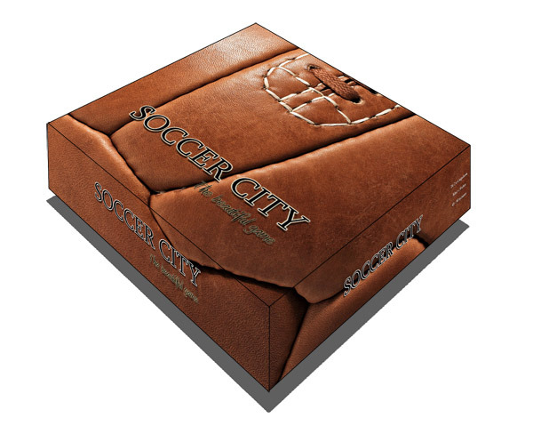
출처: https://opinionatedgamers.com/wp-content/uploads/2016/06/soccer-city-box.png
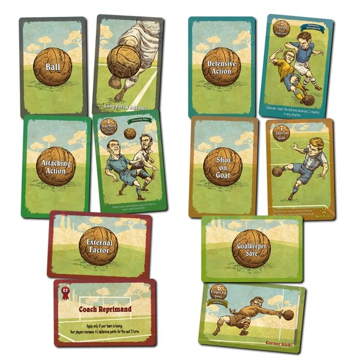
출처: https://opinionatedgamers.com/wp-content/uploads/2016/06/soccer-city-cards.jpg
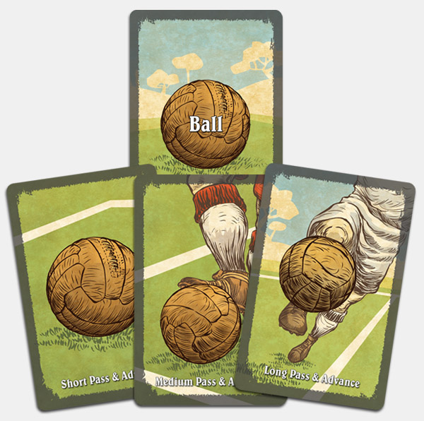
출처: https://opinionatedgamers.com/wp-content/uploads/2016/06/soccer-city-ball-cards.jpg
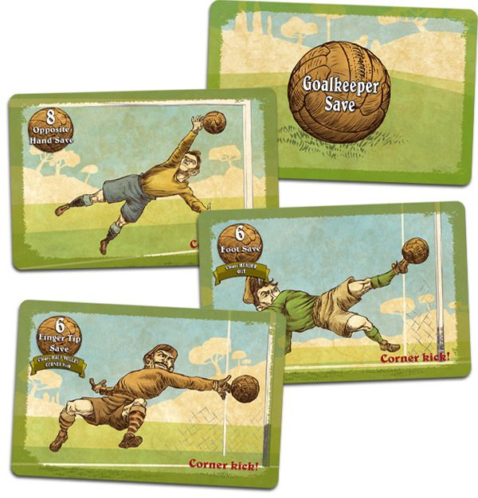
출처: https://opinionatedgamers.com/wp-content/uploads/2016/06/soccer-city-gk.jpg

#### 출처
- http://web.archive.org/web/20161023161021/http://soccercitythegame.com/?wpdmdl=651 (English Rulebook v3.0 PDF, 36쪽. 원 링크 http://soccercitythegame.com/?wpdmdl=651 는 사이트 소멸)
- https://opinionatedgamers.com/2016/06/24/dale-yu-review-of-soccer-city/
- https://killscreen.com/articles/soccer-citys-ironic-realism-does-away-pesky-player-agency/
- https://misutmeeple.com/2014/11/resena-soccer-city-beautiful-game/
- https://www.verkami.com/projects/6398-soccer-city-the-beautiful-game/blog/9680-las-cartas-de-soccer-city
- https://www.boardgamebliss.com/products/soccer-city-the-beautiful-game (구성물 수량)
- http://soccercitythegame.blogspot.com/2013/07/what-is-soccer-city-game_14.html
- https://www.kickstarter.com/projects/soccercity/soccer-city-the-strategy-board-game-for-football-l (403, 검색 스니펫으로 캠페인 수치 확인)

---

### 킥오프 / 페널티 (Kick-Off, MB Games, 1981 — 원형 Penalty!, Pepys Games / Castell Bros, 1960년대, Ernesto Scola(밀라노) 원작)

| 항목 | 값 |
|---|---|
| 인원 | Penalty 2~6 (팀전). Kick-Off 2+ (팀 구성 가능) |
| 플레이 시간 | 미확인 (블라인드 팩 2회 소진) |
| 연령 | Kick-Off 7+ (eBay 카탈로그) |
| 형태 | 카드 + 격자 피치(종이/플라스틱) + 볼 말 |
| 근거 수준 | Penalty: 규칙서 원문(8쪽 이미지를 판독). Kick-Off: 블로그 리뷰(The Football Attic) + 상점·카탈로그 소개문. Kick-Off 규칙서 원문은 미확보 |

Penalty 규칙서 표지: "PENALTY! A game of skill for 2 to 6 players", "Published by arrangement with Ernesto Scola, Milan. Copyright No. 10299 — Class A — E. Scola, Milan. Printed by A. & M. Weston Ltd". "12명의 전문가가 5년간 18,000회 시험 경기". WOPC: 영국판 최소 3판, 2010년 Lagoon 이 "Goal" 로 재발매. Kick-Off 는 oldfootballgames: "Another version of the original game Penalty, also marketed as Gazza at one time". 사용자가 언급한 Waddingtons 판은 확인 못 함 → 미확인(출처들은 모두 MB Games).

#### 구성물
- **Penalty(52장)**: 페널티 1, 골키퍼 5, 코너 4, 프리킥 4, 일반("kick" 또는 "movement") 38. 볼(나무), 피치. 일반 카드는 화살표 방향 + 옆에 이동 칸 수. 코너 카드는 둥근/네모 기호(피치 4 코너에 같은 기호). 골키퍼 카드는 화살표. 일부 카드 하단 코너에 코너 기호, 일부 카드에 손(HAND) 그림.
- **Kick-Off(1981)**: 카드 56장, 보드 1(국기 테두리 격자 피치), 볼 1, 설명서. 종류: Attacking(이동), Free-Kick, Goalkeeper, Corner, Penalty(1장, "guarantees a spot kick in each half"). 종류별 매수 미확인. 팀 Blues 대 Yellows.

#### 셋업 (Penalty)
- 배분: 2인 8장씩. 3인 = 한 팀 2명은 6장씩, 혼자인 상대 8장. 4인 6장씩. 5인 = 3명 팀 5장씩, 2명 팀 6장씩. 6인 5장씩. 나머지 = 블라인드 팩(뒷면). Kick-Off 도 8장(블로그).
- 피치 펼치고 볼을 센터 스팟. 킥오프 결정. 3인 이상은 팀이 번갈아: A 대 B·C 이면 A,B,A,C 순. 5인(A·B 대 C·D·E)은 첫 라운드 A,C,B,D,A,E, 둘째 B,C,A,D,B,E … 이후 A·B 가 번갈아 2회.

#### 턴 구조 (Penalty)
- 카드는 화살표 방향·칸 수대로, 항상 자기 골에서 멀어지는 쪽으로(직선 크로스킥 예외). 킥오프: 카드를 블라인드 팩 옆에 앞면으로 내고, **자기 쪽 하프라인의 두 센터 칸 중 하나에서** 이동. 1장 드로우. 페널티·프리킥·코너·골키퍼 카드로 킥오프 불가.
- 다음 차례(상대 팀)는 볼이 있는 칸에서 이어서. 각자 1장 내고, 볼 이동, 1장 드로우(프리킥·페널티로 2장 이상 냈으면 그만큼). 항상 시작 매수 유지.

#### 판정
- **골킥**: 볼이 골라인 좌우로 나가면 다음 사람이 골 에어리어(골 앞 흰 선 4칸)에서 골킥. 나간 쪽의 오른쪽 2칸/왼쪽 2칸 중 하나에 놓고 일반 카드 또는 골키퍼 카드로 클리어.
- **스로인**: 사이드라인을 넘으면 다음 사람이 넘은 칸을 포함해 2칸 임의 방향으로 옮긴 뒤 일반 카드(또는 프리킥+일반) 플레이. 대각선으로 나가면 마지막 밟은 칸 기준. 코너 플래그 대각선은 사이드라인으로 간주.
- **프리킥**: 페널티 에어리어 밖 어디서나(킥오프·골킥 불가). 프리킥 카드 + 즉시 같은 사람이 일반 카드 1장, 두 카드 합계만큼 이동 → 2장 드로우. 한 턴에 프리킥+일반+페널티(앞 두 장으로 페널티 에어리어 진입 시) 가능, 3장 드로우. 프리킥만으로 슛이 되면 두 번째 안 냄.

#### 슈팅과 득점
- 카드가 볼을 골 안으로 넣으면 슛. 골라인을 골포스트 사이로 넘기기만 하면 되고 킥이 길어도 무방, 볼은 골 에어리어 4칸 중 하나에 "정지". **다음 차례가 골키퍼 카드나 코너 카드를 내지 못하면 골.** 골 후 센터로, 실점 팀 킥오프.
- **골키퍼 세이브**: 다음 사람이 골키퍼 카드를 내고 골 에어리어 칸에서 카드 화살표대로 볼 이동, 1장 드로우.
- **코너로 세이브**: 코너 카드를 내면 카드 기호(둥근/네모)와 같은 코너로 볼 이동.
- **코너에서 득점**: 볼이 코너에 있으면 공격 팀 다음 사람이 **블라인드 팩을 컷**. 컷한 카드 하단 코너 기호가 볼이 있는 코너 기호와 같으면 골. 아니면 세이브, 골 에어리어에 놓고 다음 사람이 골킥.
- **페널티**: 낸 카드로 볼이 상대 페널티 에어리어에 들어가면 즉시 페널티 카드(있으면) 추가 플레이. 볼은 페널티 스팟, 2장 드로우. 다음 사람(수비)이 블라인드 팩 컷 — **손(HAND) 그림이면 세이브, 아니면 골.** 세이브면 골 에어리어에서 컷한 수비가 골킥. 페널티는 골키퍼·코너 카드로 못 막음.
- Kick-Off: 페널티는 "defender cuts the cards; a hand symbol in the top corner = saved". 코너는 "ball placed by the corresponding colour flag; attacking player cuts the blind pack".

#### 시간 진행과 종료
- 전반: 블라인드 팩 마지막 카드를 집으면 종료(집은 사람은 이미 냈음). 그 사람은 페널티 불가(2장 드로우 못 하므로), 프리킥은 단독으로 슛일 때만. 마지막 카드가 슛이면 다음 사람이 골키퍼/코너로 세이브 가능(코너킥은 안 차고 종료; 후반 시작 전 1장 보충). 볼 센터, 손패 유지.
- 후반: 버린 카드를 섞어 블라인드 팩. 반대편이 킥오프. 종료도 전반과 같은 규칙.
- Kick-Off: "When the pack runs out, it's half time … shuffle and start again for the second period." 동점 처리: 미확인.

#### 특수 상황
- 오프사이드·교체·경고: 없음. 파울 = 프리킥 카드로만 표현(원인 없이 카드 플레이).

#### 평가와 교훈
The Football Attic(2013): 어린 시절 추억의 게임. 골키퍼 카드는 "그냥 카드 지시대로 공을 밖으로 낸다". 페널티 카드 1장이 하프마다 스팟킥을 보장. oldfootballgames: "카드에 선수 번호를 써 넣어 골을 선수에게 귀속시켰다". 리뷰 수준의 정식 평가는 없음.
- 가져올 점: **"골 = 다음 사람이 GK/코너 카드를 못 내면"** — 손패 정보로 세이브가 결정되는 가장 단순한 결정론. 손패 매수가 항상 일정(낸 만큼 드로우). 코너·페널티 득점을 "블라인드 팩 컷 후 기호 확인" 으로 통일한 랜덤 절차. 하프 = 팩 1회 소진.
- 피할 점: 소유권 개념이 없어 아무나 아무 방향으로 볼을 움직인다(양 팀이 번갈아 같은 볼을 자기 쪽으로 차는 구조). 격자 피치와 칸 수 세기는 카드 게임 치고 손이 많이 간다. 프리킥 카드가 "이유 없는 장거리 이동" 이라 축구적 인과가 없다.

#### 참고 이미지
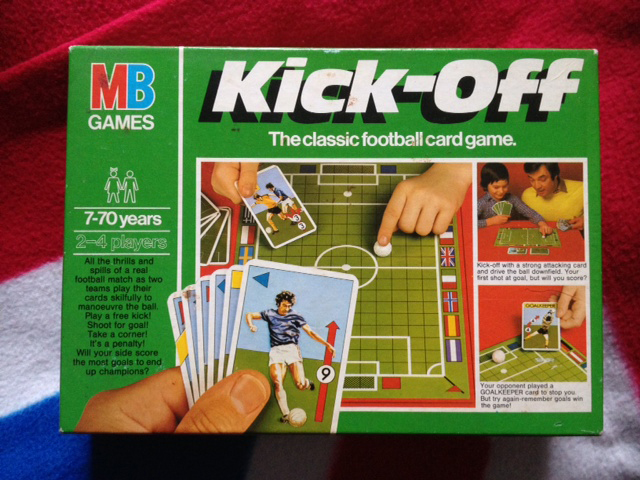
출처: https://blogger.googleusercontent.com/img/b/R29vZ2xl/AVvXsEjBYZ6UVxUWyO5qW3ihgeeK6bK9YIr9nuLacbUHydXSfdGmdiB5UIhPyAI9QcRu8GKy_PM3bUmE81_BonL3iorPfS8ikAF-beuU-ErcZCDD1982jvbv0fkR-3bdAGgSkcvQnXsN01U68flV/s1600/box.jpg
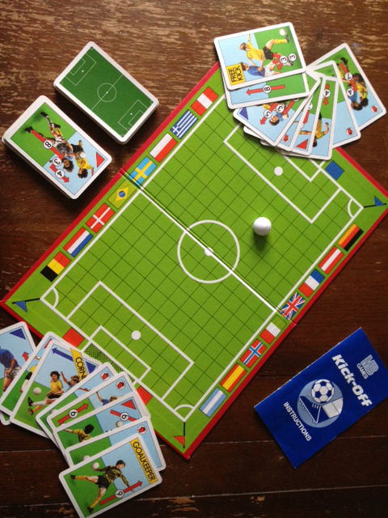
출처: https://blogger.googleusercontent.com/img/b/R29vZ2xl/AVvXsEipfY2CGugXdp7unGgsm1VNTNVN3wXhB-ot0-7wCvEM2M9EXTV_HKKYFJYxBt-sg5QWTE8Y9qWwh3cizSuVvrj5gdaHsKNmj3nTWbtWwCySYNb3PLsdRgYwI8h8yCBmLpqPrSvDu4Z0EmqG/s1600/board.jpg
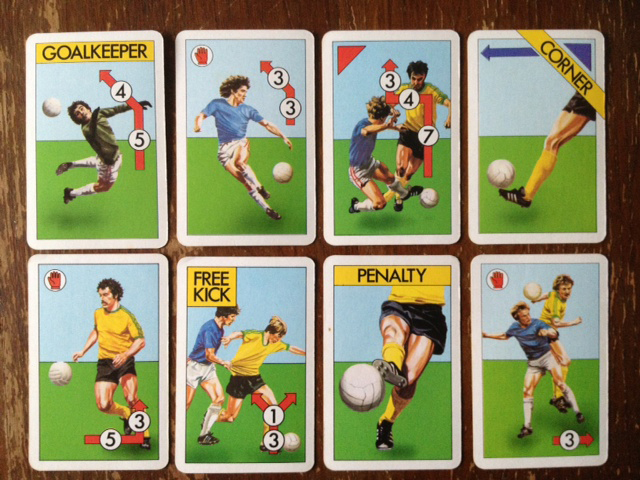
출처: https://blogger.googleusercontent.com/img/b/R29vZ2xl/AVvXsEhFCBscDU0LVF_WmaPTA0H4azl4kvX8ekYGnCrF8OG42sl05aqYTCwycvg5RtkLBp1ZzRoKRlHk8ssz_zyKH-4HnlbjiY1kivgH9vT5Zk_yLief0jamyntiTWsvtUxSvK1xthNsDaM2nR8B/s1600/cards.jpg
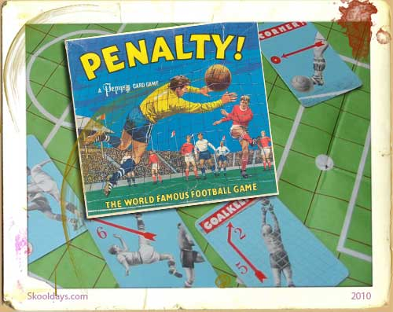
출처: http://www.skooldays.com/blog/wp-content/uploads/penalty.jpg
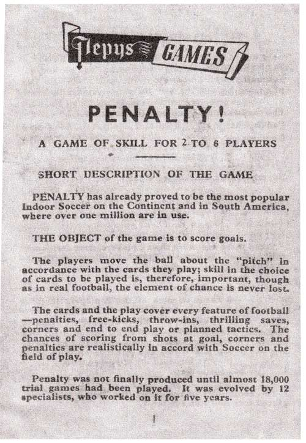
출처: http://www.skooldays.com/blog/wp-content/uploads/1.jpg
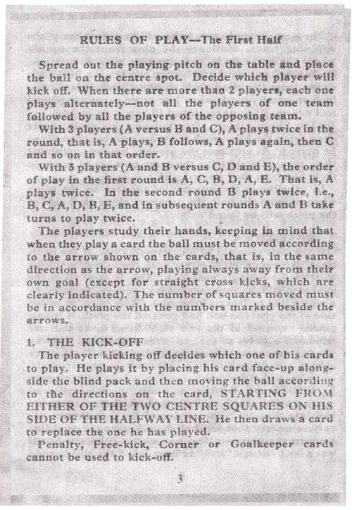
출처: http://www.skooldays.com/blog/wp-content/uploads/3.jpg

#### 출처
- https://www.skooldays.com/blog/penalty-football-card-game/ (규칙서 8쪽 이미지: /blog/wp-content/uploads/1.jpg ~ 8.jpg)
- https://www.wopc.co.uk/uk/pepys/penalty (카드 구성 52장 내역, 판본)
- https://www.oldfootballgames.co.uk/index.asp?pageid=127168
- https://thefootballattic.blogspot.com/2013/01/kick-off-1981.html
- https://cartophilic-info-exch.blogspot.com/2023/10/mb-games-kick-off-card-game-1981.html (56장 확인)
- https://www.ebay.co.uk/p/1523198535 (MB, 1981, 7+)
- https://www.gamesunite.co.uk/products/kick-off-1981-classic-football-fun-in-a-card-game (인증서 만료·본문 미수신. 검색 스니펫: "1 game board, 56 playing cards, 1 ball, and instructions", "played over two halves… pack played through twice")

---

### 풋볼 카드 (Football Cards, Andrzej Ignyś & Jerzy Ignyś, 출판사 미상(박스에 폴란드 축구지 Piłka Nożna 로고), 2002)

| 항목 | 값 |
|---|---|
| 인원 | 2 |
| 플레이 시간 | 15분 |
| 연령 | 미확인 (BGG minage 0) |
| 형태 | 카드 |
| 근거 수준 | BGG 설명문(2021 Wayback 스냅샷)만. 규칙서·리뷰 없음 |

BGG 34077. 박스 문구 "Gra karciana dla kolekcjonerów"(수집가를 위한 카드 게임), "O futbolu wiemy wszystko!"(Piłka Nożna 지 슬로건). 잡지 부록/프로모션으로 보이나 미확인. 메커닉: Hand Management. 카테고리: Card Game, Sports.

#### 구성물
56장 = 실제 플레이 카드 52장(폴란드 국가대표 주요 선수 사진) + 규칙 카드 1 + "flow of game" 카드 1 + 범례(legend) 카드 2.

#### 셋업
미확인.

#### 턴 구조
미확인. BGG 설명: "In each half players tried to score goals by playing cards with ball symbol and defend opponents attacks by playing cards with goal symbol."

#### 판정
볼 기호 카드 = 공격(득점 시도), 골 기호 카드 = 수비. 비교 방식 미확인.

#### 슈팅과 득점
미확인.

#### 시간 진행과 종료
전·후반 2하프. 종료 조건 미확인.

#### 특수 상황
"several special cards simulating free kicks, penalties and offsides." 세부 미확인.

#### 평가와 교훈
리뷰 없음. 교훈: 52장 표준 규격 안에 "볼 기호/골 기호 + 특수 카드 몇 장" 으로 공수를 나눈 극단적 단순화 사례라는 것 외에는 확인 불가.

#### 참고 이미지
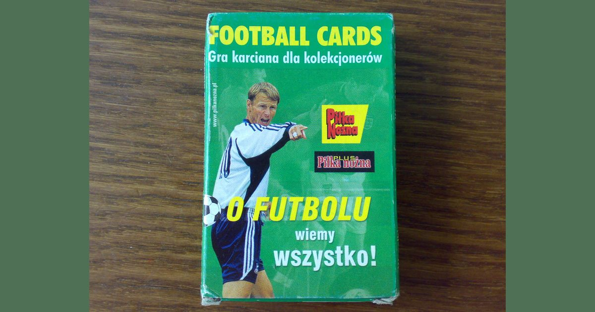
출처: https://cf.geekdo-images.com/Mt-rYAaTH6s-6OeTBYdl_A__opengraph_letterbox/img/GC_tUDzgAQhyxbG_C7ZhLBuEono=/fit-in/1200x630/filters:fill(auto):strip_icc()/pic341909.jpg

#### 출처
- https://boardgamegeek.com/boardgame/34077/football-cards (직접 접근 403. Wayback 2021-05-16 스냅샷 http://web.archive.org/web/20210516032056/https://boardgamegeek.com/boardgame/34077/football-cards 에서 설명·크레딧 추출)

---

### 비교 요약 (간단한 축구 시뮬레이션 카드 게임 설계 관점)

| 게임 | 시간 진행 | 소유권 | 판정 핵심 | 결정론 |
|---|---|---|---|---|
| Soccards | 카드 시간 비용 합산, 90분 | 있음(존 전진) | 존 기본점 + 카드 합, 마진→확률 | 낮음(확률 굴림) |
| Time Vault Soccer | 손패·덱 소진 = 하프 | 없음(양쪽 Move 병존) | Move 합 비교, GK 2배, 동점=상대 손 1장 기호 | 높음 |
| Magic Number Eleven | 시너지 덱 소진 = 하프 | 없음(배치 퍼즐) | 공격 vs 수비 합, 정확히 11 = 무조건 골 | 중간(미공개 1장) |
| Strikerz | 드로우 덱 소진 = 하프 | 없음 | 세트 수집 후 좌/우 일치 | 높음 |
| Soccer City | 볼 카드 45장 = 45분 | 있음(헥스 위 볼) | 카드값+선수값, 동점=파울/GK 카드 지시 | 중간(주사위, GK 무작위) |
| Penalty/Kick-Off | 블라인드 팩 소진 = 하프 | 없음(번갈아 볼 이동) | 다음 사람이 GK/코너 카드 없으면 골 | 높음(컷 제외) |
| Football Cards | 2하프(세부 미확인) | 미확인 | 볼 기호 vs 골 기호 | 미확인 |

---

## 그룹 C. 독일어권 카드·보드 게임

### 슛과 골 (Schuss und Tor, Rudi Hoffmann, Lookout Games / Berliner Spielkarten, 1985 초판 · 2015 재판)

| 항목 | 값 |
|---|---|
| 인원 | 2~4인 (규칙서: "am besten 4 Spieler", 마주 앉은 둘이 한 팀) |
| 플레이 시간 | 약 10분 (박스 표기 "~10"; cliquenabend 5~10분; spielen.de 10~15분) |
| 연령 | 8세 이상 |
| 형태 | 카드 |
| 근거 수준 | 규칙서 원문 (spielkarten.com 배포 PDF. PDF 내부 표기는 "© 2015 Lookout GmbH", 부록 카드 "1 L-Deck Karte für Agricola" 가 있어 Lookout Klassiker 판 규칙서로 보임) |

판본 이력 (spielen.de): 1985 Berliner Spielkarten → 1988 Franjos (Schuß und Tor) → 2001 Lookout → 2015 Lookout (일러스트 Nikolaus Moras). 디자이너 Rudi Hoffmann 은 2008년 83세로 작고.

#### 구성물
규칙서 원문 목록(그대로): **66장** — 축구선수 카드(Fußballspielerkarten) 33장(녹색 뒷면), 골찬스 카드(Torchancenkarten) 21장(빨간 뒷면), 레드카드 1장, 옐로카드 1장, 우승컵(Siegerpokal) 2장, 작가·일러스트레이터 카드 1장, Agricola 용 L-Deck 카드 1장.
- 위 항목을 더하면 60장이라 66장과 맞지 않는다. 사진에는 작가 카드와 일러스트레이터 카드가 따로 있고 Agricola 프로모 카드도 2장(Bärenjäger, Ausbildung) 보인다. 정확한 내역 미확인.
- 레드·옐로카드, 우승컵, 작가 카드, L-Deck 카드는 게임에 쓰지 않는다(규칙서).
- 축구선수 카드의 등장인물: Luigi, Otto, Willi, Max, Fritz (5명) + 특수카드 Torjäger(골잡이)·Torwart(골키퍼). 2인 규칙에서 "Torjäger 1장과 Torwart 1장을 제거" 하므로 각각 최소 2장 이상 들어 있다. 정확한 장수 미확인.
- 축구선수 카드 한 장에는 이름 두 개가 위아래로 적혀 있다: "Max zu Luigi" = Max 가 Luigi 에게 패스. "Luigi zu Luigi" 처럼 같은 이름 = 드리블.
- 골찬스 카드 21장: 일반 "Tor", "2 Tore", 선수 이름 또는 Torjäger/Torwart 가 붙은 "Tor"(예: "Tor-Willi"), 그리고 특수카드 5장("Foul", "Aus", "Nachspielzeit"). 각 장수 미확인(규칙서는 "5 Sonderkarten" 이라고만 쓰고, Foul 은 복수형 "eine der Karten 'Foul'", Aus 와 Nachspielzeit 는 단수로 언급).

#### 셋업
1. 뒷면 색으로 카드를 나눈다. 쓰지 않는 카드는 치운다.
2. 골찬스 카드 더미를 뒤집어 테이블 중앙에 둔다.
3. 각자 축구선수 카드 **7장** 을 받는다. 남은 축구선수 카드는 뒤집은 더미로 중앙에 둔다.
4. 딜러가 그 더미의 맨 위 카드를 공개한다 = **킥오프(Anstoß)**. 이 카드가 첫 "따라야 할" 카드다.

#### 턴 구조 (4인 기준)
- 시계 방향으로 각자 손에서 카드 1장을 마지막에 놓인 카드 위에 공개해 낸다. 마지막 카드가 "무엇을 따라야 하는지(bedienen)" 를 정한다.
- 마지막 카드가 "Max zu Luigi" 면 다음 사람은 "Luigi zu …" 카드를 내야 한다(패스를 받아 이어 감). "Luigi zu Luigi"(드리블)도 가능.
- 따를 수 없거나 따르고 싶지 않으면 세 가지 선택:
  1. **Torjäger** (공격 조커): 누구 대신이든 낼 수 있다. 낼 때 누구에게 패스하는지 선언한다("Torjäger auf Fritz"). 반드시 5명 중 한 명을 지목해야 하며, Torjäger 위에 Torjäger 를 낼 수는 없다.
  2. **Torwart** (수비 조커): 공을 다른 선수에게 넘기지 않고 공격을 끝낸다. 다음 사람은 아무 카드나 내서 새 공격을 시작한다.
  3. 아무것도 못 내면 → 상대(직전에 그에게 패스한 사람)에게 **골찬스** 를 준다.
- 손패 보충 규칙은 없다. 예외적으로 골찬스 카드 "Foul"·"Nachspielzeit" 를 뽑았을 때만 축구선수 더미에서 1장 뽑는다.
- 뒤에 온 카드는 앞 카드 위에 쌓이며, 골이 나거나 Torwart 로 끝나면 다음 사람이 "아무 카드나" 내서 새 공격을 시작한다.

#### 판정
판정은 오직 골찬스 카드 1장 공개로 한다. 골찬스를 얻은 사람이 골찬스 더미 맨 위를 공개한다.

| 뽑은 카드 | 결과 |
|---|---|
| 일반 "Tor" | 1골. 카드를 자기 앞에 공개해 둔다. 다음 사람이 아무 카드로 킥오프 |
| "2 Tore" | 2골(더블). 위와 같음 |
| 이름이 붙은 "Tor"(예: Tor-Willi, Tor-Torjäger, Tor-Torwart) | **다음 사람** 이 손에서 요구된 카드(예: 아무 "Willi zu …" 카드)를 내면 골을 막는다. 이때 Torjäger·Torwart 로는 대신 막을 수 없다. 막히면 게임은 그 카드부터 정상 진행. 못 막으면 골 |
| "Foul" | 공격 중단. 뽑은 사람이 축구선수 더미에서 1장 뽑고 새로 낸다(spielt neu aus) |
| "Aus" | 골찬스 없이 공격 종료. 뽑은 사람의 왼쪽 이웃이 아무 카드로 이어 간다 |
| "Nachspielzeit" | 골찬스 없이 공격 종료. 뽑은 사람이 축구선수 더미에서 1장 뽑고 새로 낸다. 이 카드는 자기 앞에 보관 → 게임 종료 시 추가시간 여부를 결정할 권리(아래) |

#### 슈팅과 득점
- 별도의 슈팅 단계가 없다. "상대가 패스를 이어받지 못함" = 슈팅 상황이고, 골찬스 카드 1장이 결과를 정한다.
- 득점한 골찬스 카드를 자기 앞에 두는 것이 스코어보드다.

#### 시간 진행과 종료
- **딜러가 7번째(마지막) 카드를 내면 게임 종료.** 이 마지막 카드는 수비적 의미만 있다(딜러는 그 카드로 골찬스를 얻지 못한다).
- 골이 많은 팀(또는 개인)이 승리. 동점이면 "재경기(Wiederholungsspiel)가 결정해야 할 것" 이라고만 되어 있다.
- **추가시간**: "Nachspielzeit" 카드를 가진 사람이 게임 종료 시 추가시간 여부를 결정한다. 하면 축구선수 카드 전부를 다시 섞어 각자 **3장** 씩 나누고 딜러가 맨 위 카드를 킥오프로 공개한다.

#### 특수 상황
- 파울: 골찬스 카드 "Foul" 로만 발생. 공격 중단 + 뽑은 사람이 1장 보충 후 새로 낸다.
- 아웃: "Aus" 카드. 왼쪽 이웃이 새 공격.
- PK·오프사이드·교체·세트피스: 없음.
- 레드·옐로카드는 구성물에 있지만 규칙에서 쓰지 않는다.
- 3인: 각자 대결(결과가 "3:2:0" 처럼 나올 수 있다고 규칙서가 인정). 시작 손패 **9장**.
- 2인: Torjäger 1장·Torwart 1장을 제거. 시작 손패 **12장**.

#### 평가와 교훈
- Cliquenabend (Jörg Köninger, 5/10): "4인 권장" 을 지켰는데도 운 비중이 너무 높고 전술의 여지가 적다. 5~10분에 끝나고 골이 안 나는 판도 있어 2~3판 연속으로 하길 권함. 카드 메커니즘을 축구에 입힌 것 자체는 잘 됐다. 축구를 몰라도 할 수 있으나 재플레이 욕구 부족.
- spielen.de 평점 3.3/5 (9명), 장르 "Aus-der-Hand-Spiel(손패 털기)".
- 규칙서 자체가 "카드를 낼 때 큰 소리로 중계하고 골 세리머니를 하면 축구 중계 분위기가 난다" 고 권하며 Musterspiel(예시 경기)을 중계 대사로 써 놓았다.
- **가져올 점**: (1) "패스 체인을 이어받지 못하면 곧 슈팅 상황" 이라는 한 줄짜리 핵심 루프. 패스 성공 판정 없이 손패 매칭만으로 점유가 결정된다. (2) 골찬스 카드 1장으로 슈팅·파울·아웃·추가시간을 한 번에 해결하는 "결과 덱" 구조. (3) "이름 붙은 골" 로 수비수에게 마지막 한 번의 블록 기회를 주는 것. (4) 딜러의 마지막 카드로 끝내는 명확한 종료 조건.
- **피할 점**: 손패 보충이 없어 후반은 거의 강제 플레이가 된다(전술 여지 감소). 골찬스 덱 구성 비율이 곧 득점률이므로 덱 구성이 밸런스의 전부인데 이 판본은 그 정보를 공개하지 않는다. 팀 게임인데 파트너와의 협업 수단이 없다.

#### 참고 이미지
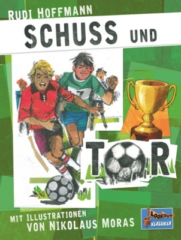
출처: https://www.cliquenabend.de/images/db/41367_500x400.jpg
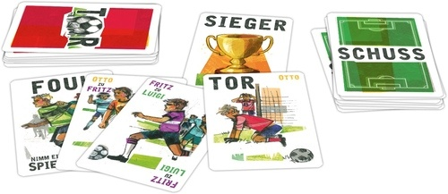
출처: https://www.cliquenabend.de/images/db/41368_500x400.jpg
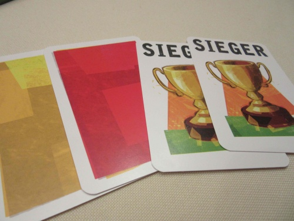
출처: https://www.cliquenabend.de/images/db/44655_500x400.jpg
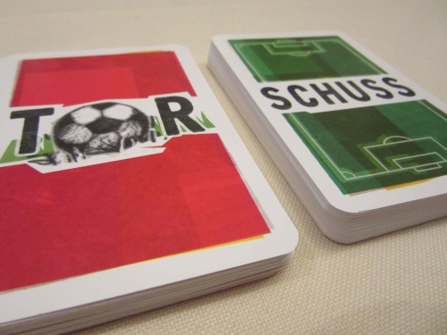
출처: https://www.cliquenabend.de/images/db/44660_500x400.jpg

#### 출처
- 규칙서 PDF: https://www.spielkarten.com/wp-content/uploads/2019/09/22160011_SchussUndTor.pdf (로컬 사본에서 텍스트 추출)
- https://www.cliquenabend.de/spiele/111600-Schuss-und-Tor.html
- https://gesellschaftsspiele.spielen.de/alle-brettspiele/schuss-und-tor/

---

### 해트트릭 (Hat-Trick, Patryk Kowalski, Games Unplugged (Unplugged, 폴란드 Zielona Góra), 2014)

| 항목 | 값 |
|---|---|
| 인원 | 2인 |
| 플레이 시간 | 45분 (reich-der-spiele) / 40분 (cliquenabend, wokolplanszy) / 30~40분 (폴란드 소개문) / 실측 60~70분 (GamesFanatic) |
| 연령 | 14세 이상 (Tabletopia 는 16+) |
| 형태 | 카드 (선수 카드가 그리드를 이루는 "카드로 만든 보드") |
| 근거 수준 | 상세 리뷰·인스트 (독일어 리뷰 1, 폴란드어 상세 리뷰 2, 출판사 소개문). 규칙서 PDF 는 공식 사이트(htspiel.de, htgame.uk)가 로그인 페이지만 남아 있어 미확보 |

일러스트: Bartek Fedyczak (cliquenabend). Essen 2014 출품. 규칙서는 18×9cm 8쪽, 폴란드어·독일어 2개 국어(wokolplanszy). 출판사가 웹 튜토리얼과 비디오 튜토리얼을 제공했다(GamesFanatic).

#### 구성물 (110장 + 공 토큰 1)
- 선수 카드(Spielerkarten) **20장**: 각 10장. 등번호, 위쪽에 공격력(공 아이콘 수), 아래쪽에 수비력. 뒷면은 "스타" 버전(별 표시)으로 한 능력치가 더 높다.
- 액션 카드(Aktionskarten) **64장**: 각 32장, 동일 구성. 종류는 짧은 패스·긴 패스·드리블 3종. 카드 좌/우 가장자리에 공 아이콘(강도)과 색(슈팅 강도용), 아래쪽에 어느 라인을 셀지 그림.
- 슈팅 카드(Torschusskarten) **9장**: 슈팅 강도와 정확도(예: "+4").
- 골키퍼 카드(Torwartkarten) **12장**: 각 6장. 슈팅 위치별 뽑을 카드 수 격자(사진: 윗줄 5·2·2·5, 아랫줄 4·3·3·4)와 "+"(예측 성공)·"−" 섹터 표시.
- 옐로카드 2, 레드카드 1.
- 팀 카드(Mannschaftskarten) 2장: 32개 국가대표(2014 브라질 월드컵)를 만드는 표. 어떤 번호를 스타 면으로 뒤집을지 적혀 있다(예: 카메룬 = 6번·11번).
- 공 토큰 1.

#### 셋업
- 두 팀 모두 항상 **4-4-2** 로 시작(GamesFanatic). 선수 카드를 규칙서의 배치도대로 놓는다. 라인(열)당 양 팀 합쳐 최대 4명(GamesFanatic: "zawsze w linii jest maksimum łącznie czterech zawodników obu drużyn"). 빈 칸이 4개 있다(wokolplanszy).
- 팀 선택: 팀 카드를 보고 스타 선수를 뒤집는다. 어떤 클럽팀이든 몇 초 만에 만들 수 있다고 출판사가 홍보.
- 각자 자기 액션 덱(32장)을 섞어 뒤집어 두고 **3장** 을 손에 든다.
- 선공을 무작위로 정하고 그 선수의 **6번** 선수에게 공을 놓는다(wokolplanszy).

#### 턴 구조 (wokolplanszy 요약, GamesFanatic 보충)
1. 두 사람이 **동시에** 손에서 액션 카드 1장을 뒤집어 낸다. 낸 뒤 덱에서 1장 뽑아 손패 3장을 유지. 공개한다.
2. **공격측(공 가진 팀) 이동**: 자기 선수 1명을 한 칸 앞 또는 뒤로 옮긴다(이웃과 자리 교환 또는 빈 칸 4개 중 하나로 진입). GamesFanatic: 움직일 선수는 낸 액션 카드의 공 아이콘이 있는 쪽(좌/우)에 해당하는 반쪽 필드로 제한.
3. **공격측 의무 패스**: 공 가진 선수는 같은 라인의 가장 가까운 팀 동료에게 공을 넘겨야 한다. 동료가 없으면 그대로.
4. **수비측 이동**: 같은 규칙으로 1명 이동.
5. **액션 판정** (아래 "판정").
6. 공격측이 상대의 마지막 라인에 도달하지 않았으면 1로 돌아간다. 도달했으면 "골문 앞 액션(akcja podbramkowa)" 으로 전환.

#### 판정
공 아이콘 합산 비교. 공격측은 관련 선수들의 공격력, 수비측은 수비력을 세고, 양측이 이번 턴에 낸 액션 카드의 공 아이콘을 더한다.

| 액션 | 세는 범위 | 성공(공격 합 > 수비 합) | 실패(수비 합 > 공격 합) |
|---|---|---|---|
| 짧은 패스 | 공이 있는 라인 | 공이 1라인 앞으로, 그 라인의 가장 낮은 번호 동료에게. 동료 없으면 같은 라인 유지 | 공은 같은 라인에 남되 수비팀의 가장 낮은 번호 선수에게 |
| 긴 패스 | 목표 라인(공격자가 1·2·3라인 앞 중 선택) | 위와 같음(목표 라인) | 위와 같음 |
| 드리블 | 공 가진 선수의 공격력 vs 바로 앞 수비수의 수비력 | 앞으로 나가며 그 수비수와 자리 교환 | 수비수가 공을 얻고 위치 불변 |
| **동점** | — | **파울**: 공격이 성공한 것으로 처리 + 수비측 옐로카드 + 프리킥 | — |

- 수비수가 라인에 들어와 있으면 짧은 패스가 막힌다(프레싱 효과), 골문 앞을 두텁게 하면 긴 패스는 막히지만 짧은 패스로 페널티 에어리어까지 접근당한다(GamesFanatic).
- 손패 3장이 적어 보이지만, 더 많으면 강팀(스타 많음 = 공 아이콘 많음)이 너무 자유로워지므로 의도된 제한이라는 평.

#### 슈팅과 득점
- **골문 앞 액션**: 시작은 일반 턴과 같이 액션 카드를 뒤집어 내지만 **보충 드로우가 없다**. 이동 규칙도 같으나 이 단계에서는 수비측이 공 가진 선수를 옮길 수 있다(평소 금지, GamesFanatic). 액션 카드의 기능이 조금 달라진다(세부 미확인).
- 액션을 성공시키고 공 가진 선수가 **마지막 2개 라인** 안에 있으면 슈팅. 아니면 골문 앞 액션을 반복.
- **슈팅**: 공격자가 방금 성공시킨 액션 카드와 같은 색의 슈팅 카드들 중 1장을 고르고, 수비자는 동시에 골키퍼 카드 1장을 고른다(비밀 선택, 골문 3구역 중 하나). 동시에 공개.
  - 슈팅 강도 = 성공한 액션 카드의 공 아이콘 + 슈팅 카드 수정치(예: 2 + 4 = 6).
  - 골키퍼는 자기 **액션 덱** 에서 카드를 뽑는다. 장수는 슈팅 위치에 따라 골키퍼 카드 격자에 적힌 수(정면 가까이가 적고, 각도 좁은 측면·원거리가 많음 — 사진 격자 5·2·2·5 / 4·3·3·4). 슈팅 카드를 골키퍼 카드 위에 겹쳐 놓았을 때 골키퍼 손이 "+" 에 닿으면(방향 예측 성공) 1장 더, "−" 면 1장 덜 뽑는다.
  - 뽑은 카드의 공 아이콘 합 > 슈팅 강도 → 선방. **= 슈팅 강도 → 쳐내기(parry)**, 공은 골문 옆 선수에게. **< 슈팅 강도 → 골**.
  - GamesFanatic 예시: 강도 6 슈팅, 16m 정면 → 골키퍼 3장, 방향 맞춰 4장. 앞 3장 합 4 → 마지막 1장에 2개 이상 있어야 선방.
- 골 후: 기록, 셋업대로 재배치, 중앙에서 재개.
- 리뷰어들이 공통으로 슈팅 미니게임을 최고 장점으로 꼽음(블라인드 게싱, 그림이 겹쳐지는 연출).

#### 시간 진행과 종료
- 양쪽이 액션 덱(각 32장)을 다 쓰면 전반 종료. 섞어서 후반.
- 두 하프 뒤 골이 많은 쪽 승. 동점 처리 미확인.

#### 특수 상황
- 파울: 판정 동점 시. 공격 성공 처리 + 수비측 옐로카드 + 프리킥(절차 미확인).
- PK: 파울로 중단된 액션의 결과로 공 가진 선수가 골문 앞 2칸 중 하나에 있게 됐을 경우. 옐로카드 + 공격 성공 처리 후 PK 실행(절차 미확인).
- 옐로 2장 → 레드? 미확인(레드카드 1장이 있으나 규칙 미확인).
- 오프사이드·교체·코너킥: 기본판에는 없음. 확장 "Spieler"(2015~)에 코너킥·교체 등 이벤트 6종, 선수 역할 22종, 능력 44종, 플레이스타일 카드 12장, 팀 45개, 팀 구성 카드 3장 추가(Tabletopia 설명).
- 골이 거의 항상 10·11번(정면 최전방)에서 나온다는 구조적 편향(GamesFanatic).

#### 평가와 교훈
- reich-der-spiele (Ingo Krüger, 2014): 규칙서가 너무 세부적이고 번잡해 이해가 어렵다. 다이내믹이 없고 매 수마다 공 아이콘을 세는 "카드 놓기 게임". 슈팅조차 카드 값 비교라 긴장이 없다. 손패 운 때문에 전략 세우기 어렵다. Fußball Taktik 2006, Street Soccer, Fußball-Ligretto 가 더 낫다. 댓글: 월드컵 시뮬레이션용으로 좋다는 반론.
- GamesFanatic (Odi, 7.5/10, 복잡도 7, 그래픽 6): 가벼운 필러가 아닌 "계산할 것 많은" 게임. 장점 — 팀 만들기 쉬움, 블라인드 비딩·핸드 매니지먼트·우위 계산 등 고민거리 많음, 슈팅 메커닉. 단점 — 선수 개성 없음(특수 능력 없음), 무리뉴식 점유 축구 느낌, 조금 김. 의무 이동과 골문 앞 규칙 변경이 비직관적.
- wokolplanszy (7/10): 액션이 "건조" 하고 지루했다. 규칙 일부가 혼란스러워 자주 하지 않으면 잊는다. 전술 깊이는 있음. 운 비중 큼.
- Tabletopia 평점 7.8, 무료 제공.
- **가져올 점**: (1) 슈팅을 "위치 → 뽑는 장수" 표 + "방향 맞추기 ±1장" 으로 푼 설계. 위치 우위와 심리전을 한 번에 해결. (2) 판정에서 동점 = 파울로 처리해 무승부 판정을 없앤 것(결정론성). (3) 같은 액션 카드에 "강도·색·이동 방향" 세 정보를 실어 1장으로 여러 결정을 하게 함. (4) 손패 3장으로 강팀 억제.
- **피할 점**: 매 수 라인의 공 아이콘을 세는 계산 부담. 의무 이동·의무 패스처럼 "반드시" 가 많으면 직관과 어긋난다. 골문 앞에서 규칙이 바뀌는 2단 구조는 배우기 어렵다. 선수 개성이 없으면 팀이 달라도 플레이가 같아진다.

#### 참고 이미지
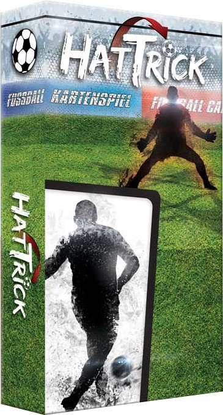
출처: https://www.gamesfanatic.pl/wp-content/uploads/2014/06/Hattrick.jpg
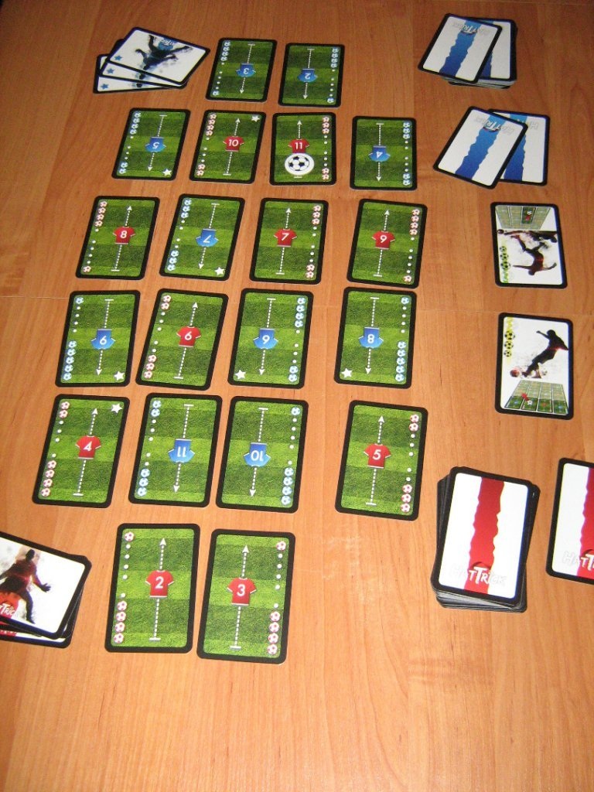
출처: https://www.gamesfanatic.pl/wp-content/uploads/2014/10/IMG_1996.jpg
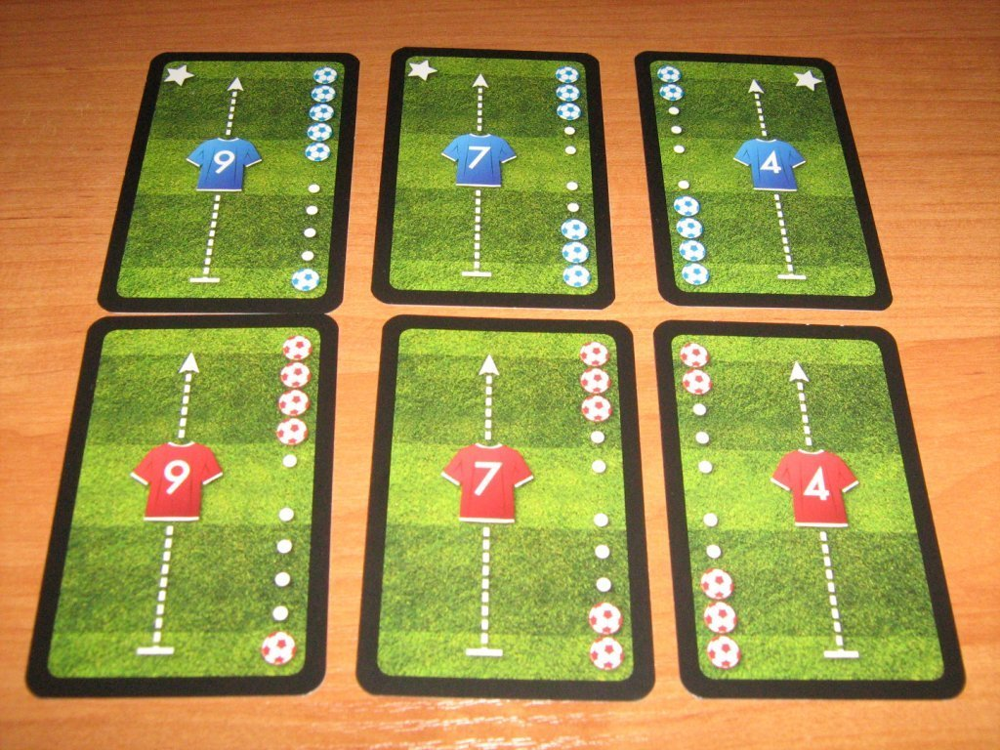
출처: https://www.gamesfanatic.pl/wp-content/uploads/2014/10/IMG_2003.jpg
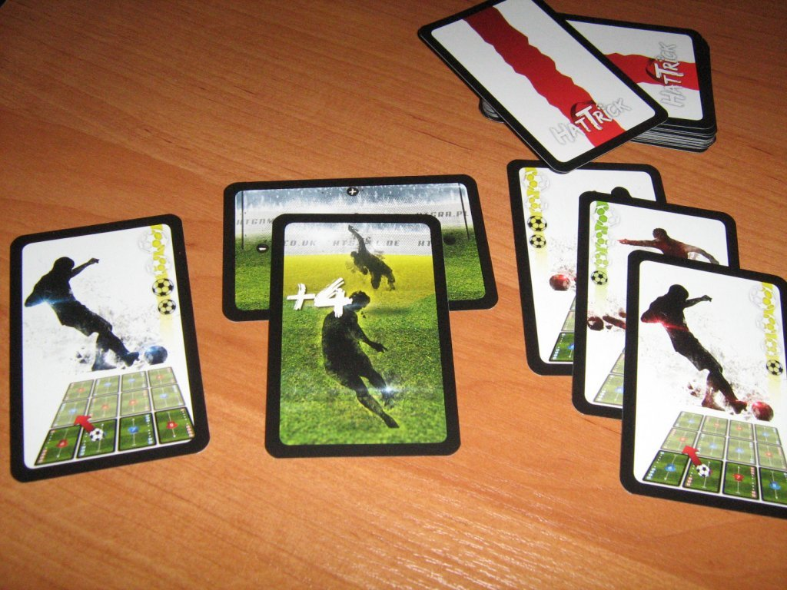
출처: https://www.gamesfanatic.pl/wp-content/uploads/2014/10/IMG_2001.jpg

#### 출처
- https://www.reich-der-spiele.de/kritiken/Hattrick-Kartenspiel
- https://www.cliquenabend.de/spiele/237400-Hat-Trick.html (구성물 목록, 출판사 소개문)
- https://tabletopia.com/games/hat-trick-basisspiel-spieler-erweiterung (확장 내용)
- https://www.gamesfanatic.pl/2014/10/13/hat-trick/ (폴란드어 상세 리뷰)
- http://wokolplanszy.blogspot.com/2015/10/hat-trick-recenzja.html (폴란드어, 턴 절차 상세)
- 접근 실패: http://htspiel.de/ , http://htgame.uk/ (로그인 페이지), gry-planszowe.pl 포럼(Cloudflare), BGG(403)

---

### 축구 대결 (Fußball-Duell – Macht euer Spiel!, Brett J. Gilbert & Matthew Dunstan, Kosmos, 2018 · 2023 "kicker Fußball-Duell" 재판)

| 항목 | 값 |
|---|---|
| 인원 | 2인 (3·4인은 코치 팀) |
| 플레이 시간 | 30~35분 (spielen.de) / 40분 (rds, kicker 판 박스) / 20~40분 (spieletest.at) |
| 연령 | 8세 이상 |
| 형태 | 보드 (카드 구동) |
| 근거 수준 | **규칙서 원문** (Kosmos 공식 PDF 12쪽, Art.-Nr. 697792) + 리뷰 3건 |

그래픽 Bluguy Grafik-Design, 3D Martin Hoffmann, 피규어 일러스트 Andreas Resch. 2023년 kicker 잡지 브랜드로 재판(Art. 684563, "Erklär-App" 포함). 제조사 사이트에 다른 유니폼 색 피규어 인쇄용 PDF 제공.

#### 구성물 (규칙서 원문)
- 게임판 "Fußballfeld" 1 (12×9 칸, angespielt 리뷰). 양 골문 앞에 숫자 1~4가 적힌 **슈팅 칸(Torschussfelder)**. 중앙선 양옆 두 줄은 흰 줄무늬.
- 팀당 선수 피규어 6 (kicker 판 뒷면 표기: 필드플레이어 10 + 골키퍼 2), 공 마커 1(검정), 골 마커 2(파랑·빨강), 골대 2.
- 전술 카드(Taktik-Karten) **31장** (그중 1장이 "Abpfiff(종료 휘슬)"), 슈팅 카드(Torschuss-Karten) **5장**, 요약 카드 4장.
- 변형용: 경합 카드(Zweikampf-Karten) 9장, 노란 받침(gelbe Standfüße) 6개, 주사위 1.
- 슈팅 카드 5장의 구성: "Tooor!" 2장 + "Gehalten(선방)" 3장 (spieletest.at: "bei den fünf Karten zwei TOOOR"; 규칙서도 4번 칸에서 "automatisch ein Tor" 라고 하여 일치).

#### 셋업
- 판을 가운데 두고 옆에 앉는다. 카드를 전술·슈팅·경합으로 나눈다. 기본 게임은 전술 + 슈팅 카드만 쓴다.
- 2인: 각자 피규어 6개, 같은 색 골 마커를 꽂은 골대, 요약 카드 2장. 골 마커를 0에 맞추고 골대를 판 양끝에 세운다.
- 동전 던지기로 선공을 정한다. 선공은 공 마커를 자기 피규어 하나에 꽂는다.
- **하프 시작 배치**: 골키퍼는 숫자 4 칸에. 공 가진 피규어는 센터서클에. 나머지는 자기 진영 아무 곳. 단 중앙선 양옆의 흰 줄무늬 두 줄에는 센터서클 피규어 외에 아무도 서지 못한다.
- 전술 카드에서 "Abpfiff" 를 빼고 나머지를 섞어 드로우 더미로 둔다. 맨 위 3장을 집어 Abpfiff 와 함께 섞어 더미 **맨 아래** 에 넣는다(= 종료 카드는 마지막 4장 중 하나).
- 각자 전술 카드 **3장** 을 손에. 공 가진 쪽이 시작.

#### 턴 구조
턴 = ① 손패 1장 내기 → ② 액션 실행(+ 슈팅 가능) → ③ 1장 보충.
- 카드는 **공격면(연두)** 과 **수비면(진녹)** 두 반쪽으로 되어 있다. 공을 가진 쪽은 공격면을 위로, 상대는 수비면을 위로 든다. 공을 잃거나 얻으면 **즉시 손패 전부를 뒤집는다**(역할 교대).
- 카드에 적힌 액션은 **임의 순서** 로, 이동 칸 수는 다 쓰지 않아도 되고 액션을 통째로 버려도 된다. 한 액션을 여러 피규어에 나눌 수는 없다. 한 피규어가 여러 액션을 연속 수행할 수 있다(예: 프리런 → 패스 받음 → 드리블).
- 카드에 "ODER(또는)" 가 있으면 둘 중 하나만.
- 이동 규칙(공통): 가로·세로·대각 모두 가능, 도중 방향 전환 가능, **점유된 칸은 진입도 통과도 불가**. 골키퍼는 필드플레이어처럼 이동한다.

**공격 액션** (숫자 = 카드에 적힌 칸 수 예시):
| 액션 | 내용 |
|---|---|
| Freilaufen ohne Ball (2) | 공 없는 피규어 이동 |
| Dribbeln mit Ball (2) | 공 가진 피규어만 이동 |
| Pass (3) | 공을 직선(가로·세로·대각)으로, 방향 전환 없이, 반드시 다른 자기 피규어에게. 빈 칸에서 끝날 수 없고 피규어를 넘을 수 없다 |
| Hoher Pass (3) | Pass 와 같되 점유된 칸을 **넘어서** 패스 가능 |

**수비 액션**:
| 액션 | 내용 |
|---|---|
| Laufen (1) | 아무 피규어 이동 |
| Zweikampf (!) | 특수. 항상 턴의 **마지막** 액션. 자기 피규어가 공 가진 상대 피규어와 (가로·세로·대각) 인접해 있으면 가능 |
| Parade (!) | 특수. 상대가 슈팅을 선언하는 즉시 낼 수 있다 |

- 액션을 마치고 슈팅하지 않으면(못 하면) 1장 보충하고 턴 종료.

#### 판정
- **경합(Zweikampf, 기본 게임)**: 가위바위보. 같으면 반복. 공격자가 이기면 공 유지, 이제 공격자 턴. 수비자가 이기면 경합한 피규어에 공 마커를 옮기고 전술 카드 1장을 뽑으며 양측 손패를 뒤집고 **수비자(새 공격자)가 곧바로 한 번 더 턴**.
- **프로리그 변형(Profi-Liga)**: 경합 카드 9장을 섞어 뒤집어 둔다. 경합 시 수비자가 맨 위 1장 공개:
  - 가위바위보: 기본과 같이.
  - 옐로카드: 거친 파울. 경합한 피규어를 노란 받침으로 교체. 공격자 공 유지. 이미 노란 받침인 피규어가 또 받으면 **퇴장(이 게임 동안 제외)**.
  - Foul: 경합 실패, 공격자 공 유지.
  - 주사위: 수비자가 1회 굴림 — 공 획득 / 상대 공 유지 / 파울+옐로카드(사진상 주사위 면: ✓, ✗, 노란 카드).
  - Ballgewinn: 경합 성공, 공 획득. 그 뒤 경합 카드 전부를 다시 섞는다.

#### 슈팅과 득점
- 공 가진 피규어가 숫자 칸에 도달하면 즉시 슈팅을 선언하거나 더 전진할 수 있다. **슈팅은 액션이 아니며 카드가 필요 없다.**
- 선언하면 수비자가 슈팅 카드 5장을 손에 들고 섞고, 공격자가 **서 있는 칸의 숫자만큼**(1~4) 뽑는다. 예외: Parade — 수비자가 손에 Parade 카드가 있으면 즉시 내서 1장 **덜** 뽑게 한다. 턴당 Parade 1장까지.
- 뽑은 것 중 "Tooor!" 가 1장이라도 있으면 골. 골 마커를 올린다. 4번 칸에서는 4장 = 자동 골(규칙서 팁).
- 골 후: 이전 수비자가 공을 받고 하프 시작 배치대로 재배치(공 피규어 센터서클, 나머지 자기 진영).
- "Gehalten" 만 뽑으면 무득점, **골킥(Abschlag)**: 상대 골키퍼가 공을 받고, 공격자의 모든 피규어는 페널티 에어리어 밖으로 **직선** 으로 밀어낸다. 손패를 뒤집고 새 공격자 턴.

#### 시간 진행과 종료
- 전술 카드 더미에서 **Abpfiff** 를 뽑는 순간 하프 종료(더 이상 액션 없음). 후반은 더미와 배치를 다시 만들고, **전반을 수비로 시작한 팀** 이 공을 갖고 시작.
- 후반 Abpfiff → 게임 종료. 골 많은 쪽 승.
- 동점: 슈팅 카드를 섞어 뒤집어 늘어놓고, 휘슬 시점에 공을 가진 쪽부터 번갈아 1장씩 공개. **먼저 Tooor! 를 뒤집는 쪽이 승리**(서든데스).

#### 특수 상황
- 파울·옐로·퇴장: 프로리그 변형에서만(위 표).
- PK·오프사이드·교체·코너·스로인: 없음(spieletest.at 가 오프사이드 부재를 단점으로 지적, rds 는 레드카드·교체·PK·핸드볼 부재를 지적).
- 3인: 두 명이 한 팀(각 손패 2장), 혼자인 쪽은 3장. 빨강·파랑 팀이 번갈아 턴(예: Felix(파) → Peter(빨) → Annette(파) → Peter(빨)…).
- 4인: 2대2, 각 손패 2장, 시계 방향으로 빨·파 코치가 번갈아 앉는다.

#### 평가와 교훈
- reich-der-spiele (Dirk Janßen, 2018): 단순하고 운 비중이 큰 게임. 어떤 카드를 내고 어떤 피규어를 옮기느냐보다 슈팅·경합에서 어떤 카드를 뽑느냐가 승부를 가른다. 어린 플레이어용. 재료는 기능적이나 분위기 없음. 프로리그 경합 카드는 재미있음.
- spieletest.at (Jörg Domberger, 2018-12): 오프사이드 없음, 골키퍼가 필드플레이어와 같음, 새로운 것 없음, 하프타임에 하기엔 길다. 장점은 쉬운 규칙, 빠른 진행.
- angespielt (Carsten Pinnow, 7/10): 액션이 명료하고 이해 쉬움. 카드 1장으로 프리런→패스→드리블 진입→슈팅까지 이어지는 콤보가 가능해 약간의 전술이 있음. 수비도 길목 차단·태클 위치 선점 등 할 일이 있음. 옐로카드가 들어가야 재미있어짐. 판 12×9.
- spielen.de 평점 2.9/5 (41명).
- **가져올 점**: (1) 한 카드에 공격면/수비면을 같이 실어 "공 소유 = 카드 뒤집기" 로 역할 교대를 즉시 처리하는 방법. (2) 슈팅 = "위치 숫자만큼 5장 중 뽑기, 2장이 골" 이라는 확률 표(1칸 40%, 2칸 70%, 3칸 90%, 4칸 100%)와 Parade 로 −1장. 카드 게임에서 그대로 쓸 수 있는 슈팅 판정. (3) 종료 카드를 더미 맨 아래 4장 안에 섞어 넣는 타이머(끝이 보이되 정확히는 모름). (4) 동점 서든데스가 규칙에 명시됨.
- **피할 점**: 경합이 가위바위보라 전술과 무관(리뷰 공통 불만). 골키퍼가 특별하지 않다. 파울·PK 같은 축구 이벤트가 변형에만 있고 기본판은 밋밋하다. 보드 이동 게임이라 카드 게임으로 옮기면 "위치" 를 대체할 장치(라인·존)가 필요하다.

#### 참고 이미지
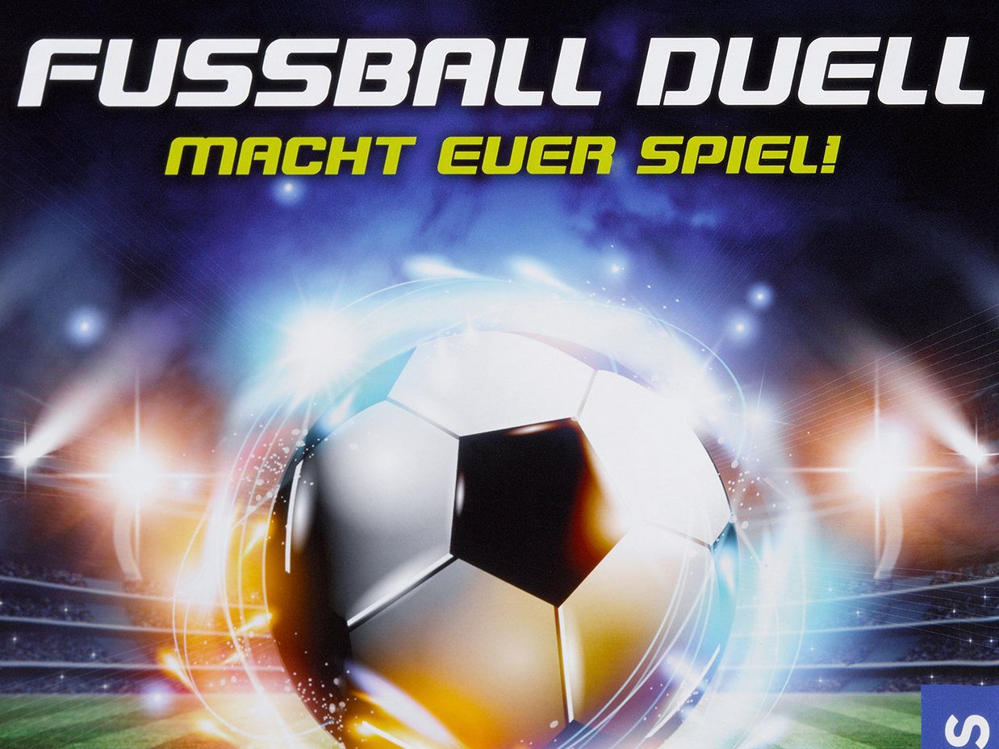
출처: https://spielen.de/uploads/image/60557/5a5e264aa5f5e.jpeg
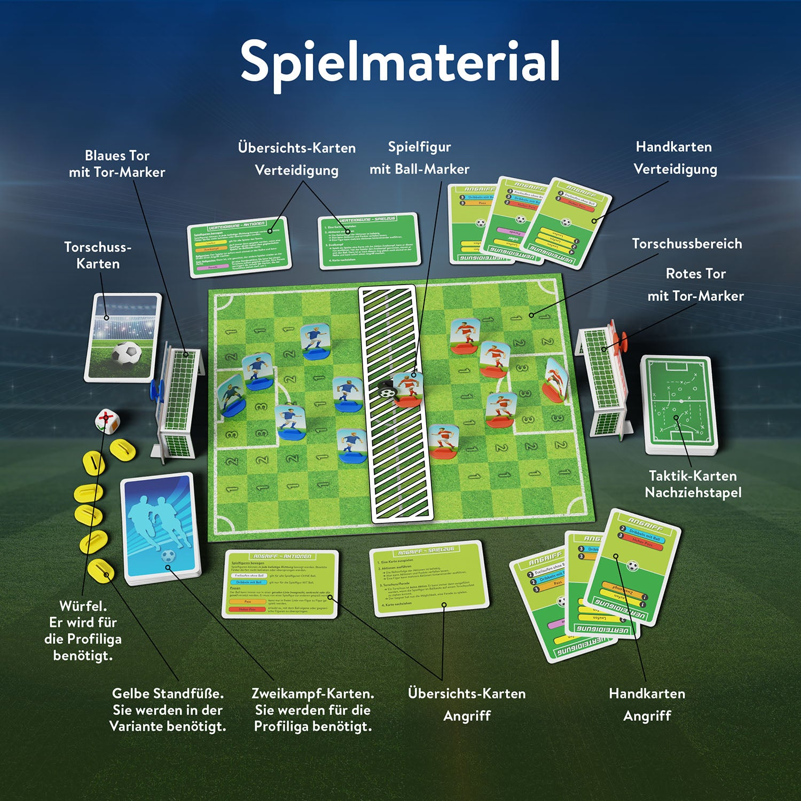
출처: https://www.kosmos.de/cdn/shop/files/4002051684563_2.jpg?v=1786557879&width=1500
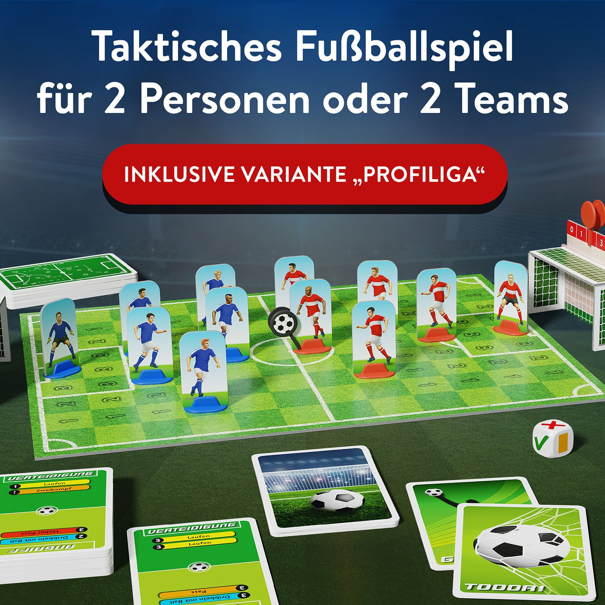
출처: https://www.kosmos.de/cdn/shop/files/4002051684563_3.jpg?v=1786554653&width=1500
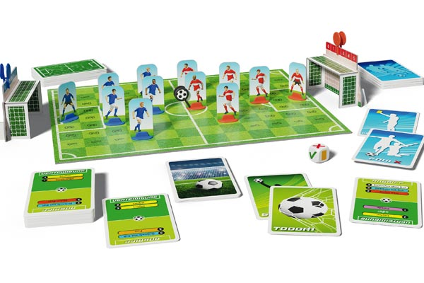
출처: https://www.reich-der-spiele.de/wp-content/uploads/fussball-duell.jpg

#### 출처
- 공식 규칙서 PDF: https://www.kosmos.de/cdn/shop/files/4002051697792_Fussball-Duell_Manual_web.pdf (FragKosmos 문서 "697792_Fussball-Duell_Manual_web.pdf" 와 동일 파일명 계열)
- https://gesellschaftsspiele.spielen.de/alle-brettspiele/fussball-duell/
- https://www.reich-der-spiele.de/kritiken/Fusball-Duell-Kosmos
- https://www.spieletest.at/gesellschaftsspiel/5684/fussball-duell-macht-euer-spiel
- https://www.angespielt.de/kritiken/fussball-duell
- https://www.kosmos.de/de/kicker-fussball-duell_7684563_4002051684563 (kicker 재판 이미지)
- 접근 실패: https://fragkosmos.zendesk.com/... (Cloudflare), brettspielversand.de PDF (429)

---

### 루카스와 놀자: 드리블 열병 (Spiel mit Lukas: Dribbel-Fieber, Stefan Feld & Wolfgang Panning, Queen Games, 2010)

| 항목 | 값 |
|---|---|
| 인원 | 2인 |
| 플레이 시간 | 20~30분 (luding) / 20분 (Meeple Mountain) / 실측 기본 40분·변형 60분 (spielphase) |
| 연령 | Kick'n'Run 6세+, 챔피언 버전은 더 높음 (luding 7+, spielphase 8+; 정확한 표기 미확인) |
| 형태 | 보드 (카드 구동, 덱빌딩 요소) |
| 근거 수준 | 상세 리뷰·인스트 (Meeple Mountain 2024 영어 리뷰의 규칙 요약 + spielphase.de 독일어 리뷰 + luding 출판사 보도자료). 규칙서 PDF 미확보 (Queen Games 규칙 디렉토리·spielen.de 에 없음, BGG 403) |

일러스트 Harald Juch. "Spiel mit Lukas"(Lukas Podolski) 시리즈 2종 중 하나. Nürnberg 2010, 28유로. 절판, 희귀. 상자 안에 입문판 **Kick'n'Run** 과 **Champion-Version** 두 규칙이 함께 들어 있다.

#### 구성물 (luding 보도자료·spielphase)
- 게임판 1: **5×8 칸** 스트리트사커 필드. 많은 칸에 색 표시(색 주사위와 대응). 가장자리에 양 팀 골 트랙, 슈팅 강도 트랙 2개, 양쪽에 선수 카드 슬롯 5개씩.
- 나무 피규어 10 (팀당 5, 번호 스티커를 붙임), 나무 공 1, 골 표시기(Toranzeiger) 2.
- 코인(Polditaler, 판지) 28 — 여러 액면.
- 색 주사위 1, 숫자 주사위 1, 킥오프 코인(Anstoßmünze, 양면 색이 다름) 1, 마킹 링 2.
- 카드 40: 선수 카드(등번호, 공격/수비값, 이동값), 액션 카드(이동 패턴; 카드마다 기능 2개 중 택1), Poldi 카드(액션 심볼 + 카드 번호 + 가격; 파랑·노랑, 챔피언판에 빨강 추가), 요약 카드. 종류별 장수 미확인.
- Poldi 카드는 Podolski 실제 사진.

#### 셋업 (Kick'n'Run, Meeple Mountain)
- 각자 자기 색 액션 덱, 스코어 마커, 슈팅값 링, 피규어를 갖는다.
- 선수 카드를 자기 쪽 판 가장자리 슬롯에 놓는다. **골키퍼는 항상 가운데 슬롯**, 나머지 4장은 자유. 슬롯 = 필드 포지션, 카드 = 피규어 1개. 피규어는 표시된 시작 칸에.
- 슈팅값 링을 0에, 스코어 마커를 0에, 공을 센터에.
- 파랑·노랑 Poldi 카드를 섞어 덱으로 두고 **3장** 을 공개해 시장을 만든다. 각자 Polditaler **2개**. 나머지 코인은 은행.
- 각자 액션 카드 **3장** 드로우. 킥오프 코인을 던져 선공.

#### 턴 구조 — 4 페이즈
1. **카드 없는 플레이(kartenlose Aktion)**: 공격자(활성 플레이어)가 공을 갖고 있지 않으면 공에 가장 가까운 자기 피규어를 공이 있는 칸으로 옮긴다(= 공 획득). 갖고 있으면 자기 피규어 하나를 무료 이동(spielphase: 대각 1칸 또는 직선 최대 2칸).
2. **카드 플레이**: 손에서 원하는 만큼(spielphase: 1~3장) 임의 순서로. 각 카드는 두 기능 중 하나 — 공 없는 이동, 공 가진 이동, 피규어 없이 공만 이동(패스·크로스 등; 카드 이름은 luding 보도자료에 "Flanke, Pass, Dribbling"). 또는 카드를 버리고 장당 **Polditaler 2개**.
3. **카드 드로우**: 시장의 Poldi 카드 1장을 살 수 있다(가격은 카드에). **파랑** → 손으로, **노랑** → 자기 앞에 놓아 두었다가 나중에 버려서 효과 사용(예: Volley 카드는 슈팅 보너스). 그 뒤 손패를 3장까지 보충. **사지 않으면 시장에서 번호가 가장 높은 카드를 게임에서 제거하고 새로 깐다.** Poldi 덱이 다 떨어지면 게임 종료(= 타이머; Meeple Mountain). spielphase 는 "6라운드" 라고 기술 — 어느 쪽이 정확한지 미확인.
4. **슈팅**: 공이 상대 진영에 있을 때만 가능. 공이 자기 피규어와 같은 칸에 있고 그 칸이 상대 골문 바로 앞 구역이면 **슈팅 의무**(spielphase: "im Strafraum sogar Pflicht"). 공이 자기 진영이면 슈팅 없이 턴 넘김.

#### 판정 (챔피언 버전의 경합)
- Kick'n'Run 에서는 공이 있는 칸에 들어가면 자동으로 공을 얻는다.
- 챔피언 버전: 피규어 번호(카드 좌하단 유니폼 아이콘 숫자) = **경합력(Zweikampfwert/dueling strength)**. 공이 있는 칸의 양측 피규어 경합력을 비교해 공 소유를 정한다. **동점은 공격자**. 상대 피규어를 밀고 지나갈 때도 경합력 대결. 손패 1장을 버리면 그 카드에 적힌 수만큼 피규어 경합력을 일시 상승(마커를 선수 카드에 올림). 효과는 다음 공격 턴까지 지속 → 상대 턴의 수비에도 적용.
- 챔피언 버전의 1페이즈는 공격자 이동 → 수비자 이동 → 공격자 이동으로 확장.

#### 슈팅과 득점
- 공격값 = 슈터의 공격력(선수 카드) + 골문과의 거리 보정(가까울수록 큼) + 노랑 Volley 카드 보너스.
- 수비값 = 골키퍼 수비력(골키퍼 위치에 따라 다름) + 공이 있는 칸의 수비 피규어 보너스.
- **목표값 = 수비값 − 공격값**. 링으로 트랙에 표시. d6 을 굴린다:
  - **> 목표값** → 골. 모두 시작 위치로, 다음 플레이어 턴.
  - **= 목표값** → 튕김(Abpraller). 수비자가 골키퍼(색) 주사위를 굴려 골문 주변 어느 칸으로 공이 가는지 정한다. 그 칸에 공격측 피규어가 있으면 다시 슈팅 기회.
  - **< 목표값** → 튕김. 이번엔 골키퍼가 나온 색과 같은 칸 아무 곳에나 공을 놓는다.
- spielphase: 실패 시 은행에서 코인 1개를 받는다. 색 주사위로 공이 가는 칸 또는 골킥(Abstoß) 결정.

#### 시간 진행과 종료
- Kick'n'Run: Poldi 덱 소진(또는 6라운드) → 골 많은 쪽 승. **동점 가능**(spielphase).
- 챔피언 버전: Poldi 덱에 **하프타임 휘슬**·**종료 휘슬** 카드 2장 추가(그래서 Poldi 카드도 더 넣음). 하프타임에 잠시 멈추고 각자 **덱에서 원치 않는 카드를 제거**(보상으로 코인). 종료 휘슬로 끝.

#### 특수 상황
- 파울·PK·오프사이드·교체·세트피스: 없음(스트리트사커 테마).
- 빨강 Poldi 카드(챔피언판): **상대 턴에** 쓸 수 있는 카드. 내용 미확인.

#### 평가와 교훈
- Meeple Mountain (David McMillan, "Fair"): 희귀하지만 좋은 게임은 아님. 주사위와 카드 드로우의 운을 조정할 수단이 없다. 어린이 대상. 챔피언판은 덱 정리가 가능해 그나마 낫다. 테마(동네 아이들의 골목 축구)는 매력적.
- spielphase (Keirat, 3점/10): 기계적 카드와 공격/수비값 끝없는 계산으로 매우 건조. 슈팅이 두 값 비교 + 주사위라 판 위에서 슈팅이 보이지 않는다. 변형은 더 길고 계산만 늘어난다. Feld 의 가장 약한 게임.
- **가져올 점**: (1) 슈팅 = 공격값 − 수비값 → 목표값 → d6 초과/동일/미달의 3분기 결과(골/튕김 재기회/골키퍼 처리). 튕김에 "재슈팅 기회" 를 넣은 것은 축구 느낌을 준다. (2) 시장에서 안 사면 가장 높은 번호 카드 제거 → 시장 순환 + 타이머 결합. (3) 손패 버리기 = 경합력 상승이라는 이중 용도.
- **피할 점**: 값 계산이 많으면 축구 느낌이 사라진다는 두 리뷰의 공통 지적. 결과를 바꿀 수단 없는 순수 운은 피할 것. 덱빌딩(구매)은 20분 게임에 얹기엔 무겁다.

#### 참고 이미지
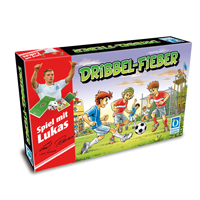
출처: https://www.luding.org/luding/press/2010DribbelFieber.jpg
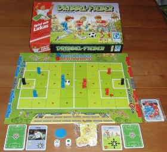
출처: http://ftp.informatik.rwth-aachen.de/keirat/txt/Scans/D/DribbelF.jpg

#### 출처
- https://www.meeplemountain.com/reviews/dribbel-fieber/ (규칙 요약 상세)
- https://www.meeplemountain.com/boardgame/spiel-mit-lukas-dribbel-fieber/
- https://www.luding.org/cgi-bin/GameData.py/ENgameid/23497 (구성물, 보도자료)
- http://ftp.informatik.rwth-aachen.de/keirat/txt/D/Dribbelf.html (spielphase.de 리뷰)
- 접근 실패: spielkult.de/spielkultisten.de (Cloudflare), BGG 규칙 파일·리뷰 스레드(403), rules.queen-games.com (해당 파일 없음)

---

### 리그레토 축구 (Das Ligretto Fußballspiel, Michael Feldkötter, Schmidt Spiele, 2012)

| 항목 | 값 |
|---|---|
| 인원 | 2~6인 (두 팀: 1v1, 1v2, 2v2, 2v3, 3v3) |
| 플레이 시간 | 15~20분 |
| 연령 | 8세 이상 |
| 형태 | 카드 (리얼타임, 동시 진행) |
| 근거 수준 | **규칙서 원문** (spielen.de 배포 공식 규칙 PDF, 독·불어) + Cliquenabend 리뷰 |

일러스트 Michael Menzel. 약 8유로. 참고: Schmidt 는 2017년 이후 "Ligretto Fußball"(2~4인, 7세+, 150장, 3골 선취, 4 카드로 킥오프) 이라는 **다른 규칙의 신판** 도 냈다(schmidtspiele.de 규칙 PDF 확인). 아래는 2012판 기준.

#### 구성물 (160장)
- 손패 카드(Handkarten) **120장**: 팀 검정·흰색 각 60장. 앞면은 유니폼과 등번호(숫자), 뒷면은 골문의 1/4 조각 그림(골 장면 조립용).
- 골 카드(Torkarten) **16장**: 팀당 8장. 한 면은 "1번 유니폼(골키퍼)", 다른 면은 골 장면(골대 4조각 + 공 위치).
- 필드 카드(Spielfeldkarten) **24장**: 숫자면(예: 3, 11, 6, 21, 12)과 필드 그림면.

#### 셋업 (매 라운드)
1. 필드 카드 5장을 무작위로 뽑아 숫자면을 위로 한 줄로 깐다 = 필드. 남은 필드 카드는 다음 라운드용.
2. 각 팀은 자기 색 골 카드 8장 중 **5장** 을 뒤집어 뽑아 골 카드 더미로 자기 기준 필드 **왼쪽** 에 놓는다(자기 팀 색 "1번 유니폼" 이 자기 쪽을 향하게). 남은 3장은 치운다.
3. 2인: 각자 한 색의 손패 전부. 그 이상: 팀을 나누고(1v2, 2v2, 2v3, 3v3), 상대끼리 마주 앉고, 팀원끼리 손패를 대략 균등 분배.
4. 각자 손패를 뒤집은 더미(유니폼면 아래)로 들고 잘 섞는다.

#### 턴 구조 (턴 없음 — 전원 동시)
- "Anpfiff!" 신호로 시작. 각자 손패 더미의 맨 위 1장씩 공개한다.
- 시작은 자기 골(1번 유니폼): "1" 을 찾아 자기 골 카드 아래에 놓는다. 그 다음 첫 번째 필드 카드, 충족되면 두 번째… 왼쪽에서 오른쪽으로 **순서대로** 상대 골까지.
- 놓을 수 없거나 놓기 싫은 카드는 자기 앞에 공개해 버림 더미를 만든다. 각자 **버림 더미 2개** 까지. 버림 더미 맨 위 카드도 낼 수 있다. 특례: 1v2 의 혼자인 쪽은 4개, 2v3 의 2인 팀은 각 3개.
- 손패 더미가 떨어지면 버림 더미들을 합쳐 섞어 새 손패 더미로.
- 필드 카드 충족 방법: (1) 카드 1장의 등번호가 값과 같음, (2) 여러 장의 합이 값과 정확히 같음(예: 18 = 10 + 6 + 2).
- 막히면 그 필드 카드에 놓인 손패를 **전부** 버림 더미로 치우고 다시 시작할 수 있다(일부만 치우기는 금지).

#### 판정
- 판정 없음. 정확한 합산과 속도만.

#### 슈팅과 득점
- 필드 카드 5장을 모두 충족한 팀은 즉시 **상대 골 카드 더미** 의 맨 위를 뒤집는다. 그 골 장면이 조립 템플릿.
- 팀원 각자 손패 + 버림 더미를 합쳐 새 더미로 만들고 **뒤집는다**(이제 골 조각면이 위). 다시 1장씩 넘기며 골 조각 4장으로 장면을 재현. 팀이 함께 한 골을 만든다. 맞으면 따로 두고, 아니면 버림 더미 2개 중 하나로. 골대 방향과 공 위치를 맞춰야 한다.
- 완성하면 "TOOOR!". 상대 팀이 필드 카드 전부와 골을 검사. 맞으면 골 카드를 획득. **틀리면 자책골**: 상대 팀이 그 골 카드를 자기 더미에 다시 섞고, 실수한 팀의 골 카드 더미 맨 위를 가져간다.

#### 시간 진행과 종료
- 라운드 뒤: 필드 카드 치우고 새 5장. 열려 있던(미완성) 상대 골 카드는 더미에 다시 섞는다. 팀원이 손패를 섞어 재분배.
- **먼저 5골** 을 넣은 팀이 승리(신판은 3골).

#### 특수 상황
- 파울·PK·오프사이드·교체: 없음. 자책골(검사 실패)만 있음.

#### 평가와 교훈
- Cliquenabend (Jörg 7/10, Smuker 8/10): 전략은 없고 반응 속도와 계산뿐. 팀 협업(소리 지르며 필요한 숫자 알리기)이 큰 재미. 운은 큼(맞는 카드가 언제 나오느냐). 인원에 상관없이 잘 돌아감. 접힌 다국어 규칙지는 불만. 8유로에 카드 160장은 가성비 좋음. 축구팬이 아니어도 재미있었다.
- reich-der-spiele 의 Hat-Trick 리뷰에서 "Fußball-Ligretto 가 더 긴장감·액션·재미가 있다" 고 언급.
- spielen.de 평점 2.3/5 (4명).
- **가져올 점**: (1) "골키퍼(1)에서 출발해 필드 카드 5장을 순서대로 통과 → 골" 이라는 공간 없는 빌드업 표현. (2) 골 장면 조립이라는 마무리 미니게임과 검사 실패 = 자책골이라는 처벌. (3) 팀원이 같은 골을 함께 만드는 협동 구조.
- **피할 점**: 리얼타임이라 결정론적 규칙서와 맞지 않는다(동시 처리 분쟁 규칙 없음). 축구 시뮬레이션 요소(수비·판정)가 전무.

#### 참고 이미지
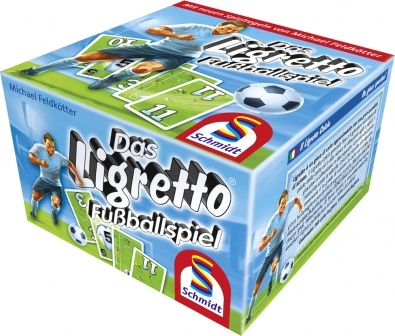
출처: https://www.cliquenabend.de/images/db/21407_500x400.jpg
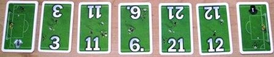
출처: https://www.cliquenabend.de/images/db/22886_500x400.jpg
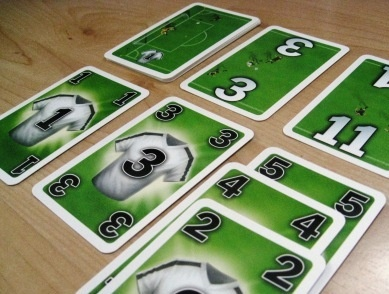
출처: https://www.cliquenabend.de/images/db/22888_500x400.jpg
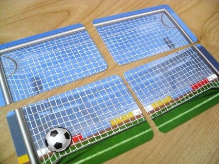
출처: https://www.cliquenabend.de/images/db/22890_500x400.jpg

#### 출처
- 공식 규칙 PDF (2012판): https://gesellschaftsspiele.spielen.de/uploads/files/657/54c362e17b69a.pdf
- https://gesellschaftsspiele.spielen.de/alle-brettspiele/das-ligretto-fussballspiel/
- https://www.cliquenabend.de/spiele/877100-Das-Ligretto-Fu%C3%9Fballspiel.html
- 신판 규칙 PDF (Ligretto Fußball, 다른 게임): https://www.schmidtspiele.de/files/Retail/72dpi_PNG/78720_Fu%C3%9Fball_Ligretto_DE_FR_IT_EN_NL_ES.pdf

---

### 페널티킥! (Elfmeter! – Das rasante Kartenspiel, 디자이너 미확인, Kosmos, 2020)

| 항목 | 값 |
|---|---|
| 인원 | 2인 |
| 플레이 시간 | 약 15분 |
| 연령 | 7세 이상 (박스 표기 7+) |
| 형태 | 카드 (리얼타임, 상자 바닥이 필드) |
| 근거 수준 | 상점·소개문 (Kosmos 소개문, ludorium.at 데이터 카드). 규칙서 PDF 미확보 (FragKosmos Cloudflare 차단, Kosmos CDN 파일명 추정 실패) |

Art.-Nr. 741730, 그래픽 Fiore GmbH (ludorium). 디자이너 미확인.

#### 구성물
- 카드 60장, 상자 바닥의 필드, 규칙서. ludorium: "카드 세트와 **킥오프 카드 6장**".
#### 셋업
- 미확인.
#### 턴 구조
- 턴 없음, 동시 진행. Kosmos 소개문: 두 사람이 동시에 가능한 한 빨리 올바른 카드를 낸다. 한 명이 공격 — 상대 수비수를 피해 슈팅하려 함; 다른 한 명이 수비 — 막으려 함. 수비 성공 시 공을 낚아채고 **즉시 역할 교대**. 카드가 다 떨어질 때까지 반복.
- ludorium 요약: 선공이 킥오프 카드 1장을 공개하면 둘 다 자기 역할 면을 위로 하고 카드를 낸다. 공격자는 공을 움직여야 하고 수비자는 막아야 하며, 어느 쪽이든 낸 카드의 선수가 **올바른 위치** 에 그려져 있어야 한다. 올바른 수비 카드가 나오면 역할 교대. 공격자가 올바른 카드를 **연속 3장** 내면 페널티킥이 일어나고 라운드 종료.
#### 판정
- 위 "올바른 위치" 매칭. 상세 미확인.
#### 슈팅과 득점
- 연속 3장 성공 → 페널티킥. 골이면 공격자가 킥오프 카드를 골 마커로 가져간다. PK 판정 방식 미확인.
#### 시간 진행과 종료
- 필요할 때 킥오프 카드를 낼 수 없는 사람이 생기면 종료, 골 마커가 많은 쪽 승리 (ludorium).
#### 특수 상황
- 미확인.
#### 평가와 교훈
- 리뷰 미확보. 소개문상 "공격 연속 성공 3회 = 슈팅 기회, 수비 성공 1회 = 즉시 역습" 이라는 리듬은 카드 축구의 공수 전환을 아주 짧게 압축한 예로 참고할 만하다. 리얼타임이라 결정론적 규칙서와는 맞지 않는다.
#### 참고 이미지
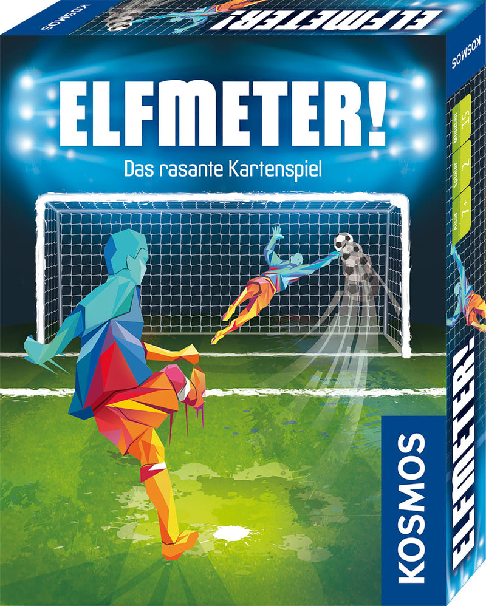
출처: https://www.kosmos.de/cdn/shop/files/4002051741730.jpg?width=800
#### 출처
- https://www.ideeundspiel.com/p/elfmeter/KOSMOS741730 (Kosmos 소개문 전문)
- http://ludorium.at/SPIELE/kosmos/elfmeter_e0.htm
- https://www.otto.de/p/kosmos-spiel-kartenspiel-elfmeter-CS075N0U2/
- 접근 실패: https://www.kosmos.de/spielware/spiele/karten-und-wuerfelspiele/11026/elfmeter (404), BGG 327980 (403)

---

### 피날레 (Finale) — 같은 이름의 게임이 둘

사용자 메모 "2인 15분 주사위" 에 가까운 것은 (a) Noris 판이다(단 리뷰 표기는 20분). 어느 쪽을 뜻하는지 미확인이라 둘 다 적는다.

#### (a) Finale – Das spannende Fußball-Duell (Ingo Althöfer, Noris Spiele, 2005/2006/2008 판)

| 항목 | 값 |
|---|---|
| 인원 | 2인 |
| 플레이 시간 | 20분 (reich-der-spiele) |
| 연령 | 6세 이상 |
| 형태 | 보드 (주사위) |
| 근거 수준 | 상세 리뷰 (reich-der-spiele) + 디자이너 개발기(althofer.de) |

- 구성물: 국기 12개가 인쇄된 판, 각 11개의 플라스틱 말(등번호 1~6, 1번만 1개, 2~6은 2개씩). **공이 없다.**
- 셋업: 각자 11개 말을 자기 골문 앞에 놓는다.
- 턴: 주사위를 굴려 **나온 번호의 말 1개** 를 **1칸** 앞으로(직진 또는 대각) 옮긴다. 항상 말 1개, 1칸.
- 판정·슈팅: 자기 말 1개를 **상대 골문 안으로 밀어 넣으면** 승리. 말이 골에 들어가야 한다(공이 없으므로).
- 종료: 골 1개로 즉시 승리.
- 특수 상황: 없음.
- 디자이너 개발기: 원형은 2002년 "Würfel-Fussball". 컴퓨터 대전으로 **7×5 판이 6×5 보다 훨씬 낫다**(무승부 급감)는 것을 확인. Noris 가 "Finale" 로 4개 판본 출간(2005, 2006, 헝가리판 Döntő 2006, 2008). 2008년 Noris 계약 종료 후 Kosmos 가 새 디자인·새 이름 **"Torjäger"**(2010 월드컵) 로 재출간. 같은 뿌리에서 추상 게임 "EinStein würfelt nicht!" 가 나왔다.
- 평가 (rds, Ingo Krüger): 국기 오류(영국 국기, 포르투갈·스웨덴 좌우 반전), 재료 성의 없음. 축구 시뮬레이션으로는 부적합, 점프 없는 체커 같음. "체커가 더 낫다".
- 교훈: 주사위 → "그 번호의 말만 이동" 은 극단적으로 단순한 결정론이지만 축구 느낌이 전혀 없다는 평. 공 없는 축구 게임은 피할 것.
- 이미지: 미확보 (rds 페이지에 상품 이미지 없음).
- 출처: https://www.reich-der-spiele.de/kritiken/finale , https://althofer.de/ewn-ursprung-2.html

#### (b) Finale (Oliver Abendroth, Kosmos, 1998 · 개정판 "Tooor!" 2005)

| 항목 | 값 |
|---|---|
| 인원 | 2인 |
| 플레이 시간 | 30분 |
| 연령 | 미확인 |
| 형태 | 카드 + 주사위 |
| 근거 수준 | 상세 리뷰 (brettspielblog.ch 2010) |

- 카드로 팀을 직접 구성하거나 기본 구성을 쓴다. 우스꽝스러운 이름의 선수 카드는 경기 중 계속 **뒤집혀 전력이 바뀐다**.
- **전술 카드** 가 경기 리듬과 이번 수에 참여하는 선수를 정한다. 한 수는 **빌드업(Spielaufbau) → 공격(Angriff)** 두 단계로 나뉘고, 매 수는 **주사위** 로 마무리한다.
- 부상, 옐로·레드카드 있음. 교체 선수 4명. **6라운드**, 동점이면 연장·승부차기. 역습(Konter), 점수 체계, 공격 횟수 규칙도 있으나 리뷰가 상세히 다루지 않음.
- 평가 (Paddy, brettspielblog.ch): 모든 특수 상황을 담으려다 복잡해져 흐름이 끊긴다. 전술 게임을 표방하지만 주사위 의존이 크다. 2005년 개정판 "Tooor!" 가 나왔다. 재플레이 욕구 낮음.
- 교훈: "모든 축구 상황을 다 넣으면" 규칙이 무거워진다는 반면교사. 6라운드 고정 + 연장·승부차기라는 종료 구조는 참고할 만하다.
- 이미지:
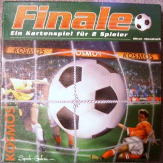
출처: https://www.brettspielblog.ch/wp-content/uploads/2010/10/finale.jpg
- 출처: https://www.brettspielblog.ch/spielkritik/finale-spielkritik/

---

### 그룹 C 종합 — "간단한 축구 시뮬레이션 카드 게임" 에 주는 시사점

1. **슈팅 판정의 두 계열**: (a) 결과 덱에서 뽑기(Schuss und Tor 1장, Fußball-Duell 위치별 1~4장 중 Tooor 2/5) — 확률이 덱 구성으로 투명하게 정해지고 계산이 없다. (b) 값 비교 + 주사위(Dribbel-Fieber 목표값 d6, Hat-Trick 카드 합 vs 강도) — 표현력은 높지만 "계산이 많아 축구 느낌이 죽는다" 는 평이 반복된다. 간단한 카드 게임이라면 (a) 에 Hat-Trick 의 "위치·방향 예측으로 ±1장" 정도만 얹는 것이 좋다.
2. **공수 전환 처리**: Fußball-Duell 의 "카드 양면 = 역할" 이 가장 깔끔하다. Schuss und Tor 는 "못 이으면 곧 슈팅" 으로 전환 자체를 없앴다.
3. **동점 판정 금지**: Hat-Trick 은 동점 = 파울, Fußball-Duell 은 경합 동점 = 재시도, 종료 동점 = 서든데스. 결정론적 규칙서를 위해 모든 비교에 동점 처리를 명시해야 한다.
4. **타이머**: Abpfiff 카드를 더미 밑 4장에 섞기(Fußball-Duell), 시장 덱 소진(Dribbel-Fieber), 각자 덱 소진 = 하프(Hat-Trick), 딜러 마지막 카드(Schuss und Tor). 카드 게임이면 "덱 소진 = 하프" 가 가장 자연스럽다.
5. **피할 것**: 가위바위보 같은 무전술 판정(Fußball-Duell 기본), 의무 이동·의무 패스 같은 강제 절차의 과다(Hat-Trick), 모든 축구 이벤트를 다 넣기(Finale 1998), 공 없는 축구(Finale Noris), 리얼타임(Ligretto·Elfmeter!).

---

## 그룹 D. 보드 시뮬레이션과 매니지먼트

### 카운터 어택 (Counter Attack, Webstar Games(에든버러) 제작, 2019)

| 항목 | 값 |
|---|---|
| 인원 | 2 |
| 플레이 시간 | 90분 (실시간 45분 × 2, 셋업 약 10분) |
| 연령 | 10+ |
| 형태 | 보드 (헥스 피치 + 선수 카드 + 주사위) |
| 근거 수준 | 규칙서 원문 (Rulebook v1.3, 48쪽 PDF 전문 추출) + 상세 리뷰(Zatu, Board's Eye View) |

디자이너 개인명은 규칙서에 없다(미확인). 저작권 표기는 "WEBSTAR GAMES, EDINBURGH".

#### 구성물
규칙서 "What's inside the box?" 그대로:
- 피치 1 (수백 개의 헥스. 루즈볼 방향 1~6 이 피치에 인쇄돼 있음. 뒷면에 포메이션 예시)
- 선수 카드 46
- 심판 카드 4
- 선수 말 22 (나무 디스크, 팀 무늬와 번호)
- 공 2
- 거리 막대(distance stick) 2 — 퍼스트타임 패스 / 스탠다드 패스 / 하이패스 / 헤더 / 슛 사거리 눈금
- 옐로카드 4, 레드카드 4
- 부상 토큰 4
- "hexagonal dice" 2 — 리뷰에 따르면 12면체에 1~6 이 두 번씩 인쇄된 주사위(축구공 모양). 확률상 d6 과 같다
- 모래시계 2
- 규칙서, 퀵 플레이 가이드 2

#### 선수 능력치 (선수 카드)
아웃필더 7종: **Pace(주력), Dribbling, Tackling, Heading, High Pass, Resilience(내구), Shooting**.
골키퍼: **Aerial ability(공중볼), Saving, Handling** + 나머지는 아웃필더와 동일.
심판 카드: **Leniency(관대함)** 1종.
- 능력치 최댓값은 6 으로 보인다 (리그 규칙 "어떤 능력치도 6 을 넘기지 말 것"). 최솟값 미확인.
- 대부분의 판정은 "능력치 + 주사위(1~6) = 합산 점수(combined score)" 를 쓴다.

#### 셋업
1. 골키퍼 카드를 뒤집어 놓고 각자 1장 무작위.
2. 아웃필더 드래프트: 카드를 섞어 4장을 공개 → 한쪽이 1장, 상대가 1장, 다시 첫째가 1장, 상대가 마지막 1장. 선픽을 번갈아 가며 각자 아웃필더 15명이 될 때까지 반복.
3. 스쿼드 16명 = GK 1 + 아웃필더 10 + 교체 5. 선발 11명에게 등번호 1~11 을 주고 피치 옆 카드 슬롯에 놓는다. (무브먼트 페이즈에서 움직인 선수는 카드를 위로 밀어 표시)
4. 심판 카드 1장 무작위, 공개.
5. 각자 자기 진영에 선수를 아무 헥스나 1명씩 배치. 동전 던지기로 킥오프 팀 결정. 킥오프 팀은 센터 스팟에 1명 + 공. 공격팀은 센터서클 안에 여러 명 가능, 수비팀은 0명. 양쪽이 포메이션을 빠르게 재조정한 뒤 공격팀이 스탠다드 패스로 시작.

#### 턴 구조
정해진 "턴" 이 없다. 공을 가진 쪽(공격 매니저)이 **액션**을 잇달아 선언하고, 액션 사이에 **무브먼트 페이즈**를 원하는 만큼 넣을 수 있다 (하이패스 직후만 예외). 상대는 태클·인터셉트·디플렉션으로 개입한다.

**무브먼트 페이즈 = 4-5-2 시퀀스**
1. 공격 매니저가 선수 4명을 각자 Pace 만큼 이동 (아군·적군 통과 불가)
2. 수비 매니저가 선수 5명을 각자 Pace 만큼 이동
3. 공격 매니저가 **아직 안 움직인** 선수 2명을 최대 2헥스씩 이동

무브먼트 페이즈 중:
- 패스는 페이즈가 끝나야 가능. 단 공 소유자가 박스 안으로 뛰어들면 **스냅샷** 가능.
- 수비수가 공에서 1헥스 이내로 오면 태클 시도 가능 (모래시계 일시정지). 태클 성공 시 소유권 이동, 페이즈 즉시 종료.
- 공 소유자가 수비수의 존 오브 인플루언스(6헥스)로 들어가면 그 수비수는 **6 이 나오면 스틸**. 실패하면 그 수비수는 이 페이즈에 더 시도 불가. **1 이 나오면 파울.**
- 60초 모래시계: 시간 안에 못 움직이면 차례 종료 (시간 끌기 방지용).

**존 오브 인플루언스(ZoI)** — 모든 선수 주변:
- 자기 헥스: 통과·정지 불가. 스탠다드 패스 경로면 자동 인터셉트. 슛 경로면 5·6 에 디플렉션.
- 인접 6헥스: 드리블 진입 시 6 에 스틸. 패스 경로 통과 시 6 에 인터셉트. 헤더 경합 참가 가능. 슛 경로면 6 에 디플렉션.
- 2헥스: 헤더 경합 가능하나 주사위 -1.

**파이널 서드 자유 이동**: 공이 한쪽 파이널 서드에 있고 어떤 액션이 끝나면, 반대쪽 파이널 서드의 모든 선수가 6헥스씩 무료 이동 (공격팀 먼저).

#### 판정
| 상황 | 공식 / 임계값 |
|---|---|
| 스탠다드 패스(지상) | 거리 막대 사거리 내. 상대 헥스 통과 불가(아군은 통과 가능). 경로가 수비수 1헥스 이내를 지나면 그 수비수는 **6 에 인터셉트**. |
| 하이패스(크로스) | 거리 막대로 목표 지정, 목표는 반드시 아군의 "머리". 패서 1헥스 이내 정면에 상대가 있으면 불가. 공이 뜨는 동안 양팀 1명씩 3헥스 이동(박스 안이면 GK 도 1헥스). **High Pass + 주사위 ≥ 8 이면 정확**. 정확하면 2헥스 이내 모든 선수가 헤더 경합. 부정확하면 루즈볼. 하이패스 뒤에는 반드시 헤더. |
| 롱패스 | 거리 제한 없음(막대 불필요). 금지: 파이널 서드→반대 파이널 서드(어드밴스드에선 **10+** 로 허용), 인접 헥스의 상대가 경로를 막는 경우. 착지점은 아군 5헥스 이내 금지, 상대 인접 헥스 금지. **High Pass + 주사위 ≥ 9 이면 정확**, 아니면 루즈볼. 롱패스 후 수비 GK 가 Pace 만큼 이동, 이어서 무브먼트 페이즈(공격 먼저). |
| 퍼스트타임 패스(어드밴스드) | 스탠다드 패스 직후에만. 짧다. 목표 지정 후 양팀 1명씩 1헥스 이동(공격 먼저). 수비수가 경로에 들어가면 **5·6 인터셉트**, 1헥스 이내면 **6 인터셉트**. 받는 사람은 패서와 달라야 한다. |
| 태클 | 수비수가 무브먼트 페이즈 중 공 소유자 1헥스 이내로 이동. **Dribbling+주사위 vs Tackling+주사위**. 공격 승 → 태클 실패, 공격수는 수비수 주변 아무 헥스로 재배치. 수비 승 → 소유권 이동, 수비수를 태클당한 선수 주변 헥스로 재배치, 페이즈 종료. 동점 → 루즈볼. **수비수 주사위 1 = 파울**(공격수가 플레이온 또는 파울 선택). 한 페이즈에 여러 수비수가 태클 가능. |
| 헤더 | 하이패스 후. 1헥스 이내 선수는 그대로, 2헥스는 -1 로 경합. 경합 인원 제한 없음. Heading+주사위 비교. 동점 → 루즈볼. 헤더 슛은 수비수가 막을 수 없고 GK 가 Saving+주사위로 세이브 시도(공격수는 재굴림 안 함). 헤더 패스는 인터셉트 불가, 연속 2회 헤더 패스 불가. 수비가 이기면 거리 막대만큼 헤딩 클리어(인터셉트 불가), 그 팀이 공격팀. 헤더에 참여한 선수는 다음 무브먼트 페이즈에 못 움직인다. 코너킥에서 GK 에게 백헤딩 금지. GK 는 Aerial ability 로 경합 가능, GK 가 지면 골. |
| 루즈볼 | 발생: 디플렉션 성공, 부정확한 하이/롱패스, 태클·헤더·슛 동점. 사건 지점에서 주사위 1회 = 방향(피치의 1~6 표시), 주사위 1회 = 거리(헥스 수). 이동 중 선수에 닿으면 그 팀 소유(태클 승리처럼 재개). 아무도 안 닿으면 무브먼트 페이즈 계속/시작(공격 먼저). 루즈볼로 골 가능: GK 1헥스 이내 통과 시 GK 가 **5·6** 에 세이브, 1헥스 넘으면 세이브 불가. 거리 1 로는 골이 안 된다(공 전체가 라인을 넘어야 함). |
| 디플렉션 | 슛이 수비수 헥스를 지나면 **5·6**, 1헥스 이내면 **6**. |
| 존 스틸 | 드리블러가 ZoI 진입: **6** 스틸, **1** 파울. |
| 너트메그(어드밴스드) | 수비수를 통과할 Pace 가 있어야 함. 태클 판정과 같되 수비수 Tackling +1. 성공: 수비수 반대편 헥스로 이동, 수비수는 이번 페이즈 스턴. 실패: 수비 승. 동점: 루즈볼. |
| 하이패스 컨트롤(어드밴스드) | 경합할 수비수가 없을 때만. **Dribbling+주사위 ≥ 9** 면 태클 승리처럼 진행, 실패 시 루즈볼. |
| 심판 판정 | 의견이 갈리면 공격 매니저가 주사위: **≥ Leniency 면 공격 측 손**, 미만이면 수비 측 손. |

#### 슈팅과 득점
- 거리 막대의 슛 눈금 안에서만. 모든 슛은 "정확" 한 것으로 보되(코어), 수비수가 디플렉션 가능.
- **슈팅 = 슈터(Shooting+주사위) vs GK(Saving+주사위) 듀얼.** 공격 > GK → 골. 동점 → 루즈볼. GK > 공격 → 세이브.
- 페널티: 박스 밖 슛 -1, 스냅샷 -1, 어려운 각도 헥스(어드밴스드, 작은 원 표시) -1. **주사위 페널티 최대 -2**.
- 박스 밖 슛이면 GK 가 세이브 전에 1헥스 이동.
- 세이브 후 **핸들링 체크**: 주사위 ≥ Handling → 코너킥 헌납, 미만 → 캐치(소유권 GK 팀).
- 스냅샷: (a) 무브먼트 페이즈 중 박스 안에 공을 갖고 있을 때, (b) 패스 직후(박스 안팎 무관). Shooting -1. 직전에 상대가 아무 선수(GK 포함) 1명을 2헥스 이동시켜 디플렉션 시도 가능.
- GK 다이빙 범위: 골라인과 평행으로 양쪽 3헥스. **슛이 4헥스 이상 떨어져 있으면 세이브 불가**. 어드밴스드: 3번째 헥스 세이브는 -1. 스냅샷에 GK 를 2헥스 이동시키면 2번째 헥스 -1, 3번째 헥스 추가 -1.
- 어드밴스드 "부정확한 슛": 슛/헤더 주사위 1 = 자동 오프타겟(수비 디플렉션은 가능) → 골킥.
- GK 가 드리블러의 발에 다이빙: Saving+주사위 vs Dribbling+주사위. 무브먼트 페이즈에서 인접 헥스로 이동해 시도 가능. **주사위 1 = 파울**.
- 세이브 후 GK 선택: (1) 킥 — 양 파이널 서드의 선수들이 6헥스씩 이동(GK 팀 먼저), GK High Pass+주사위 ≥ 8, 반대 파이널 서드 금지, 실패 시 루즈볼, 공중에 뜬 동안 양팀 1명씩 3헥스, 2헥스 이내 수비수 있으면 헤더. (2) 퀵 스로 — 아무도 안 움직임, 스탠다드 패스 거리, 인터셉트 불가.
- 프리킥 슛: **Shooting+주사위 ≥ 9 면 온타겟(수비 블록 불가, GK 세이브 시도)**, 미만이면 경로의 수비수가 블록 시도(루즈볼 규칙). 9 미만이어도 골 가능. 박스 밖 -1 은 그대로.

#### 시간 진행과 종료
- **실시간**. 전후반 각 45분을 시계로 잰다. 규칙서에 "게임 시간" 을 계산하는 별도 트랙은 없다. 모래시계(60초)는 한 수의 제한 시간용.
- 동점이면 연장 또는 승부차기 (규칙서 서문에 언급. 연장 길이·승부차기 절차 상세는 미확인).
- 퀵파이어 시나리오: 30분/45분/2시간짜리 상황극 4종 (예: 2-0 뒤진 상대가 2명 퇴장, 어웨이골 등).

#### 특수 상황
- **파울**: 태클·스틸에서 수비 주사위 1. 피해팀은 프리킥/PK 또는 플레이온 선택. 어느 쪽이든 **부상 체크**(주사위 ≥ Resilience 면 부상, 부상 토큰, 남은 경기 Pace -2, 세트피스에서 교체 가능)와 **경고 체크**(주사위 ≥ 심판 Leniency 면 옐로) 를 한다. 옐로 2장 = 레드, 즉시 퇴장, 이때는 반드시 프리킥/PK.
- **프로페셔널 파울**: 명백한 득점 기회(무브먼트 페이즈에서 다른 수비수가 슛 전에 못 따라잡는 상황)를 파울로 막으면 주사위 ≥ Leniency 에 다이렉트 레드, 아니면 옐로.
- **리클리스 태클(어드밴스드)**: "RECKLESS TACKLE" 선언, 수비만 굴림. 1·2 = 실패 + 옐로. 3+ = 파울 성립, 플레이 정지, Leniency 체크 통과 시 옐로 / 실패 시 레드. 공 없는 선수에게도 가능.
- **백태클(어드밴스드)**: 공격수가 상대 골 중앙을 본다고 가정하고 "뒤" 2헥스에서 태클하면 1·2 가 파울. Leniency 체크 통과 옐로 / 실패 레드.
- **PK**: 박스 안 파울(박스 경계에 걸친 헥스는 박스 안으로 간주). 모든 선수 재배치, 박스 안엔 키커와 GK 만. 듀얼에서 **GK -2**. 동점 루즈볼.
- **프리킥**: 파울 지점에 키커+공. 2헥스 이내 상대는 2헥스 밖으로. 재배치: 공2-수2-공2-수2-공3-수2 (공격 7명, 수비 6명, 같은 선수 중복 가능). 이후 패스 또는 슛(위 프리킥 슛 규칙).
- **코너킥**: 키커를 코너 아크에. 각자 6명 재배치(2명씩 번갈아, 공격 먼저). 하이패스(박스 안 아무 곳, 거리 제한 없음, **코어에선 항상 정확**, 이후 반드시 헤더) 또는 로우패스(퍼스트타임 패스 거리). 어드밴스드: 코너킥도 하이패스 정확도 체크(8+), 킥 직전 양팀 1명씩 3헥스 이동(공격 먼저).
- **스로인**: 부정확한 하이/롱패스 또는 루즈볼 후. 스로어 지정 → 무브먼트 페이즈 1회(원하면 2회) → 헤더 거리만큼 던짐.
- **오프사이드**: 적발되면 오프사이드 위치에서 상대 프리킥. (오프사이드 위치의 정의는 규칙서 본문에 없고 예시 그림에서만 언급 — 판정 기준 미확인)
- **세트피스 공통**: 양팀 GK 를 즉시 재배치 가능. **교체**는 아무 세트피스에서나, 교체 선수가 나간 선수 번호를 이어받음.
- **GK 백헤딩(어드밴스드)**: 주사위 1 이면 자책골.
- **리그(선택)**: 부상은 주사위 1~4 = 그 수만큼 결장, 5·6 회복. 옐로 3장 누적 = 다음 경기 결장, 레드 = 다음 경기 결장. 홈 어드밴티지 = 임시 보너스 6점 분배(능력치 6 초과 금지).

#### 평가와 교훈
리뷰(Zatu, Board's Eye View) 요지: "진짜 경기 같다", 전술 깊이가 뛰어나고 드래프트로 리플레이성이 있음. 단점은 규칙이 복잡해 FAQ 가 필요하고, 축구 지식을 전제하며, 아트가 미니멀하고, 실시간 압박이 느린 사람에게 스트레스. 대략 2시간 걸린다.

간단한 축구 카드 게임에 가져올 점:
- **"능력치 + d6 vs 능력치 + d6" 단일 듀얼 공식**과 **고정 임계값(8+, 9+)** 두 가지만으로 거의 모든 판정을 해결한다. 동점 = 루즈볼(무작위 방향·거리)로 "무승부" 를 없앤 설계도 참고할 만하다.
- 파울 = "수비 주사위 1", 스틸 = "6" 처럼 **극단값 하나에 사건을 얹는 방식**은 별도 굴림 없이 사건을 만든다.
- 슛 페널티 상한(-2) 을 두어 누적 페널티를 막는다.
- 세이브 후 핸들링 체크로 코너킥이 자연스럽게 발생한다.

피할 점:
- 실시간 45분×2 와 헥스 이동은 카드 게임엔 무겁다. 4-5-2 시퀀스, ZoI, 거리 막대는 보드 전용.
- 오프사이드 같은 규칙이 본문에 정의되지 않아 판정 논쟁이 생기고, 그래서 "심판 주사위" 라는 메타 규칙이 필요해졌다. 결정론적 규칙서라면 이런 폴백에 기대지 않게 써야 한다.

#### 참고 이미지

출처: https://i0.wp.com/counterattackgame.com/wp-content/uploads/2024/09/main-box-transBG.png
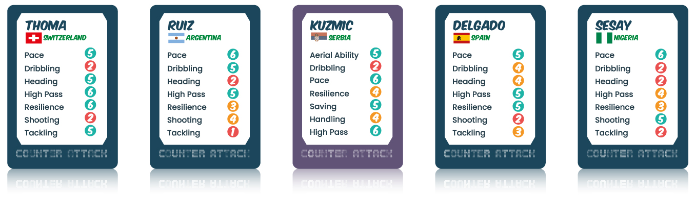
출처: https://i0.wp.com/counterattackgame.com/wp-content/uploads/2024/09/cards-lineup2.jpg
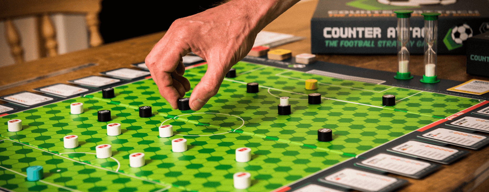
출처: https://i0.wp.com/counterattackgame.com/wp-content/uploads/2024/09/hand-placing-ball.png
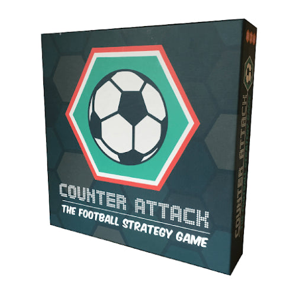
출처: https://zatu.com/cdn/shop/files/Counter-Attack_-Classic-Game-Set.jpg

#### 출처
- 규칙서 v1.3 PDF: https://cdn.tabletopia.com/games/counter-attack/rules/rule-book-v1-3/en (로컬 추출본 counter-attack-rules.txt)
- https://counterattackgame.com/
- https://zatu.com/counter-attack-review/ (board-game.co.uk 에서 리다이렉트)
- https://www.boardseyeview.net/post/counter-attack

---

### 골라조 (Golazo, Mark Wright·Ian Akehurst·Craig Akehurst·Andrea Rosero Villarreal, Golazo Games Ltd, 2021 출하 — 킥스타터 2020년 9월 종료)

| 항목 | 값 |
|---|---|
| 인원 | 2 (Tabletopia 표기 2–4. 규칙서: 셋 이상이면 두 팀으로 나눠 굴림과 이동을 돌아가며) |
| 플레이 시간 | 20–30분 (Tabletopia). 고급 규칙 페이지는 15–20분 권장, 타이머 옵션 팀당 턴 20초 |
| 연령 | 10+ (Tabletopia) |
| 형태 | 보드 (격자 피치 + 카운터 + 주사위 + 카드) |
| 근거 수준 | 규칙서 원문 (GOLAZO Rulebook EN, 14쪽 PDF 전문) + 공식 사이트 고급 규칙 페이지 |

#### 구성물
규칙서·공식 이미지 기준 (정확한 장수는 규칙서에 없는 것은 미확인):
- 보드 1 (피치: 번호 매겨진 시작 위치, GK 존, 킥오프 스페이스, 페널티 에어리어 안의 번호 스페이스, 크로스 존(양 측면, 주사위 1~4개 표시), 롱샷 스페이스, 타이머 트랙(KO→HT→FT), 스코어 트랙 2)
- 선수 카운터 22 (팀당 #1~#11, 흑/백)
- 공 1
- SHOOT 카드 6, SAVE 카드 6
- ACTION DECK (액션 카드 + POWERCARD. 장수 미확인)
- GOLAZO 주사위 2 (면: 1~5 와 "G" 아이콘 1면)
- 클래식 d6 4
- 타임 카운터 1, 스코어 카운터 2
- 별매 확장: Managers (매니저 카드, 각 3개 특수능력, 1회용)

#### 셋업
1. 카운터를 피치의 지정 번호 스페이스에. GK(#1)는 GK 스페이스에 고정(항상 거기 있어야 함).
2. POWERCARD 를 ACTION DECK 에 섞어 보드에.
3. SHOOT/SAVE 카드를 피치 옆에.
4. 타임 카운터를 KO 에, 스코어 카운터를 0 에.
5. 각자 GOLAZO 주사위 1개. 클래식 주사위 4개는 옆에.
6. 킥오프: 각자 클래식 d6, 높은 쪽이 킥오프. 킥오프 팀은 선수 1명+공을 킥오프 스페이스로 옮기고 클래식 d6 → 그 수만큼 이동.

#### 턴 구조
킥오프 후 매 턴 3단계:
1. **주사위 굴림**: 양팀 동시에 GOLAZO 주사위. 높은 쪽 승(동점이면 재굴림).
   - 1~5: 그 수 = 그 팀의 이동 수(moves).
   - **G**: 양팀 모두 이동 0. G 를 굴린 팀이 ACTION DECK 1장을 뽑아 실행. 타임 카운터 +1 (카드가 막지 않는 한).
2. **이동**: 승자가 먼저 자기 이동을 전부, 그다음 패자. 이동 종류(자유 조합):
   - **PLAYER** (1 move): 공 없는 선수 1칸 아무 방향. 같은 선수 여러 번 가능.
   - **DRIBBLE** (1 move): 공 가진 선수 1칸 아무 방향. **드리블한 선수는 공을 패스하기 전까지 이 턴에 다시 못 움직임.**
   - **PASS** (1 move): 가로·세로·대각선 직선으로 아군에게. 경로에 상대가 없어야. 거리 무제한.
   - **TACKLE** (2 moves): **주사위 승자만** 가능. 공 소유자와 인접한 선수가 공을 가져온다. 남은 move 로 계속 행동 가능.
3. **키 이벤트**: 가능한 것을 수행 후 1단계로.
   - 상대 페널티 에어리어에 공 → SHOT
   - 상대 진영 롱샷 스페이스 → LONG SHOT (경로에 상대가 있어도 가능)
   - 상대 진영 크로스 존 → CROSS

금지: 피치 전폭을 막는 벽 만들기, 공 소유자 완전 포위, 카드 없이 상대 선수 옮기기, **자기 페널티 에어리어에 6명**.
액션 카드에 공격/수비 분할 카드가 있으면 공 소유 여부로 한쪽만 적용. POWERCARD 는 즉시 또는 보관 후 사용, 1회 후 덱 바닥으로. 예: "Load the Box"(크로스 전에 상대 PA 에 3명 추가 배치), "Offside Trap"(상대가 우리 진영에 공을 가졌을 때 공을 우리 GK 에게 → 클리어런스), "Keeper off the Line"(현 위치에서 즉시 롱샷), "Brilliant Defensive Play"(공을 아무 선수에게), "Pitch Invasion"(타이머 안 움직임).

#### 판정
확률 판정은 세 곳뿐이다.
| 상황 | 공식 |
|---|---|
| 턴 주도권 | GOLAZO 주사위 비교, 높은 쪽 |
| 태클 | 굴림 없음. 주사위 승자가 인접해서 2 move 내면 자동 성공 |
| 슛 | 카드 심리전 (아래) |
| 크로스 | 주사위 매칭 (아래) |
| 하이 클리어런스 | 2d6 합 = 받는 선수 번호 (12 = 아무나, 퇴장자면 같은 번호의 상대 선수, 둘 다 없으면 재굴림) |

#### 슈팅과 득점
- **SHOT**: 공격이 SHOOT 6장 중 1장(조준 위치) 비공개 선택, 수비가 SAVE 6장 중 **2장** 선택. 동시 공개. 수비의 2장 중 일치가 없으면 **골**. 일치하면 세이브 → GK 소유.
- **LONG SHOT**: 같은 방식이되 수비가 SAVE **4장** 선택.
- **CROSS**: 공 소유자가 선 크로스 존 칸에 표시된 수만큼(1~4개) 클래식 d6 을 굴린다. 어느 주사위든 **PA 안의 번호 스페이스에 서 있는 아군 선수의 번호와 일치하면 골**. 아니면 GK 소유 → 클리어런스. (예: 3·6 번 칸에 아군, 3개 굴려 2,2,6 → 6 일치 → 골)
- **세이브/클리어런스**: 모든 선수를 PA 밖 같은 진영의 빈 칸으로(슛 팀 먼저). GK 는 (1) 같은 진영 아군에게 패스 1회, 또는 (2) 하이 클리어런스: 2d6 합 번호의 선수에게. 받은 선수가 키 이벤트 가능하면 즉시 수행.
- **골**: 전원 시작 위치로, 실점 팀 킥오프.

#### 시간 진행과 종료
- 타임 카운터는 **G 가 나와 액션 카드를 뽑을 때만** 1칸 전진 (약 1/6 확률/턴). 즉 경기 길이가 무작위.
- HT 도달 + 진행 중 이벤트 완료 → 전원 리셋, 전반에 킥오프하지 않은 팀이 킥오프.
- FT 도달 → **스토피지 타임**: 클래식 d6 1개 → 남은 턴 수. 그동안 GOLAZO 주사위 대신 클래식 주사위로 턴 진행. 마지막 턴 뒤 키 이벤트까지 끝나면 종료.
- 동점: 골든골(득점 즉시 종료) 또는 승부차기(SHOOT/SAVE 규칙, 5회씩 다득점).

#### 특수 상황
- 파울·옐로·레드: 기본 규칙엔 없음. 고급 규칙 **슬라이드 태클**: 주사위에서 진 팀이 이동 전부를 걸고 인접 선수로 시도, 수비가 클래식 d6 1개: **1 = 퇴장(카운터 제거)**, **2~5 = 이 턴 이동 전부 몰수**, **6 = 공 획득 + 6 move**.
- 오프사이드: 규칙 없음(파워카드 "Offside Trap" 이름만).
- 교체·부상: 없음.
- 고급 규칙(공식 사이트): Tactical Golazo(패자가 먼저 이동하되 태클 불가), 벽 금지(가로 한 줄 최대 4명), 패스 거리(1~4칸 1 move, 5~8칸 2, 9~12칸 3), 타이머(팀당 턴 20초), GK 러시아웃(수비가 d6 1개, 슈터 번호와 일치하면 클리어, 아니면 SAVE 카드 1장만), GK 이동(존 이탈 가능, 공 뺏기면 거리 따라 SAVE 0~5장으로 즉시 슛), GK 에게 패스(하이 클리어 1 move+2d6, 또는 일반 드리블/패스), 윙어(크로스 존 안에서 여러 move 드리블 가능, 같은 턴에 들어갔다 나오기 불가), 너트메그(2d6 더블이면 성공, 드리블 1 move), 하이패스(1 move, 1~2 d6 거리, 상대 위로 넘김).
- 3인 이상: 두 팀으로 나눠 굴림·이동을 돌아가며.

#### 평가와 교훈
공식 소개는 "몇 분 만에 배우고 항상 양쪽이 관여" 를 강조. 리뷰 사이트(boardgamesjournal.com)는 접속 불가로 미확인.

가져올 점:
- **슛 = 6칸 조준 vs 2칸 방어의 동시 공개 심리전**. 주사위 없이 "골 확률 4/6" 이 나오고, 롱샷은 4장으로 2/6. 카드 게임에 그대로 옮길 수 있는 가장 좋은 골 판정 메커닉.
- **크로스 = "박스 안 아군 번호 × 주사위 수"** 로 박스 안에 사람을 넣을수록 확률이 오르는 구조.
- **시간 = 1/6 확률 이벤트로만 전진** → 경기 길이 무작위, 스토피지 타임을 주사위로. 카드 덱에서 "휘슬 카드" 를 뽑는 식으로 옮길 수 있다.
- 태클을 "주도권 승자만, 2 move 자동 성공" 으로 굴림 없이 처리.

피할 점:
- 동시 주사위 굴림으로 주도권을 정하면 매 턴 운이 크다 (Tactical Golazo 로 완화).
- 드리블한 선수는 패스 전까지 재이동 금지 같은 예외 규칙이 결정론성엔 좋지만 설명이 길어진다.

#### 참고 이미지
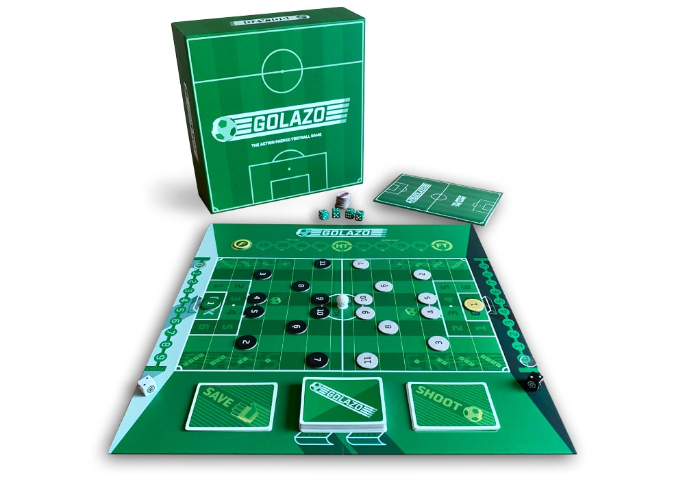
출처: https://www.golazo-game.co.uk/images/BOX_components.jpg
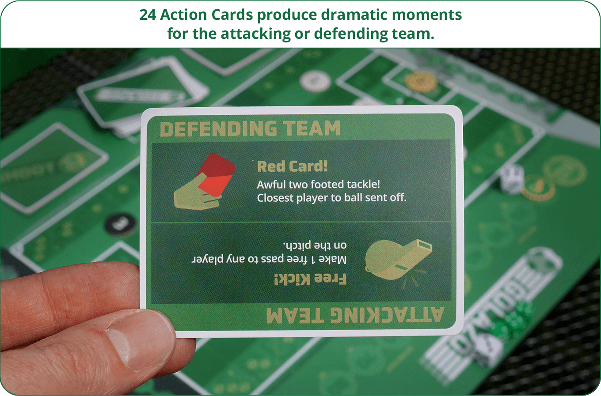
출처: https://www.golazo-game.co.uk/images/cards.png
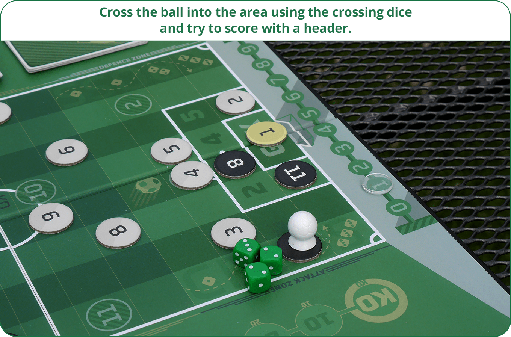
출처: https://www.golazo-game.co.uk/images/cross.png
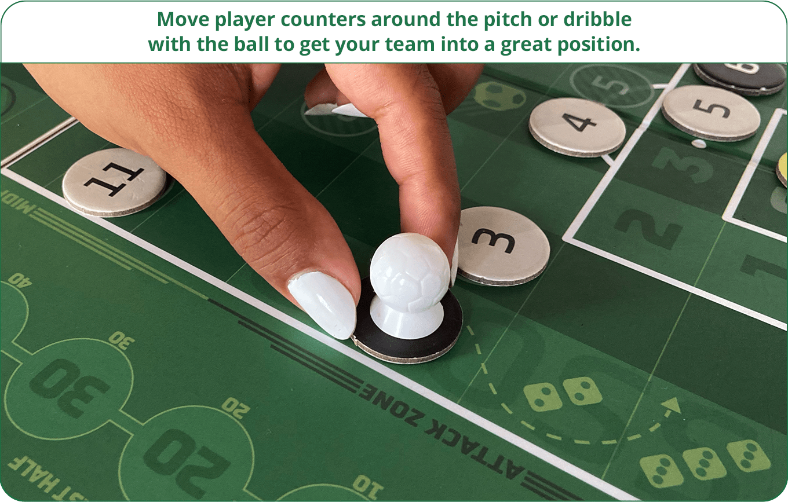
출처: https://www.golazo-game.co.uk/images/move_dribble.png

#### 출처
- 규칙서 PDF: https://golazo-game.co.uk/rules/GOLAZO_Rulebook_EN.pdf (로컬 추출본 golazo-rules.txt)
- https://www.golazo-game.co.uk/advanced.html
- https://www.golazo-game.co.uk/
- https://tabletopia.com/games/golazo
- https://gamefound.com/en/projects/golazo-games/golazo

---

### 스트리트사커 (StreetSoccer, Corné van Moorsel, Cwali, 2002)

| 항목 | 값 |
|---|---|
| 인원 | 2 |
| 플레이 시간 | 20–30분 (25 "분" = 25턴씩) |
| 연령 | 8+ (Board Game Bliss) |
| 형태 | 보드 (10×6 격자 + 나무 말 + d6 1개) |
| 근거 수준 | 상세 인스트 (출판사 cwali.nl 규칙 예시·보충 규칙, LittleGolem 온라인판 규칙 문서) + 상점 소개문. 영문 규칙서 PDF 는 BGG 에만 있어 미확인 |

아트: Christof Tisch. 2003 International Gamers Award 2인 전략 부문 수상(Board Game Bliss), 2002 네덜란드 게임상 후보(cwali).

#### 구성물
- 보드 1: 10칸 길이 × 6칸 폭 + 라인 밖 칸(out-of-bounds)
- 나무 선수 말 10 (팀당 5, 각 팀 GK 1 포함). 투명 스티커로 이름·번호 부착, GK 스티커로 구분
- 공 1
- d6 1
- "분" 카운터(검정) 1
- 팀 색: 노랑 vs 빨강 판, 주황 vs 파랑 판 두 버전

#### 셋업
- 노랑(또는 한 팀)은 아래 골, 빨강은 위 골. GK 는 자기 골 앞.
- 각자 필드 플레이어 3명을 합법적인 빈 칸에 배치(LittleGolem: 각 배치에서 최소 1명은 상대 진영에). 5명 중 나머지 1명의 초기 위치는 미확인(온라인판 서술상 "extra" 3명 외 1명은 고정 위치로 보임).
- 킥오프 방식: 온라인판은 "처음 두 가상 주사위의 차의 절대값(0 제외)" 을 킥오프 주사위로 씀. 실물판 킥오프 절차 미확인.

#### 턴 구조
매 "분" 에 양 코치가 한 턴씩. 한 턴:
1. d6 굴림.
2. **자기 말 1개만** 이동. 가로·세로(대각선 불가)로 **정확히 눈금만큼**, 칸마다 방향 전환 가능, 점유 칸 통과 불가.
3. 이동 중 공이 있는 칸에 닿으면 **멈추고 공을 찬다**. 공은 남은 눈금을 이어서 센다 — 공에 닿게 만든 걸음 수부터 다시 센다. 즉 눈금 4, 2걸음에 공 도달 → 공은 2,3,4 로 **3칸**(= 남은 눈금 + 1). Board Game Bliss 표현: "안 쓴 눈금 + 1 만큼 슛".
   - 공은 8방향, 한 번의 킥에 **45도 방향 전환 1회**(직선→대각 또는 대각→직선).
   - 공이 **아군 말이 있는 칸에 닿으면 그 말이 이어서 찬다**(패스). 그 말에 닿게 한 번호부터 다시 세므로 경유 말 하나당 공이 1칸 더 간다. 상대 말이 있는 칸엔 못 들어간다.
   - 공이 말에 닿으면(온라인판 문서) 말 쪽에서 공이 이어지고, 말이 공에 닿으면 이동은 거기서 끝난다.
- 아테네스틴 소개: "말이 공에 닿거나 공이 말에 닿을 때마다 추가 이동력 1" 이 위 "+1" 의 다른 서술.

#### 판정
확률 요소는 d6 하나뿐이다. 태클·경합 판정은 없다. 공은 상대 말이 있는 칸으로 갈 수 없고, 상대 말을 통과할 수도 없으므로 **수비 = 위치 선점**이다.
- 골 조건(cwali): 엔드라인을 넘기 전 마지막 칸이 **골 앞 두 칸 중 하나**여야 한다. LittleGolem: 골문은 중앙 4열, 마지막 칸은 골 바로 앞 2칸.
- GK 만 자기 골 앞 두 칸으로 이동 가능. 그 앞 페널티 에어리어 2칸에는 수비 아웃필더 **1명만**.
- 득점 후: 패한 GK 만 자기 골로 돌아가 공을 필드로 찬다(2쇄 규칙 변경).
- Anti kill-joy(방해 방지) 규칙: 양 코치는 항상 라인 밖 칸을 쓰지 않고 공에 닿을 수 있는 말을 갖고 있어야 한다(6걸음 이내일 필요는 없음). 불가능하면 사이드라인 반대편으로 2칸 이동하는 등의 조정 규칙 (전문 미확인).

#### 슈팅과 득점
별도 슛 판정이 없다. 공 이동 경로가 골 앞 두 칸을 거쳐 엔드라인을 넘으면 골.

#### 시간 진행과 종료
- 각 25턴("25분"). 다득점 승.
- 동점: 10 "분" 연장, 연장에선 **골든골**(온라인 리그 통계에 "extra time / golden goal" 기록). 토너먼트에선 연장 없이 무승부 1점 처리도 가능(cwali 팁).
- 변형: 카운터를 16 에서 시작해 누군가 1 을 굴릴 때마다 1칸 전진, 10번째 1 에서 종료(킥오프·득점 후 턴의 1 은 제외).
- LittleGolem 온라인판: 52수 후 종료, 동점이면 서든데스 최대 20수. 토너먼트 점수 정상승 5, 서든데스승 4/1, 득점 무승부는 마지막 득점자 3/2, 무득점 2/2.

#### 특수 상황
파울·카드·오프사이드·교체·부상 없음. 라인 밖 칸(공이 나갔을 때 처리)은 존재하나 정확한 절차 미확인.

#### 평가와 교훈
2인 전략 부문 수상작. 규칙이 한 쪽 분량이며 "다음 턴을 위한 위치 선점과 상대 확률 계산" 이 전부다.
가져올 점: **"남은 눈금 + 경유 아군 수" 로 패스가 길어지는** 설계는 "패스 연결이 곧 전진" 이라는 축구 감각을 주사위 하나로 만든다. 골 판정 없이 위치만으로 골이 결정되므로 결정론성이 완벽하다.
피할 점: 태클이 없어 몸싸움 감각은 없다. 실물 규칙서 원문(라인 밖 처리, 킥오프)을 못 봤으므로 인용 시 주의.

#### 참고 이미지
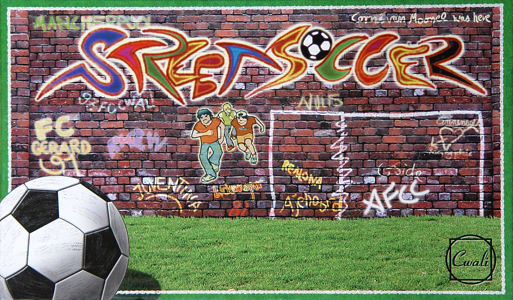
출처: https://www.boardgamebliss.com/cdn/shop/products/pic249610.jpg
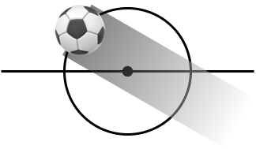
출처: https://docs.littlegolem.net/games/soccer-app.png
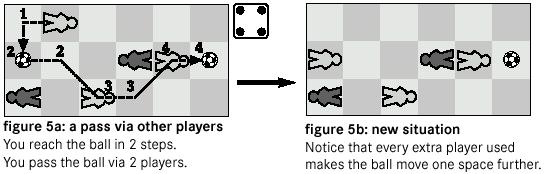
출처: https://www.cwali.nl/streetsoccer/example5.jpg
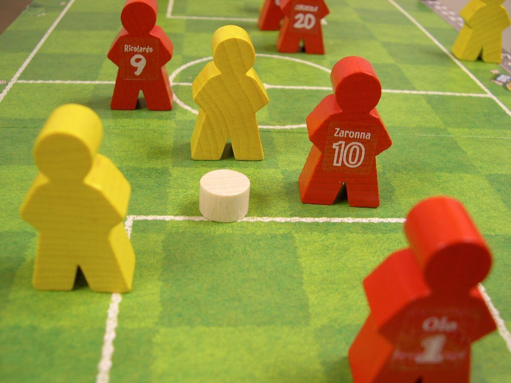
출처: https://cf.geekdo-images.com/a8LCQYKaCc4C_fdVLauroQ__large/img/z5O7saL85nNZ-xiA3lu7ibTkCCc=/fit-in/1024x1024/filters:no_upscale():strip_icc()/pic35240.jpg

#### 출처
- https://www.cwali.nl/streetsoccer/streetsoccer.htm
- https://docs.littlegolem.net/games/soccer/
- https://www.boardgamebliss.com/products/streetsoccer
- https://athenstean.com/portfolio/streetsoccer/

---

### 토탈 어택!! 사커 (Total Attack!! Soccer, Bruce Powell·Don Lawn, Dakota Productions, 1993)

| 항목 | 값 |
|---|---|
| 인원 | 2 |
| 플레이 시간 | 미확인 (리뷰: 45턴 전반 하나를 점심시간에 셋업·플레이·정리 가능) |
| 연령 | 미확인 |
| 형태 | 보드 (헥스 피치) |
| 근거 수준 | 상세 리뷰 (Steffan O'Sullivan 1995 리뷰) + Wikipedia. 규칙서 원문 미확인 |

#### 구성물
- 22"×15" 헥스 보드 (약 22×17 헥스, 축구장 마킹과 기본 게임 시작 위치 인쇄)
- 별도 스코어 보드 + 타이밍 트랙(페그)
- 페널티 슛 카드 2
- 주사위 2
- 말 27 (11명 × 2 + 고급 규칙용 여분 포지션 말)
- 규칙서 (영·서·불·독·아랍어)

#### 셋업
보드에 인쇄된 시작 위치. 상세 미확인.

#### 턴 구조
- 매 턴 **11 이동점(MP)** 을 자기 말들에 분배 (고급 15). 필드 플레이어 10명, **한 명당 최대 3헥스**. 전원을 다 움직일 수는 없다.
- 드리블(공 가진 채 이동)은 추가 MP 없음. **패스·슛은 MP 소모** (수치 미확인).
- 턴 종료마다 타임 트랙 페그 1칸 = 1분. **전반 45턴**.
- 기본 게임에서 패스는 거리와 무관하게 항상 성공.

#### 판정
- **태클**: 수비가 드리블러에 인접하면 양쪽 d6. 드리블러에 인접한 자기 선수 1명당 +1, 공격은 드리블러 본인 +1. 수비 승 → 소유권 이동 + **즉시 추가 턴**.
- 리뷰 팁: 턴 끝에 공을 선수보다 앞에 두는 "리딩 패스" 를 하면 태클당하지 않는다.
- 고급 규칙 8종(선택): 오프사이드, 포지션별 능력, 대체 슈팅/패스 규칙, 비·눈, 배드 패스, 파울, 헤더, 발리.
  - **배드 패스**: 롱패스는 주사위 → 표. 실패 시 주사위로 방향(1 = 상대 골 방향, 2 = 시계방향 다음 헥스변, …), 목표 헥스에서 그 방향 2헥스 지점에 공.
  - **포지션별 능력**: 기본에선 GK 만 다름. 고급에선 FW 는 달리기, MF 는 패스, DF 는 태클이 좋다. 리뷰어 하우스룰 표(공식과 일부 다름, 어느 칸이 다른지는 미확인):

| 타입 | Run | Pass | Safe Pass | Tackle |
|---|---|---|---|---|
| Striker | 4 | 6 | 5 | 1 |
| Midfielder | 3 | 8 | 6 | 1 |
| Fullback | 3 | 5 | 5 | 2 |
| Goalie | 4 | 15/5 | 5 | 3/1 |

#### 슈팅과 득점
- 기본: GK 가 막을 확률이 있는 "매우 단순한 시스템" (공식 미확인).
- 고급: **슛 거리 + GK 달리기 + 주사위** 로 계산해 표 참조 → Save / Goal / Punch / Kickout / Corner Kick / Rebound off the Post.

#### 시간 진행과 종료
45턴 = 전반. 후반·연장·동점 처리 미확인.

#### 특수 상황
파울·오프사이드·헤더·발리·날씨는 고급 규칙(상세 미확인). 페널티 슛 카드 2장 존재(용법 미확인).

#### 평가와 교훈
Pyramid 지(1996)·O'Sullivan 모두 "축구를 잘 재현한다", "기술 위주에 약간의 운" 으로 호평. 미식축구식 돌파는 안 통하고 패스·리딩 패스가 통한다는 점이 축구답다.
가져올 점: **MP 예산을 분배**하는 방식은 "누굴 움직일지" 를 매 턴 고민하게 한다. 태클 판정에 **인접 지원 인원수 보너스**를 넣으면 협력 수비를 표현할 수 있다. 슛 결과표에 Punch/Kickout/Post 같은 **다양한 결과**를 두면 세트피스가 자연스럽게 생긴다.
피할 점: 턴당 45턴×2 는 길다. 헥스 보드 전용 개념(방향 주사위)은 카드로 옮기기 어렵다.

#### 참고 이미지
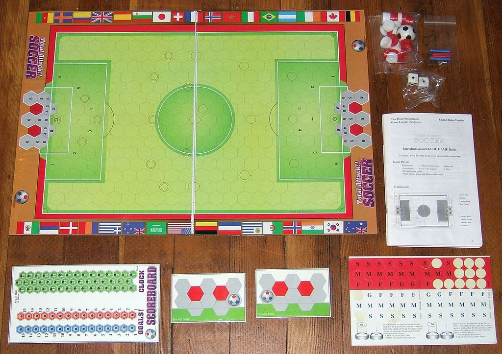
출처: https://cf.geekdo-images.com/n0fWOlVxq0O8ZnjDl5S9UA__large/img/ETzD5GWK50YDmVWMgdRrAmZuZuE=/fit-in/1024x1024/filters:no_upscale():strip_icc()/pic658416.jpg
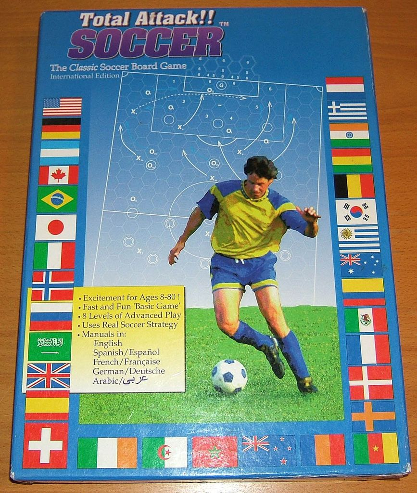
출처: https://cf.geekdo-images.com/0YfG8m6MxQOsz8zBSNY0Jw__large/img/P_dD1-S3ceV707hDl3zNOSi7N2Y=/fit-in/1024x1024/filters:no_upscale():strip_icc()/pic658431.jpg
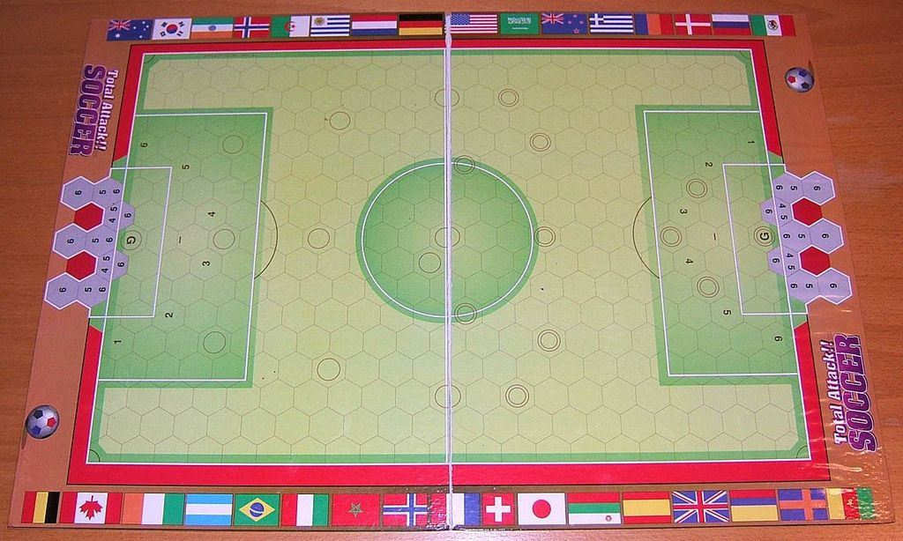
출처: https://cf.geekdo-images.com/Hoij1VFaH4j5-QffVZYXtQ__large/img/szw5yHCYxDrlpr4t9t56IvEwESI=/fit-in/1024x1024/filters:no_upscale():strip_icc()/pic658427.jpg

#### 출처
- https://en.wikipedia.org/wiki/Total_Attack!!_Soccer
- http://www.panix.com/~sos/bc/soccer.html (Steffan O'Sullivan 리뷰, 1995/1998)
- BGG 이미지 API (api.geekdo.com/api/images?objectid=1554)

---

### 사커 택틱스 월드 (Soccer Tactics World, Randall Thompson, Stein-Thompson Games, 2006 — "Football Tactics 2006" 의 영문판)

| 항목 | 값 |
|---|---|
| 인원 | 2 |
| 플레이 시간 | 90분 (타이머 45분×2. 리뷰어는 45–60분 권장) |
| 연령 | 8+ (Dice Tower). 상점 표기 7+ 도 있음 |
| 형태 | 보드 (사각 격자 + 나무 말 + d6 + 슛 주사위/스피너 + 디지털 타이머) |
| 근거 수준 | 상세 리뷰·인스트 (Geeky Hobbies 규칙 정리 + 리뷰). 규칙서 원문 미확인 |

#### 구성물
Dice Tower 목록: 나무 말 2팀(팀당 11), 나무 공 디스크 1, 보드, 스코어 다이얼 2, 스피너 2, d6 2, 슛 주사위 1, 옐로카드 10, 레드카드 5, 디지털 타이머, "The Beautiful Cup" 트로피, 규칙서, 요약 시트.
말: 번호 있는 말(GK #1, MF, FW 등) 과 번호 없는 수비수 말.

#### 셋업
- 각자 색 선택, d6 로 선공(전반 킥오프). 후반은 상대.
- GK(#1) 는 골 앞 두 칸 중 하나. 자기 엔드에서 4번째 줄 왼쪽부터 2·4·5·7번째 칸에 DF 4명. 6번째 줄 1·3·6·8번째 칸에 MF 4명. 센터라인 옆 줄에 FW 2명(킥오프 팀은 1명을 센터서클 안에, 상대는 서클 안 금지).
- 옐로/레드카드, 타이머, 트로피 옆에. 타이머 45분.

#### 턴 구조
- 킥오프: d6 로 공 이동.
- 이후 공격 측이 **d6(선수 이동) → d6(공 이동)** 을 반복. 소유권을 잃거나 골이 날 때까지 공격 측이 계속.
- **선수 이동**: 눈금 전부 이동, 직선/대각선, **방향 전환 1회**. 같은 칸 두 번 통과 불가, 상대 말 칸 통과 불가, 팀당 한 칸에 1명. 번호 없는 DF 는 센터라인 넘으면 반칙. 가로로 붙어 있는 자기 말 최대 4, 세로 최대 3. PA 안 팀당 4명. **수당 60초**.
- **공 이동**: 눈금 전부, 직선/대각선, 방향 전환 1회, 이미 지난 줄/열로 되돌아갈 수 없음, 선수 칸 통과 가능. 결과 4가지: 빈 칸 / 아군 칸(다이렉트 패스) / 눈금 1 이면 드리블(공+선수 1칸) / 두 말이 있는 칸.

#### 판정
| 상황 | 절차 |
|---|---|
| 빈 칸으로 찬 공 | 공격이 d6 로 1명 이동 시도, 수비도 d6 로 1명 이동 시도. 공격만 도달 → 유지. 수비만 → 공수 교대. 아무도 못 감 → 둘 다 다시. 둘 다 → 경합 |
| 다이렉트 패스 | 첫 패스는 수비가 반응 못 함. **연속 2회째부터** 매 패스 후 수비가 d6 로 1명 이동 |
| 드리블 | 눈금 1 일 때만. 수비가 d6 로 1명 이동, 공 칸에 오면 경합 |
| 경합(Battle) | 양쪽 d6, 높은 쪽 소유. 번호 없는 DF **+1**, GK **+2**. 동점 재굴림. **한쪽 6·다른 쪽 1 이면 1 쪽이 파울** |
| GK | 수비 차례에 주사위 대신 GK 를 1칸 이동 가능. 공 소유자 칸으로 가면 경합(+2) |

#### 슈팅과 득점
- 슛 기회: (a) PA 안에서 공을 잡거나 PA 안 아군에게 다이렉트 패스, (b) 별 표시 두 칸에서 롱슛 — **그 칸으로 다이렉트 패스한 경우만**.
- PA 로 드리블/빈 칸 킥은 양쪽이 공에 도달 시도, 공격이 유지하면 슛. 다이렉트 패스면 수비 개입 없음.
- **슛 판정 = 스피너(2바퀴 이상) 또는 슛 주사위**: 축구공 = 골, 빨간 깃발 = 코너킥, 1 = 골킥. (면 구성 비율 미확인)
- 골킥: 킥 팀의 PA 안 말을 PA 밖 가장 가까운 칸으로, 공은 GK 칸, 새 공격 측이 **2d6** 으로 공 이동.

#### 시간 진행과 종료
- 45분 타이머 × 2. 후반 종료 시 공격 측이 PA 안이면 그 시리즈를 끝내고 종료.
- 동점: 연장 2회(권장 15분). 그래도 동점이면 5회씩 슛아웃(스핀/굴림), 이후 서든데스.

#### 특수 상황
- **코너킥**: 슛한 쪽 코너에 공. GK 가 골 앞 두 칸에 없으면 그리로. 각자 3명을 주사위 없이 아무 칸에 번갈아 배치(코너 1칸 이내 수비 금지, PA 팀당 4, 골 에어리어 팀당 1). 코너 칸은 이동 수에 안 셈. 킥한 말은 다른 말이 만지기 전까지 재터치 불가.
- **오프사이드**: GK 제외 상대 전원보다 골 쪽에 있는 공격수가 다이렉트 패스를 받거나 공을 잡으면. 슛 기회가 생기면 안 만져도 자동 오프사이드. 상대 프리킥.
- **파울**: 경합에서 6 vs 1. 1 쪽 말에 옐로. 프리킥(상대 PA 안이면 PK). 옐로 2장 = 제거(DF 는 카드 공유, 두 번째를 낸 DF 말 제거).
- **프리킥**: 상대 말 전부 공에서 1칸 이상 떨어뜨림. 키커 재터치 불가.
- **PK**: GK 와 키커 외 PA 밖. 일반 슛 판정.
- 교체·부상 없음.

#### 평가와 교훈
Geeky Hobbies: 구성물(나무 말)이 좋고 축구 규칙을 대부분 넣었으나, "가볍지도 무겁지도 않은" 어중간함. 드리블이 눈금 1 에만 가능해 선택지가 적고, 슛이 전적으로 운(스피너)이며, 90분은 지루. 45–60분 권장. Battleball 과 비교해 전략이 부족.
가져올 점: **다이렉트 패스 첫 번째는 수비 무반응, 연속 패스부터 수비 반응** 은 "짧은 연결은 안전, 길게 돌리면 위험" 을 만든다. **경합 극단값(6 vs 1) 을 파울로** 쓰는 것은 Counter Attack 의 "1 = 파울" 과 같은 계열. 오프사이드를 "GK 빼고 전원보다 앞" 으로 단순화한 정의는 재활용 가능.
피할 점: 슛을 순수 운으로 두면 전략이 무의미해진다는 평. 90분 실시간.

#### 참고 이미지
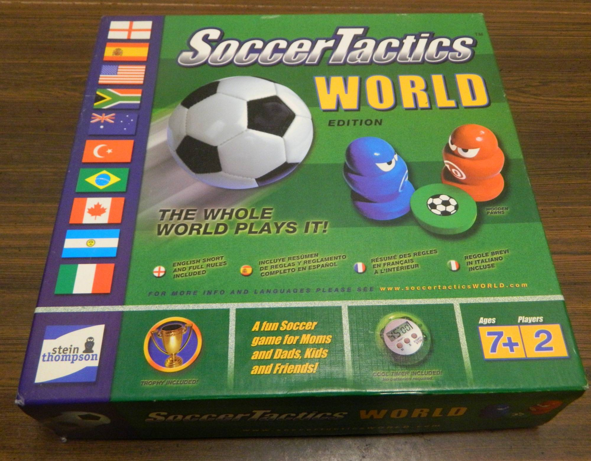
출처: https://www.geekyhobbies.com/wp-content/uploads/2017/09/Soccer-Tactics-World-Box.jpg
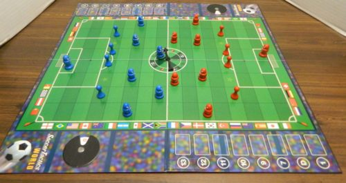
출처: https://www.geekyhobbies.com/wp-content/uploads/2017/09/Soccer-Tactics-World-Setup-500x265.jpg
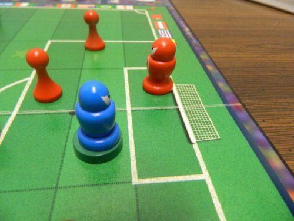
출처: https://www.geekyhobbies.com/wp-content/uploads/2017/09/Soccer-Tactics-World-Shot-in-Penalty-Area-500x375.jpg
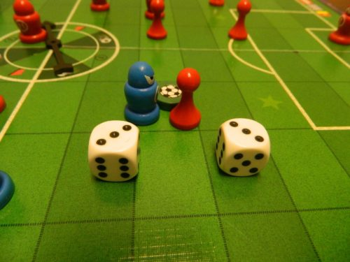
출처: https://www.geekyhobbies.com/wp-content/uploads/2017/09/Soccer-Tactics-World-Challenge-for-Ball-500x375.jpg

#### 출처
- https://www.geekyhobbies.com/soccer-tactics-world-board-game-review-and-rules/ (curl 로 수집)
- https://www.dicetower.com/board-game/19464

---

### 일레븐: 풋볼 매니저 보드게임 (Eleven: Football Manager Board Game, Thomas Jansen, Portal Games, 2022) — 매치데이 규칙 중심

| 항목 | 값 |
|---|---|
| 인원 | 1–4 |
| 플레이 시간 | 60–120분 |
| 연령 | 14+ |
| 형태 | 보드 (매니지먼트 유로게임. 경기는 카드·마커 비교) |
| 근거 수준 | 규칙서 원문 (Portal Games eleven_rulebook15.pdf, 32쪽, 매치데이 20~24쪽 추출) + 상세 리뷰 3건 |

※ 사용자가 말한 "저지 마커" 는 규칙서의 **Jersey marker(유니폼 마커)** 다. 심판 마커는 없다.

#### 구성물 (경기 관련만, 규칙서 목록)
- 개인 매치 보드 (피치: 9 존, 5 섹션 / 스코어 트랙 0~6 두 줄 / 매치 결과 표 / 벤치)
- 저지 마커 13 × 4 세트 (번호 2~11 인 10개 + 번호 없는 3개. 양면: 공격(공 아이콘)/수비(방패 아이콘))
- 선수 카드: 일반 36, 유스 18, 베테랑 8 (양면: Untrained/Trained). 골키퍼 카드는 저지 마커 없음
- 상대 팀 카드 64 (앞: 스카우트 리포트 + 포메이션, 뒤: 포메이션 배치와 각 선수 강도, GK)
- 전술 카드 12
- d6 (상대 팀 주사위 3, 경기 결과용), d12 1 (부상 선수 지정)
- 강도 토큰 20, 약점 토큰 12, 부상 토큰 10, 출장정지 토큰 10, 체력 마커 20, 관중석/팬 마커
(목록 수치는 PDF 추출 순서가 어긋나 있어 인접 항목 간 오류 가능. 확실한 것: 선수 36/18/8, 상대 카드 64, 전술 카드 12, d12 1.)

#### 셋업 (경기 관련)
- 피치에 저지 마커 10개 배치(선발 선수 카드의 번호는 카드에 표시된 면으로). **공격면 5, 수비면 5** 여야 함. 나머지 3개는 벤치.
- **피치 = 9 존 / 5 섹션**: 중앙 수비(CD), 중앙 미드필드(CM), 중앙 공격(CF), 좌측 윙, 우측 윙. 각 윙 섹션은 3 존. 중앙 존은 1~3명, 윙 존은 존당 최대 1명(윙 섹션당 최대 3명).
- 각자 기본 전술 카드 1장.
- 선수 카드: Strength 0~4(효과로 증감, 0 미만 불가). **카드 없는 저지 마커의 Strength = 1**(감소 불가). 카드에 배치 가능 존 아이콘, 공격/수비 역할, 효과와 비용.
- GK 카드: Strength + 글러브 아이콘 수(막을 수 있는 슛 수).

#### 턴 구조 (매치데이 3단계)
**A. 경기 준비**
1. 상대 카드의 스카우트 리포트(포메이션 힌트, 예 "THEY PLAY 3-4-3") 읽기.
2. 손의 전술 카드 1장을 포메이션으로 내고, 저지 마커를 9 존에 배치. **이후 이동 불가.** 기본 전술 카드는 포메이션 2개 중 택1, 다른 전술 카드는 포메이션 1 + 효과 1.
3. 이번 경기에 쓸 선수 카드에 자원(체력 등) 1개씩 배치(부상·정지 선수 불가, 같은 등번호 2장 불가). 카드 효과를 쓰려면 추가 자원 배치.
4. 부상/정지 카드에서 토큰 1개 제거.
5. "경기 전" 효과 처리(예: d6 6 이상이면 상대 점수 +1 같은 카드).
6. 관중석에 마커 배치(4개 이상 = 매진).

**B. 경기 해결**
1. 상대 카드 공개(구단명, 디비전, GK, DF/MF/FW 강도).
2. 두 번째 전술 카드를 효과용으로 낼 수 있음. 낸 카드는 모두 회수.
3. 자원 놓인 선수 카드 효과 발동(1회, 소진 표시).
4. **5 쌍의 섹션 비교** — 순서: 내 좌측 윙 vs 상대 우측 윙, 내 우측 윙 vs 상대 좌측 윙, 내 CF vs 상대 CD, 내 CM vs 상대 CM, 내 CD vs 상대 CF.

**C. 결과 확인** (아래 "시간 진행과 종료")

#### 판정 (득점 계산 공식)
각 섹션 쌍에서:
- 내 **공격(공 아이콘)** 마커와 상대 **수비(방패)** 마커를 1:1 로 짝짓는다. **공격 Strength > 수비 Strength 이면 득점, 아니면(같거나 작으면) 차단.**
- 공격 수 > 수비 수이면 남는 공격은 차단되지 않아 **득점**.
- 짝짓기 조합이 여럿이면 **양 팀 모두 가장 적게 득점하는 조합**으로 정한다(즉 수비가 최적 대응).
- 상대의 공격 vs 내 수비도 같은 방식.
- **골키퍼**: 차단되지 않은 상대 공격 중 **Strength ≤ GK Strength 인 것**을 글러브 수만큼 막을 수 있다. GK 카드가 없으면 Strength 1·글러브 1 인 GK 로 간주. 상대 GK 도 같은 방식으로 내 슛을 막는다.
- 득점마다 매치 결과 트랙의 마커 +1.

규칙서 예시:
- 내 공격 2명(Strength 3, 2) vs 상대 수비 1명(Strength 3): 3 은 3 에 막히고(같으면 차단), 2 는 상대할 수비가 없어 **득점**.
- 내 공격 1명(2) vs 상대 수비 1명(1): 2 > 1 → **득점**. 상대 공격 1명(1) vs 내 수비 1명(1): 1 ≤ 1 → 차단.
- GK: 차단되지 않은 Strength 3 슛은 GK Strength 2 로는 못 막는다(글러브는 남는다). GK 가 글러브를 다 쓰면 이후 슛은 못 막는다. (규칙서의 Brickton 2:2 Greytown 전체 예시)

리뷰어(Meeple Mountain)는 이 계산에 규칙서 30쪽 중 5쪽이 든다며 "상대 수비 총합 vs 내 공격 총합의 차이만큼 득점" 으로 단순화하자고 제안.

#### 슈팅과 득점
위 판정이 전부다. 주사위 없음(카드 효과 제외).

#### 시간 진행과 종료
- 한 경기 = 한 주(Week) 의 매치데이 1회. 시즌 = 상대 카드가 소진될 때까지의 주 수.
- 경기 후: "경기 후" 효과 → 다득점 승/무/패 → 리그 테이블 **승 3칸, 무 1칸, 패 0칸** → 관중 마커 회수·팬 획득, 선수 카드 자원 제거 → **경기 결과 주사위(d6)**: 승/무/패 열 × 주사위 눈 표(보드 인쇄)로 결과 적용. 결과 종류: 팬 +1, 훈련(카드 뒤집기), 임시 강도 토큰, 임시 약점 토큰, 부상(d12 로 등번호 지정, 출전 선수면 부상 토큰), 중상(부상 토큰 2), 이중 부상, 이중 중상. 자원 1개로 재굴림 가능(반복 가능).
- 아무도 상대하지 않은 상대 팀은 색깔 d6 로 리그 테이블 이동.

#### 특수 상황
- 부상·출장정지: 토큰이 있으면 출전 불가, 매 경기 준비 시 토큰 1 제거.
- 파울·카드·오프사이드·PK·세트피스: 없음(카드 효과로만).
- 동점: 무승부(1점).
- 상대가 하나뿐인 주에 여러 플레이어가 같은 상대와 붙을 수 있음(마커 처리 규칙 있음).

#### 평가와 교훈
- Opinionated Gamers(Dale Yu): 5 구역 비교, 막히지 않으면 골, GK 세이브, 경기 후 주사위. 재굴림에 빨간 디스크.
- Meeple Mountain: "경기 파트가 최악. 희극적으로 과복잡", 포지셔닝이 승부의 열쇠.
- Player Elimination: 스카우트 리포트가 "열린 힌트" 라 좋고, 포메이션 선택지가 적어 창의성은 제한.

가져올 점: **존별 공격 Strength vs 수비 Strength 의 1:1 비교 + 남는 공격은 자동 득점 + GK 가 "약한 슛만 n회"** 는 주사위 없이 결정론적으로 골을 내는 모델이다. 카드 게임에선 "존" 을 카드 열로 바꾸면 그대로 쓸 수 있다. 스카우트 리포트(상대 포메이션 힌트) → 배치 → 공개 순서는 심리전을 만든다.
피할 점: 조합 최소화 규칙("양 팀 최소 득점 조합") 은 사람 손으론 애매하다. 결정론성을 위해서는 짝짓기 순서를 고정(예: 강한 공격부터 가장 강한 수비와)해야 한다. 규칙 설명이 5쪽이면 너무 길다는 리뷰.

#### 참고 이미지

출처: https://i0.wp.com/opinionatedgamers.com/wp-content/uploads/2022/11/eleven.jpg
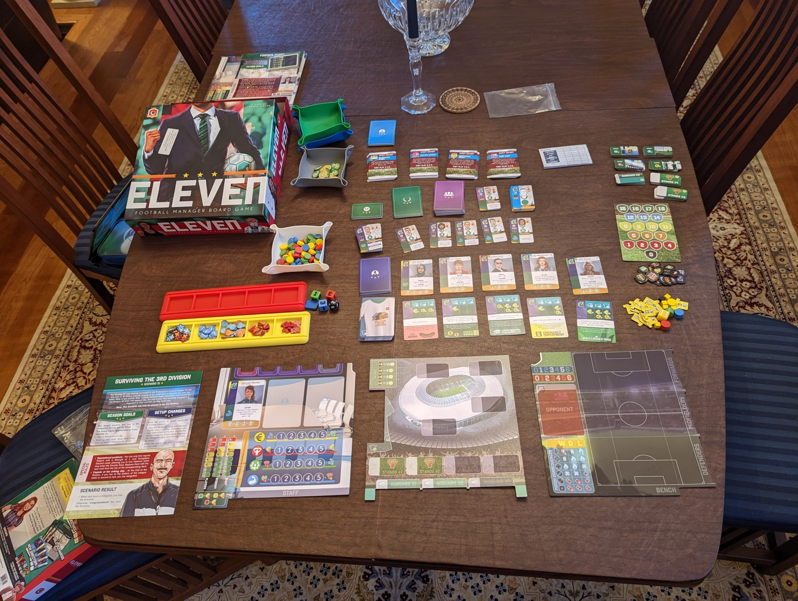
출처: https://i0.wp.com/opinionatedgamers.com/wp-content/uploads/2023/01/PXL_20221015_182557379.jpg
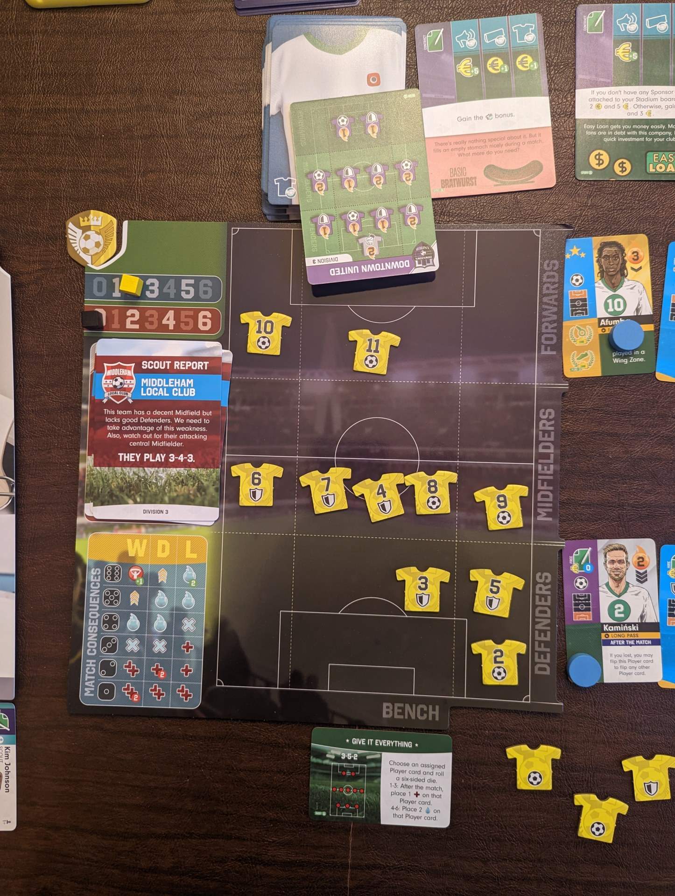
출처: https://i0.wp.com/opinionatedgamers.com/wp-content/uploads/2023/01/PXL_20221015_202532528.jpg
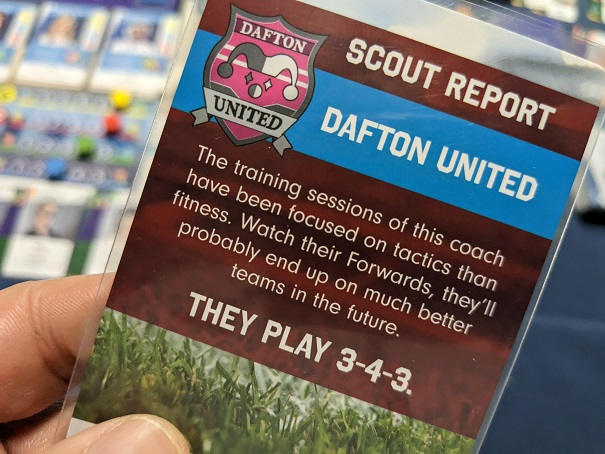
출처: https://playerelimination.com/wp-content/uploads/2023/03/pxl_20230219_005713714.jpg

#### 출처
- 규칙서 PDF: https://portalgames.blob.core.windows.net/eleven/eleven_rulebook15.pdf (로컬 추출본 eleven-rulebook.txt)
- https://opinionatedgamers.com/2023/01/11/dale-yu-review-of-eleven-football-manager-board-game/
- https://www.meeplemountain.com/reviews/eleven-football-manager-board-game/
- https://playerelimination.com/2023/03/06/its-one-louder-an-eleven-football-manager-board-game-review/
- 인원·시간·연령: Portal Games / 상점 표기(검색 결과)

---

### 풋볼 드라마 (Football Drama, Pietro Polsinelli(디자인·코드)·Daniele Giardini(일러스트, Demigiant), Open Lab Games, 2019-09-18)

| 항목 | 값 |
|---|---|
| 인원 | 1 |
| 플레이 시간 | 시즌 18주 (경기당 길이 미확인. 리뷰: "경기 길이를 정당화하지 못한다") |
| 연령 | 미확인 |
| 형태 | 디지털 (PC/Mac/Linux, 모바일, Switch) |
| 근거 수준 | 상세 리뷰 (Pocket Tactics, Gamecritics) + Steam/개발사 소개문 |

#### 구성물 / 구조
- 내러티브 매니저 게임. 주인공 Rocco Galliano 감독, Calchester Assembled FC. **18주 절차 생성 시즌**, 언제든 해고될 수 있음.
- **덱빌딩**: 스토리 선택("karma or chaos") 과 경기 결과로 카드 획득. 카드 예: "파울 연기", "오프사이드 룰" 같은 "수상한 전술".

#### 경기 (턴제)
- 탑다운 화면에서 선수는 작은 원. **턴제**, 애니메이션 리플레이.
- 매 턴 **두 선택지 중 하나**: 예) 자리를 지키며 점유 vs 위험한 롱패스 / 마킹 vs 태클 시도. **두 번째(공격적) 선택은 선수 체력을 더 소모** → 체력 관리가 핵심.
- **손패 최대 5장**의 카드를 경기 중 "지시" 로 사용. 발동이 항상 성공하지는 않으며, 성공하면 포메이션·플레이 스타일 집중 등 큰 이점. 성공한 카드마다 상대와 비교한 팀 상태 피드백(개발 일지).
- 골 발생 공식은 공개돼 있지 않음(미확인). 리뷰어: "많은 스탯이 영향을 주지만 결과의 인과가 불투명".
- 경기 후 기자회견·구단주·부인과의 대화(선택지). 선택은 카르마/카오스로 이어진다.

#### 판정 / 슈팅 / 시간 / 특수 상황
공식 미공개. 리뷰에 언급된 것은 "체력", "카드 성공/실패", "스탯" 뿐이다.

#### 평가와 교훈
Pocket Tactics: 아트(Giardini) 는 최고 수준이나 **이지선다는 경기 길이를 정당화할 만큼 몰입적이지 않고**, 대화 선택지가 반복됨. Gamecritics 7/10: "축구 팬 ∩ 비주얼 노벨 팬" 을 위한 게임, 선수와의 관계가 거의 없음.
가져올 점: **"안전 vs 공격적" 이지선다 + 공격적 선택의 체력 비용**은 카드 게임의 매 턴 결정으로 옮기기 쉽다. 손패 5장 "지시 카드" 가 항상 성공하지 않는 구조도 참고.
피할 점: 결과 인과가 보이지 않으면 선택이 무의미하게 느껴진다. 판정을 공개 공식으로 만들 것.

#### 참고 이미지
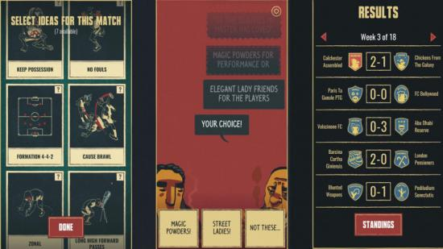
출처: https://www.pockettactics.com/wp-content/sites/pockettactics/2019/10/Football-Drama-Review-550x309.jpg
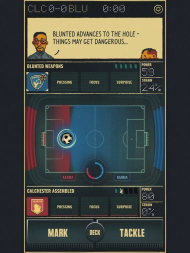
출처: https://www.pockettactics.com/wp-content/uploads/2019/10/Football-Drama-match-380x507.jpg
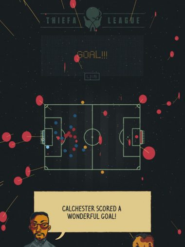
출처: https://www.pockettactics.com/wp-content/uploads/2019/10/Football-Drama-goal-380x507.jpg
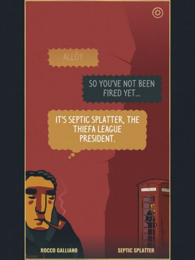
출처: https://www.pockettactics.com/wp-content/uploads/2019/10/Football-Drama-conversation-380x507.jpg

#### 출처
- https://www.pockettactics.com/football-drama/review
- https://gamecritics.com/damiano-gerli/football-drama-review/
- https://store.steampowered.com/app/876190/Football_Drama/
- https://www.demigiant.com/games/footballdrama/index.php
- https://open-lab-games.itch.io/football-drama/devlog/110995/better-narrative-matches

---

### 그룹 D 횡단 정리: "간단한 축구 시뮬레이션 카드 게임" 에 쓸 만한 판정 모델

| 모델 | 출처 | 요약 | 결정론성 |
|---|---|---|---|
| 능력치+d6 듀얼, 동점은 루즈볼 | Counter Attack | 공격치+d6 vs 수비치+d6, 임계값 8/9 | 높음(공식 명시) |
| 조준 6 vs 방어 2 동시 공개 | Golazo | 카드 심리전, 롱샷은 방어 4 | 높음, 주사위 불필요 |
| 박스 안 번호 × 주사위 매칭 | Golazo 크로스 | 사람 많을수록 확률 ↑ | 높음 |
| 존별 Strength 1:1 비교, 잉여 공격 자동 골, GK n회 | Eleven | 주사위 없음 | 짝짓기 순서를 고정해야 |
| 남은 눈금+1, 경유 아군마다 +1 | StreetSoccer | 패스 연결이 곧 전진 | 완전 결정론 |
| 극단값 = 사건 (1 파울, 6 스틸, 6vs1 파울) | Counter Attack, Soccer Tactics World | 별도 굴림 없이 사건 발생 | 높음 |
| 시간 = 1/6 확률 이벤트로만 전진 | Golazo | 경기 길이 무작위, 스토피지 타임 d6 | 높음 |
| 안전 vs 공격적 이지선다 + 체력 비용 | Football Drama | 매 턴 결정의 최소 단위 | 공식 미공개 |
